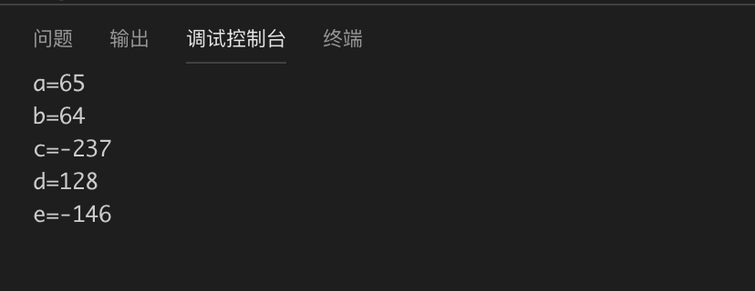
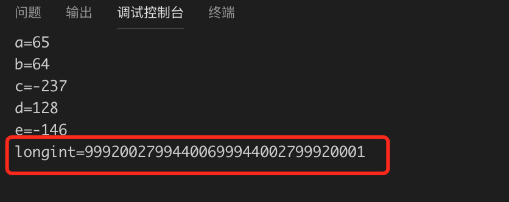
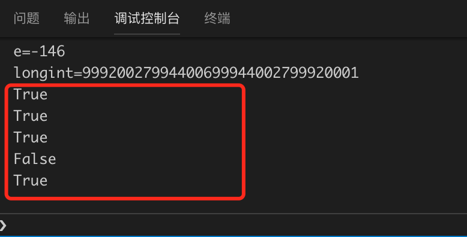
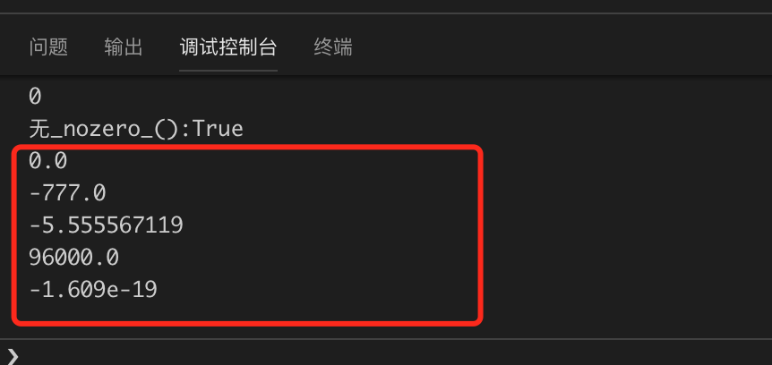
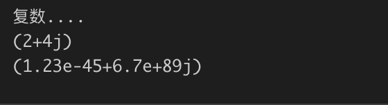
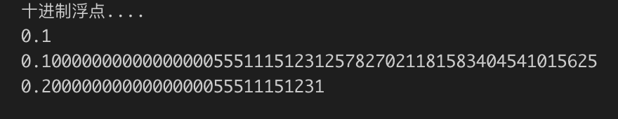
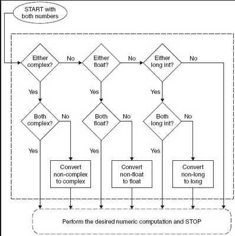
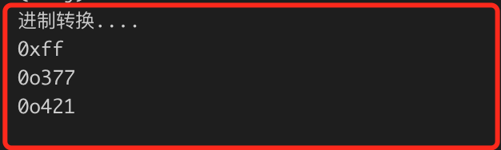
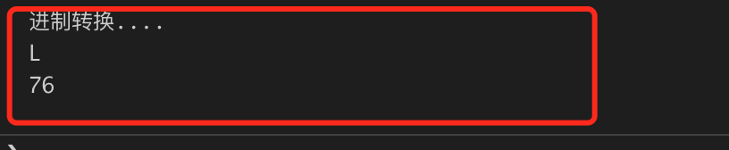

# 1.2  数值类型
从本节开始，我们快速练习Python编程基础，但是由于本教程的定位和篇幅所限，完整的编程基础内容，需要各位读者自行阅读相关书籍和教程。

数值类型，说白了就是处理各种各样的数字，Python中的数值类型包括整型、长整型、布尔、双精度浮点、十进制浮点和复数，这些类型在很多方面与传统的C类型有很大的区别。

Python中的数值类型都是不可变类型，意味着创建、修改数字的值，都会产生新的对象，当然这是幕后的操作，编程过程中大可不必理会。

新建1.2.py文件。

### 2.2.1 标准整型和长整型

标准整型等价于C中的有符号长整型（long），与系统的最大整型一致（如32位机器上的整型是32位，64位机器上的整型是64位），可以表示的整数范围在[-sys.maxint-1, sys.maxint]之间。整型字面值的表示方法有3种：十进制（常用）、八进制（以数字“0o”开头）和十六进制（以“0x”或“0X”开头）。

在1.2.py文件中添加如下代码：
```Python
# -*- coding:utf-8 -*-
 
a = 0o101
print("a="+str(a))
 
b=64
print('b='+str(b))
c=-237
print('c='+str(c))
d=0x80
print('d='+str(d))
e=-0x92
print('e='+str(e))
```

上面的代码输出结果为：



长整型是整型的超集，可以表示无限大的整数（实际上只受限于机器的虚拟内存大小）。
长整型和标准整型，目前已经基本统一，当数学运算遇到整型异常的情况，在Python2.2以后的版本，会自动转换为长整型。继续添加测试代码：




### 1.2.2 布尔型和布尔对象

布尔型其实是整型的子类型，布尔型数据只有两个取值：True和False，分别对应整型的1和0。

每一个Python对象都天生具有布尔值（True或False），进而可用于布尔测试（如用在if、while中）。

以下对象的布尔值都是False，除此之外是True：

* None
* False（布尔型）
* 0（整型0）
* 0L（长整型0）
* 0.0（浮点型0）
* 0.0+0.0j（复数0）
* ''（空字符串）
* [>]（空列表）
* ()（空元组）
* {}（空字典）
* 用户自定义的 类实例，该类定义了方法 __nonzero__() 或 __len__()，并且这些方法返回0或False

下面我们通过几段代理来加深对布尔类型的认识。
在1.2.py中添加测试代码：
```Python
#基本测试
print(bool(1))
print(bool(True))
print(bool('0'))
print(bool([]))
print(bool((1,)))
```
结果如下：



下面我们看看bool类型作为只有0和1取值的特殊整型的特性。


```Python
#使用bool数
foo = 42
bar = foo<42

print(bar)
print(bar+10)
print('%s' %bar)
print('%d' %bar)
```

运行结果如下：
```
False
10
False
0
```


再来验证下没有_nonzero_()方法的对象，默认是True。


#无_nozero_()
class C:pass
 
c=C()
print(bool(c))

运行结果如下：


### 1.2.3 双精度浮点型

Python里的浮点型数字都是双精度，类似C语言的double类型。可以用十进制或者科学计数法表示。下面我们看一些典型的浮点型数字。

添加测试代码：
```
# 双精度浮点
print(0.0)
print(-777.)
print(-5.555567119)
print(96e3 * 1.0)
print(-1.609E-19)
```

运行结果如下：



### 1.2.4 复数

在Python中，有关复数的概念如下：

* 虚数不能单独存在，它们总是和一个值为0.0的实数部分一起来构成一个复数。
* 复数由实数部分和虚数部分组成。
* 表示虚数的语法：real+imagj.
* 实数部分和虚数部分都是浮点型。
* 虚数部分必须有后缀j或J。

复数可以用使用函数 complex(real, imag) 或者是带有后缀j的浮点数来指定。

下面添加代码测试复数：
```Python
print(complex(2, 4))
print(1.23e-045+6.7e+089j)
```

运行结果如下：




### 1.2.5 十进制浮点型

十进制浮点通常称为decimal类型，主要应用于金融计算。双精度浮点型使用的是底和指数的表示方法，在小数表示上精度有限，会导致计算不准确，decimal采用十进制表示方法，看上去可以表示任意精度。

下面我们看一下十进制浮点的例子。

```Python
# 十进制浮点
# 十进制浮点
from decimal import *
 
print("十进制浮点....")
dec=Decimal('.1')
print(dec)
print(Decimal(.1))
print(dec +Decimal(.1))
```

使用decimal类型，首先要引入decimal模块，然后通过Decimal类来初始化一个Decimal对象。

运行结果如下：




### 1.2.6 操作符
在Python中同时支持不同数值类型的数字进行混合运算，数字类型不一致怎么做运算？这个时候就涉及到强制类型转换问题。这种操作不是随意进行的，它遵循以下基本规则:

首先，如果两个操作数都是同一种数据类型，没有必要进行类型转换。仅当两个操作数类型不一致时，Python才会去检查一个操作数是否可以转换为另一类型的操作数。如果可以，转换它并返回转换结果。

由于某些转换是不可能的，比如果将一个复数转换为非复数类型，将一个浮点数转换为整数等等，因此转换过程必须遵守几个规则。要将一个整数转换为浮点数，只要在整数后面加个.0就可以了。要将一个非复数转换为复数，则只需要要加上一个“0j”的虚数部分。

这些类型转换的基本原则是：整数转换为浮点数，非复数转换为复数。在 Python 语言参考中这样描述coerce()方法：

    如果有一个操作数是复数，另一个操作数被转换为复数。

    否则，如果有一个操作数是浮点数，另一个操作数被转换为浮点数。

    否则, 如果有一个操作数是长整数，则另一个操作数被转换为长整数；

    否则，两者必然都是普通整数，无须类型转换。

数字类型之间的转换是自动进行的，程序员无须自己编码处理类型转换。Python 提供了 coerce() 内建函数来帮助你实现这种转换。

转换流程图如下图所示：




### 1.2.7转换工厂

函数 int(), long(), float() 和 complex() 用来将其它数值类型转换为相应的数值类型。从Python2.3开始，Python 的标准数据类型添加了一个新成员：布尔（Boolean）类型。从此 true和 false 现在有了常量值即 True 和 False(不再是1和0)。

下面继续添加代码进行测试。
```Python
print("转换工厂....")
print(int(4.2222222))
print(float(4))
print(complex(4))
```
结果如下：


### 1.2.8 进制转换

目前我们已经看到Python支持8进制、十进制和十六进制整型，同时还提供了oct()和hex()内建函数来返回八进制和十六进制字符串。

添加测试代码：
```Python
#进制转换
print("进制转换....")
print(hex(255))
print(oct(255))
print(oct(0x111))
```
运行结果如下：


### 1.2.9 ASII 转换

chr函数和ord函数分别用来将数字转换为字符，和字符转换为数字。

添加测试代码：
```Python
#ASCII转换
print("进制转换....")
print(chr(76))
print(ord('L'))
```
运行结果如下：



### 1.2.10 

本节对Python数值类型做个比较全面的讲解，更高级的科学计算，推荐大家了解两个著名的第三方包，NumPy和SciPy。

本节留给大家的练习题目也很简单：

1. 将文章中所有代码手动敲打一遍
2. 扩展阅读,请自行查阅资料了解Python常用的数学函数：

* ceil(x) 
* floor(x)
* fabs(x)
* factorial (x)
* hypot(x,y)  
* sqrt(x*x+y*y)
* pow(x,y)
* sqrt(x) 
* log(x)
* log10(x)
* trunc(x)  
* isnan (x)  
* degree (x)
* radians(x) 

下一节，我们继续学习Python中常用的几种数据结构。

           欢迎到关注微信订阅号，交流学习中的问题和心得


   
