# 1.3 字符串、列表、元组、字典和集合

本节要介绍的是Python里面常用的几种数据结构。通常情况下，声明一个变量只保存一个值是远远不够的，我们需要将一组或多组数据进行存储、查询、排序等操作，本节介绍的Python内置的数据结构可以满足大多数情况下的需求。这一部分的知识点比较多，而且较为零散，需要认真学习。 

## 1.3.1 字符串
开始练习之前请新建string.py文件，将下面展现的代码逐步添加到该文件中，进行调试，查看输出结果。

#### 初始化

字符串是 Python 中最常用的数据类型。我们可以使用引号('或")来创建字符串。
创建字符串很简单，只要为变量分配一个值即可。下面添加代码进行测试：

```Python
# -*- coding:utf-8 -*-

#声明字符串
str1 ='Hello World!'
str2 ="hello 玄魂！"
print('声明字符串.....')
print(str1)
print(str2)
```
运行结果如下：

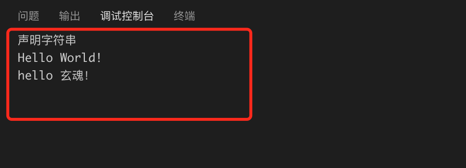

#### 字符访问

Python不支持单字符类型，单字符在Python也是作为一个字符串使用。Python访问子字符串，可以使用方括号来截取字符串,下面添加代码来测试：

```Python
#访问字符内容
print('访问字符内容.....')
print("str1[0]: ", str1[0])
print("str2[1:5]: ", str2[1:5])
```
运行结果如下：

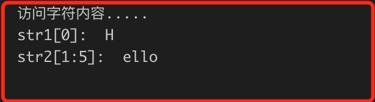

#### 转义

在需要在字符中使用特殊字符时，python用反斜杠(\\)转义字符。如下表：


#### 操作符

下表列出了字符运算的操作：
假设 q="Hello",b="Python"。
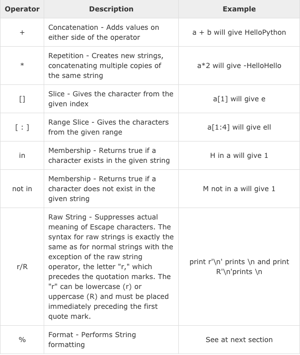

最后的字符串格式化，我们下面会单独介绍。

下面添加代码进行测试：

```Python
#字符串操作符
print('字符串操作符.....')
a ="Hello"
b ="Python"
 
print("a + b 输出结果：", a + b)
print("a * 2 输出结果：", a *2)
print("a[1] 输出结果：", a[1])
print("a[1:4] 输出结果：", a[1:4])
 
if("H" in a):
    print("H 在变量 a 中")
else:
    print("H 不在变量 a 中")
 
if ("M" not in a):
    print("M 不在变量 a 中")
else:
    print("M 在变量 a 中")
 
print (r'\n')
print (R'\n')
```
运行结果如下：

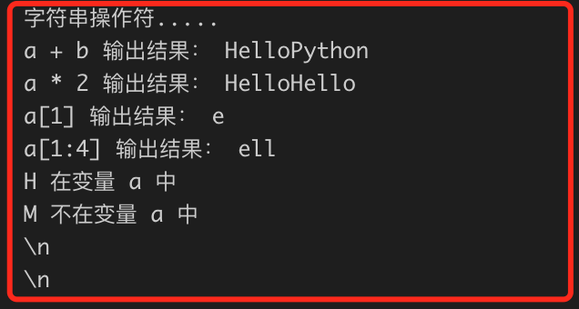

#### 格式化

Python 支持格式化字符串的输出。尽管这样可能会用到非常复杂的表达式，但最基本的用法是将一个值插入到一个有字符串格式符 %s 的字符串中。

下表列出了Python中的格式化符号：
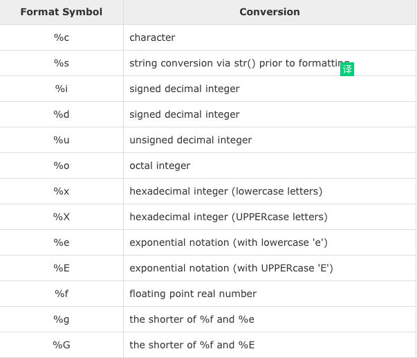

在 Python 中，字符串格式化使用与 C 中 sprintf 函数一样的语法，例如：

```Python
print("My name is %s and weight is %d kg!"%('玄魂',71))
```

另外我们可以通过string 对象的format函数来进行格式化，例如：

```Python
print("formart method call:My name is {name} and weight is {weight} kg!".format(name="玄魂",weight=71))
```

上面两行代码的运行结果为：

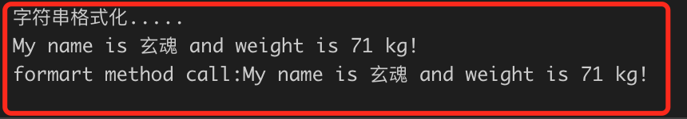

#### 三引号

python中三引号可以将复杂的字符串进行复制，python三引号允许一个字符串跨多行，字符串中可以包含换行符、制表符以及其他特殊字符。

三引号的语法是一对连续的单引号或者双引号（通常都是成对的用）。

添加如下测试代码：
```Python
#三引号
print('三引号.....')
hi = '''hi
  i am  玄魂'''
print(hi)
```
运行结果如下：
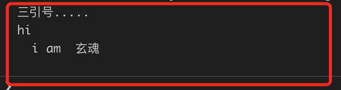

#### 字符串内建函数

内建函数可以大大简化我们编程中对字符串操作的难度，具体的列表这里就不展示了，可以参考
https://docs.python.org/3.4/library/stdtypes.html#string-methods

## 1.3.2 列表

新建 list.py,用于练习列表操作。

序列是Python中最基本的数据结构。序列中的每个元素都分配一个数字 - 它的位置，或索引，第一个索引是0，第二个索引是1，依此类推。

Python有6个序列的内置类型，但最常见的是列表和元组。序列都可以进行的操作包括索引，切片，加，乘，检查成员。此外，Python已经内置确定序列的长度以及确定最大和最小的元素的方法。列表是最常用的Python数据类型，它可以作为一个方括号内的逗号分隔值出现。列表的数据项不需要具有相同的类型

#### 创建列表

创建一个列表，只要把逗号分隔的不同的数据项使用方括号括起来即可。使用下标索引来访问列表中的值，同样你也可以使用方括号的形式截取字符:

```Python
# -*- coding:utf-8 -*-

#创建list
print("创建list.......")
list1 =['physics','chemistry',1997,2000]
list2 =[1,2,3,4,5]
list3 =["a","b","c","d"]

print("list1[0]: ", list1[0])
print("list2[1:5]: ", list2[1:5])
```
运行结果如下：

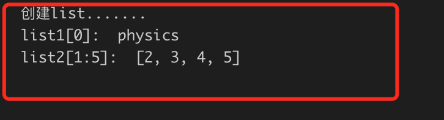

#### 更新列表

你可以对列表的数据项进行修改或更新，你也可以使用append()方法来添加列表项，如下所示：

```Python
#更新
print("更新list.......")
print("索引 2 的值: ")
print(list1[2])
list1[2]=2001
print("索引2更新后的值为 : ")
print(list1[2])
```

运行结果如下：

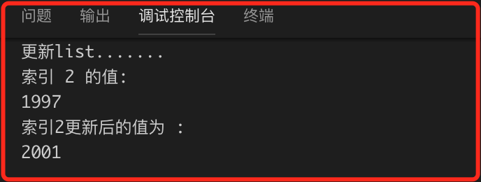

#### 删除列表元素

可以使用 del 语句来删除列表的的元素，如下所示：

```Python
#删除
print("删除list.......")
print("删除索引2处的值之前: ")
print(list1)
del(list1[2])
print("删除索引2处的值之后: \n",list1)
```
运行结果如下：

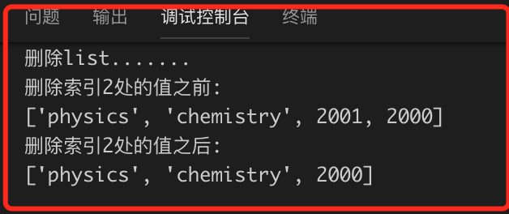

#### 操作符

列表对 + 和 * 的操作符与字符串相似。+ 号用于组合列表，* 号用于重复列表。

添加如下测试代码：
```Python
#操作符
print("操作符.......")
print('list1:',list1)
print('list2:',list2)

list4 = list1 + list2
print("list1 + list2 :",list4)

list5 = ['hello']*4
print('[\'hello\']*4:',list5)
```
运行结果如下：

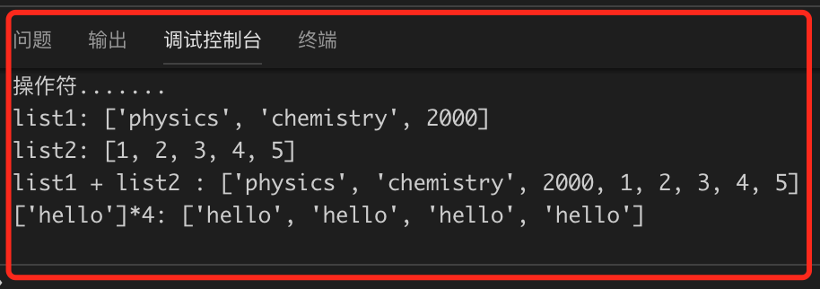

#### 截取

Python的列表截取与字符串操作类似，如下所示：
```Python
#截取

print("列表截取.......")

L =['玄','魂','玄魂!']
##读取第二个元素
print(L[2])
##读取倒数第二个元素
print(L[-2])
##从第二个开始截取
print(L[1:])
```

运行结果如下：

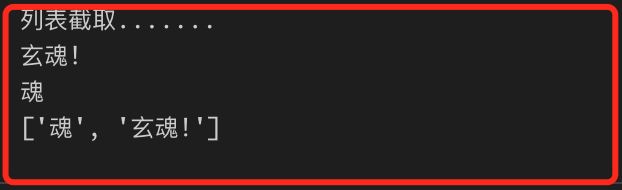

其他内置函数和方法，请参考：https://docs.python.org/2/tutorial/datastructures.html

## 1.3.3 元组

新建tuple.py文件。

Python的元组与列表类似，不同之处在于元组的元素不能修改。元组使用小括号，列表使用方括号。元组创建很简单，只需要在括号中添加元素，并使用逗号隔开即可。元组的各项操作和列表类似。添加如下测试代码：

```Python
# -*- coding:utf-8 -*-

tup0=()#空元组
tup1 = ('physics', 'chemistry', 1997, 2000)
tup2 = (1, 2, 3, 4, 5 )
tup3 = "a", "b", "c", "d"
tup4= (50,)#元组中只包含一个元素时，需要在元素后面添加逗号

print("tup0: ", tup0)
print("tup1: ", tup1)
print("tup2[1:5]: ", tup2[1:5])
print(tup4*4)
print(tup2+tup3)
print(tup1[1:])
print(tup1[-2])
```

运行结果如下：

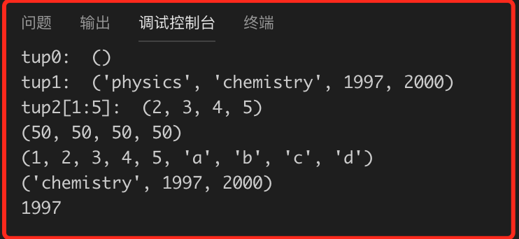

需要注意的是元组内元素不允许修改和删除，会引发错误。

## 1.3.4 字典

新建dic.py文件。

字典是另一种可变容器模型，且可存储任意类型对象。
字典的每个键值(key=>value)对用冒号(:)分割，每个对之间用逗号(,)分割，整个字典包括在花括号({})中 ,格式如下所示：

```Python
d ={key1 : value1, key2 : value2 }
```
键必须是唯一的，但值则不必。值可以取任何数据类型，但键必须是不可变的，如字符串，数字或元组。访问字典的某个值，只需要把相应的键放入方括弧即可。如果用字典里没有的键访问数据，会输出错误。在dic.py中添加如下代码：

```Python
# -*- coding:utf-8 -*-
 
dict ={'Name':'Zara','Age':7,'Class':'First'}
 
print("dict['Name']: ", dict['Name'])
print("dict['Age']: ", dict['Age'])

#访问不存在的key
print(dict['Xuanhun'])
```
运行结果如下：

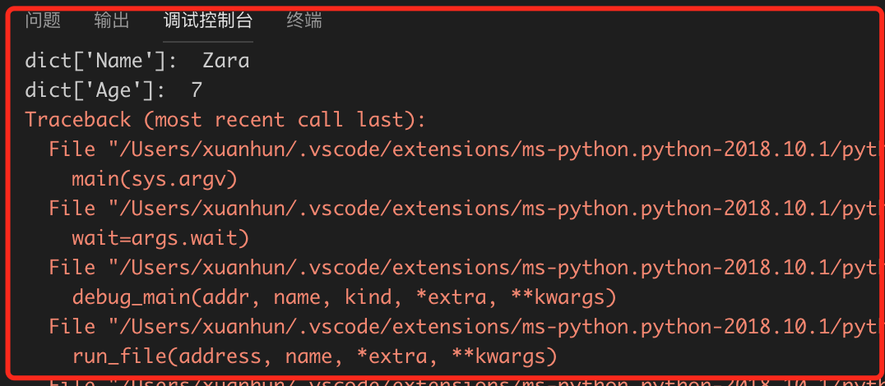

下面继续添加代码，修改存储的值：
```
#修改值

print("修改前",dict['Age'])
dict['Age']=8# update existing entry
print("修改后: ", dict['Age'])
```
运行结果如下：

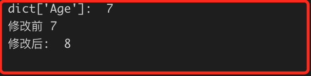

字典类型能删单一的元素也能清空字典：
```Python
#删除
del dict['Age']# 删除键是'Name'的条目
#print("dict['Age']: ", dict['Age'])#引发异常
dict.clear()    # 清空词典所有条目
print(dict)
del dict      # 删除词典
 
print(dict)    
```
运行结果如下：

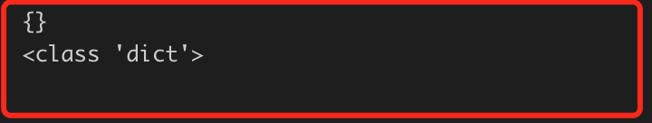

下面我们简单总结下字典键的特性：

1. 不允许同一个键出现两次。创建时如果同一个键被赋值两次，后一个值会被记住.
2. 键必须不可变，所以可以用数字，字符串或元组充当，所以用列表就不行，如下实例：

## 1.3.5 集合
请新建set.py文件，下面示例的代码添加到此文件运行调试。

把不同元素放在一起就组成了集合，集合的成员被称为集合元素。Python的集合和数学的结合在概念和操作上基本相同。Python提供了两种集合：可变集合和不可变集合。

创建集合的方法如下：

```Python
# -*- coding: UTF-8 -*-
 
s1=set('abcdde')
s2=set([1,2,3,4,5])
s3 = frozenset("xuanhun")
 
print(type(s1))
print(type(s3))
print(s2)
```
运行结果如下：

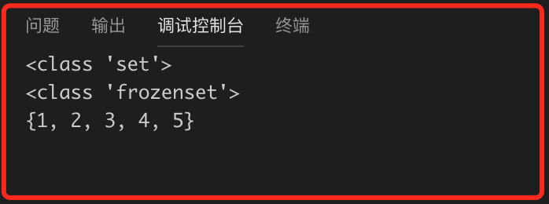


由于集合本身是无序的，所以不能为集合创建索引或切片操作，只能循环遍历或使用in、not in来访问或判断集合元素。接上面的代码，添加一个循环输出集合内容:

```Python
#输出集合内容
for item in s3:
    print(item)
```

运行结果如下：


从上图的结果，我们可以看到集合无序，无重复元素的特性。

我们可以使用内建的方法来更新集合：

```
s.add()
s.update()
s.remove()
```

下面添加测试代码：
```Python
#update
s2=set([1,2,3,4,5])
print("原始数据：",s2)
s2.add("j")  
print("添加数据后：",s2)
s2.remove(3)
print("删除数据后：",s2)
s2.update([6,7,8,9])
print("update数据后：",s2)
```

运行结果如下：

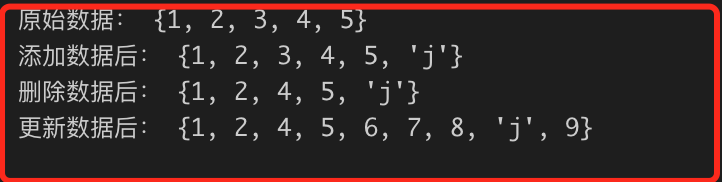

联合(union)操作与集合的OR操作其实等价的，联合符号有个等价的方法，union()。

测试代码如下：

```Python
#union
s1=set('abcdde')
s2=set([1,2,3,4,5])
s4=s1|s2
print(s4)
```


与集合AND等价，交集符号的等价方法是intersection()。测试代码如下：

```Python
#inter
print("s1&s2",s1&s2)
```
差集等价方法是difference()。测试代码如下：

```Python
#dif
print("s1-s2",s1 -s2)
print("s1 dif  s2",s1.difference(s2))
```

运行结果如下：

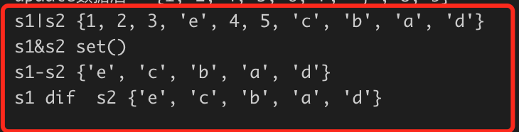

## 1.3.6 小结

基本的数据结构我们就介绍到这，相信你也有了整体的印象了，但是肯定觉得内容又过于简单了。我们会在后续的编码实践中，持续讲解没有接触到的内容。同时希望各位读者尽量拓宽基础知识。

本节留给大家的练习题如下：

1. 编写代码实现逆序输出一个列表
2. 编写代码实现查找并替换一个字符串中的一段连续内容

下一节我们将会学习流程控制，可以利用现有的知识完成一些小功能了。

           欢迎到关注微信订阅号，交流学习中的问题和心得


   
