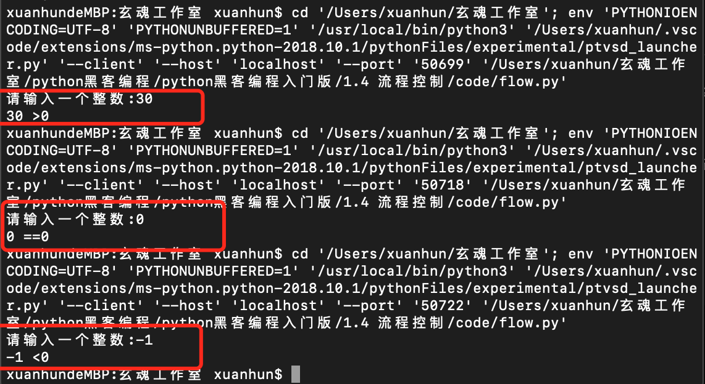
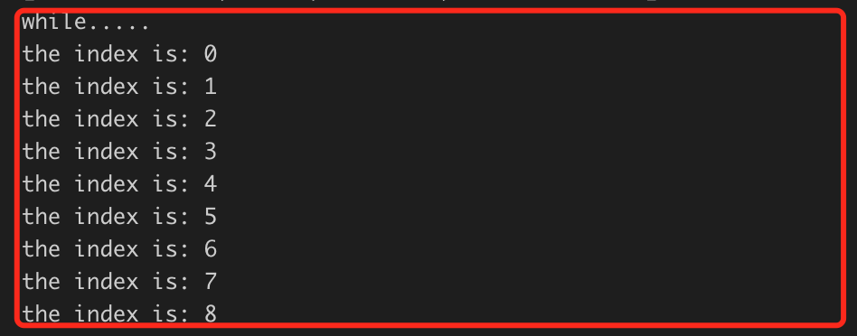
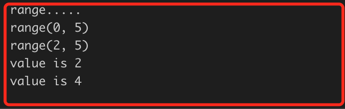
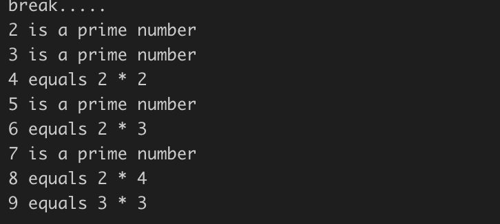
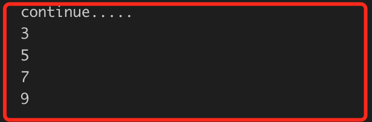

# 1.4 流程控制

本节要介绍的是Python编程中和流程控制有关的关键字和相关内容，利用这些知识可以让代码具有逻辑判断的能力。

正式开始之前，新建flow.py文件，用于练习和测试。

## 1.4.1 IF … ELSE

添加如下测试代码：
```Python
# -*- coding: UTF-8 -*-
 
x=int(input('请输入一个整数:'))
if x==0:
    print('%d ==0' %x)
elif x<0:
    print('%d <0' %x)
else:
    print('%d >0' %x)
```
上面的代码中，注意第一行代码，我们使用了input函数，这会中断程序的运行，在终端等待用户输入，我们从终端输入一个数字，代码会继续执行。接下来使用if，elif和else三个关键字，每一个关键字后面跟一个布尔表达式，以冒号结尾。跟在条件判断语句下面的是子语句，就是我们在此条件下要做的事情。运行结果如下：



## 1.4.2 FOR 语句

Python 中的 for 语句和C中的略有不同。通常的循环可能会由用户来定义迭代步骤和中止条件，Python 的 for 语句依据任意序列（链表或字符串）中的子项，按它们在序列中的顺序来进行迭代。例如：

```Python
#for 
print('for 测试.....')
words = ['cat', 'window', 'defenestrate']
for word in words:
    print(word,len(word))
```
运行结果如下：


在迭代过程中修改迭代序列不安全（只有在使用链表这样的可变序列时才会有这样的情况）。如果你想要修改你迭代的序列，可以迭代它的副本。使用切割标识就可以很方便的做到这一点:
```Python
#利用切片复制列表
print('利用切片复制列表.....')
for word in words[:]:
    if len(word)>6:
        words.insert(0,word)
print(words)
```
上面的代码通过切片操作得到了words的一个拷贝，循环过程中可以修改words列表但是不会对循环造成影响。
运行结果如下：
```
利用切片复制列表.....
['defenestrate', 'cat', 'window', 'defenestrate']
```

## 2.4.3 WHILE语句

while和if的区别在于，if如果表达式为true的话会一次执行内部的代码，而while会循环执行，直到表达式为false。例如：
```Python
#while
print('while.....')
count=0
while(count<9):
    print('the index is:',count)
    count +=1
```
运行结果如下：



## 1.4.5 RANGE和XRANGE

使用range函数可以很方便的生成一个等差系列。range函数完整的声明如下：
```
range(start,end,step =1)
```
下面我们添加代码看看range的使用方法：
```Python
#range
print('range.....')
a=range(5)
b=range(2,5)
c=range(2,5,2)
 
print(a)
print(b)
for i in c:
    print("value is",i)
```
这段代码示例了三种使用方式：

1) 只有一个参数时，传入值为end，起始值为0，步长为1；

2) 传递两个参数时，传入值为start和end，步长为1；

3) 传递三个参数时，传入值为start，end和步长。

xrange和range使用方法一样，区别有以下两点：

1) xrange不生成完整的列表，效率更高；

2) xrange只有在for循环中使用才有意义。

运行结果如下：



## 1.4.6 BREAK 、 CONTINUE和PASS

break 语句和 C中的类似，用于跳出最近的一级for或while循环。
循环可以有一个else子句，它在循环迭代完整个列表（对于 for ）或执行条件为 false （对于while ）时执行，但循环被 break 中止的情况下不会执行。
例如下面的代码：
```Python
#break
print('break.....')
for n in range(2, 10):
    for x in range(2, n):
        if n % x == 0:
            print(n, 'equals', x, '*', n//x)
            break
    else:
        print(n, 'is a prime number')
```
上面的代码循环一个包含从2到9的一个系列，内部的循环实际是判断该数是不是素数。if语句如果为true的话证明找到了除2和本身以外的分解因子，证明这个数不是素数，接着会执行break，此时会跳出当前循环，因为有了break语句，和当前for循环对应的else语句也不会执行。在相反的情况下，如果是素数，当前循环会执行完毕，else子句会执行。结果如下：



continue 语句是从 C 中借鉴来的，它表示循环继续执行下一次迭代，如下所示:
```Python
#continue
print('continue.....')
for num in range(2,10):
    if(num %2 ==0):
        continue
    print(num)
```
这是一段输出奇数的代码，结果如下：



pass 语句什么也不做，相当于汇编的nop指令。它用于那些语法上必须要有什么语句，但程序什么也不做的场合。通常我们使用pass语句来进行占位，比如规划程序功能和结构的时候，我们想好要定义哪些类，哪些方法，但是还没有具体实现的时候。比如：
```Python
#pass
def funcname(parameter_list):
    pass
 
class classname(object):
    pass
 
if a==0:
    pass
else:
    pass
```

## 1.4.7 小结

本小节快速学习了基本的流程控制，有了这些内容，我们可以解决很多算法问题了。本节留给大家的练习题如下：

1. 实现用户输入用户名和密码，当用户名为 seven且密码为123时，显示登陆成功，否则登陆失败！
2. 使用while循环实现输出2-3+4-5+6.....+100的和


下一节介绍 函数。


           欢迎到关注微信订阅号，交流学习中的问题和心得


  