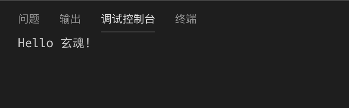
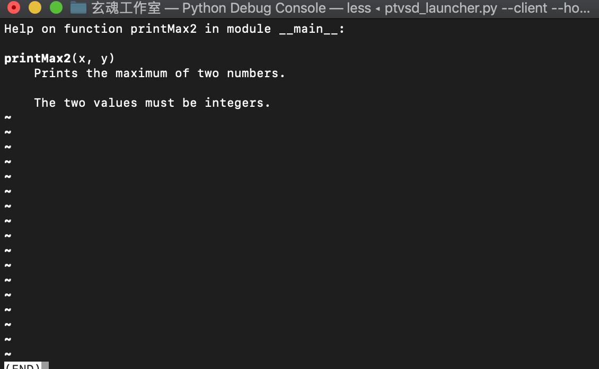

# 1.5 函数

函数是可复用的代码块。它们允许你给一块代码一个名称，然后你可以在你的程序的任何地方使用这个名称任意多次地运行这个代码块，这个过程称之为函数调用。
虽然才正式接触函数的概念，但是我们已经调用过很多次函数了，比如print。
下面我们来了解下函数的声明。

## 1.5.1 函数声明

函数通过def关键字定义。def关键字后跟一个函数的 标识符 名称，然后跟一对圆括号。圆括号之中可以包括一些变量名，该行以冒号结尾。接下来是一块语句，它们是函数体。新建function.py文件，添加如下代码：
```Python
# -*- coding: UTF-8 -*-
 #函数声明
def sayHello():
    print('Hello 玄魂!')

sayHello() #函数调用
```

我们使用def关键字定义了一个称为sayHello的函数。这个函数不使用任何参数，因此在圆括号中没有声明任何变量。函数体调用了print函数打印字符串。最后通过函数名加括号的方式类调用函数。这里需要注意代码的缩进，函数体第一层代码距离函数声明（def）一个tab键的距离。
运行结果如下：



## 1.5.2 函数形参

那么如何定义和调用带参数的函数呢？

从黑盒的角度看函数，盒子有两个管道，一个是输入，一个是输出，盒子内部是函数体。输出是返回值，输入就是函数的参数。

参数在函数定义的圆括号对内指定，用逗号分割。当我们调用函数的时候，我们以同样的方式提供值。注意我们使用过的术语——函数中的参数名称为 形参 而你提供给函数调用的值称为 *实参* 。看下面的示例：
```Python
#参数

def printMax(a, b):
    if a > b:
        print(a, 'is maximum')
    else:
        print(b, 'is maximum')
printMax(3, 4)
 
x = 5
y = 7
print('参数传递')
printMax(x, y)
```
这里，我们定义了一个称为printMax的函数，这个函数需要两个形参，叫做a和b。我们使用if..else语句找出两者之中较大的一个数，并且打印较大的那个数。在第一个printMax调用中，我们直接把数，即实参，提供给函数。在第二个使用中，我们使用变量调用函数。printMax(x, y)使实参x的值赋给形参a，实参y的值赋给形参b。在两次调用中，printMax函数的工作完全相同。这里仍然要注意缩进，if ...else 是函数体的第一层，一个tab键的缩进，内部的print调用属于if...else的代码块 距离if...else一个tab键的距离。

运行结果如下：
```
4 is maximum
参数传递
7 is maximum
```

## 1.5.3 局部变量

当你在函数定义内声明变量的时候，它们与函数外具有相同名称的其他变量没有任何关系，即变量名称对于函数来说是 局部 的。这称为变量的 作用域 。所有变量的作用域是它们被定义的块，从它们的名称被定义的那点开始。
```Python
#局部变量
def func(x):
    print('x is', x)
    x = 2
    print('Changed local x to', x)
print('局部变量')
x = 50
func(x)
print('x is still', x)
```
在上面这段代码中，首先函数定义了形参x，相当于函数的局部变量。在函数调用的时候，传入了外部x，外部x值为50。在函数内部将x值改为2，改变的是局部变量x，外部x不受影响，从最后的输出结果可以验证。运行结果如下：

```
局部变量
x is 50
Changed local x to 2
x is still 50
```
如果你想要为一个定义在函数外的变量赋值，那么你就得告诉Python这个变量名不是局部的，而是 全局 的。我们使用global语句完成这一功能。没有global语句，是不可能为定义在函数外的变量赋值的。例如：

```Python
#访问外部变量
def func2():
    global x
 
    print('x is', x)
    x = 2
    print('Changed local x to', x)
print('访问外部变量')
x = 50
func2()
print('Value of x is', x)
```
运行结果如下：

```
访问外部变量
x is 50
Changed local x to 2
Value of x is 2
```
## 1.5.4 默认参数值

对于一些函数，你可能希望它的一些参数是 可选 的，如果用户不想要为这些参数提供值的话，这些参数就使用默认值。这个功能借助于默认参数值完成。你可以在函数定义的形参名后加上赋值运算符（=）和默认值，从而给形参指定默认参数值。例如：
```Python
#默认参数
def say(message, times = 1):
    print(message * times)
 
print('默认参数。。。。')
say('Hello')
say('World', 5)
```
上面的代码中，名为say的函数用来打印一个字符串任意所需的次数。如果我们不提供一个值，那么默认地，字符串将只被打印一遍。我们通过给形参times指定默认参数值1来实现这一功能。在第一次使用say的时候，我们只提供一个字符串，函数只打印一次字符串。在第二次使用say的时候，我们提供了字符串和参数5，表明我们想要打印这个字符串消息5遍。运行结果如下：

```
默认参数。。。。
Hello
WorldWorldWorldWorldWorld
```

只有在形参表末尾的那些参数可以有默认参数值，即你不能在声明函数形参的时候，先声明有默认值的形参而后声明没有默认值的形参。这是因为赋给形参的值是根据位置而赋值的。例如，

```Python
def func(a, b=5)
```
是有效的，但是

```Python
def func(a=5, b)
```
是无效的。

## 1.5.5 关键字传参

如果你的某个函数有许多参数，而你只想指定其中的一部分，那么你可以通过命名来为这些参数赋值——这被称作 关键参数 ——我们使用名字（关键字）而不是位置（我们前面所一直使用的方法）来给函数指定实参。

这样做有两个优势：

1. 由于我们不必担心参数的顺序，使用函数变得更加简单了。
2. 假设其他参数都有默认值，我们可以只给我们想要的那些参数赋值。

例如：
```Python
#关键字传参
def func3(a, b=5, c=10):
    print('a is', a, 'and b is', b, 'and c is', c)
 
func3(3, 7)
func3(25, c=24)
func3(c=50, a=100)
```
在上面的代码中，名为func的函数有一个没有默认值的参数，和两个有默认值的参数。在第一次使用函数的时候， func(3, 7)，参数a得到值3，参数b得到值7，而参数c使用默认值10。在第二次使用函数func(25, c=24)的时候，根据实参的位置变量a得到值25。根据命名，即关键参数，参数c得到值24。变量b根据默认值，为5。在第三次使用func(c=50, a=100)的时候，我们使用关键参数来完全指定参数值。注意，尽管函数定义中，a在c之前定义，我们仍然可以在a之前指定参数c的值。运行结果如下：

```
关键字传参。。。。。
a is 3 and b is 7 and c is 10
a is 25 and b is 5 and c is 24
a is 100 and b is 5 and c is 50
```

## 1.5.6 return

return语句用来从一个函数返回，即跳出函数。我们也可选从函数返回一个值。例如：

```Python
#return
def maximum(x, y):
    if x > y:
        return x
    else:
        return y
print('return。。。。。')
print(maximum(2, 3))

```
在上面的代码中，maximum函数返回参数中的最大值，在这里是提供给函数的数。它使用简单的if..else语句来找出较大的值，然后返回那个值。运行结果如下：

```
return。。。。。
3
```

注意，没有返回值的return语句等价于return None。None是Python中表示没有任何东西的特殊类型。例如，如果一个变量的值为None，可以表示它没有值。除非你提供你自己的return语句，每个函数都在结尾暗含有return None语句。例如：

```Python
def someFunction():
    pass
print(someFunction())
```
运行结果如下：

```
None
```

## 2.5.8 DOCSTRINGS

Python有一个很奇妙的特性，称为 文档字符串 ，它通常被简称为 docstrings 。DocStrings是一个重要的工具，由于它帮助你的程序文档更加简单易懂，你应该尽量使用它。
先看下面的例子:

```Python
#docstrings
def printMax2(x, y):
    '''Prints the maximum of two numbers.
 
    The two values must be integers.'''
    x = int(x) # convert to integers, if possible
    y = int(y)
 
    if x > y:
        print(x, 'is maximum')
    else:
        print(y, 'is maximum')
 
printMax2(3, 5)
print(printMax2.__doc__)
```
在上面的代码中，在函数的第一个逻辑行的字符串是这个函数的文档字符串 。文档字符串的惯例是一个多行字符串，它的首行以大写字母开始，句号结尾。第二行是空行，从第三行开始是详细的描述。 强烈建议你在你的函数中使用文档字符串时遵循这个惯例。你可以使用__doc__（注意双下划线）调用printMax函数的文档字符串属性（属于函数的名称）。请记住Python把 每一样东西 都作为对象，包括这个函数。这里需要注意三引号的应用，按排版格式原样输出多行字符串。运行结果如下：

```

Prints the maximum of two numbers.
 
    The two values must be integers.
```

如果你已经在Python中使用过help()，那么你已经看到过DocStings的使用了！它所做的只是抓取函数的__doc__属性，然后整洁地展示给你。例如：

```Python
help(printMax2)
```
运行代码，会在终端中显示如下信息：




自动化工具也可以以同样的方式从你的程序中提取文档。因此，我强烈建议你对你所写的任何正式函数编写文档字符串。

1.5.8 小结

本节讲解了函数的关键内容，之后我们编写代码，都需要将逻辑组织封装到函数中，便于调用和维护。

本节的题目如下：

1. 将1.4节的练习题的实现都封装到函数中，传入不同的参数进行调用测试
2. 为每个函数添加文档字符串

下一节介绍 函数。


           欢迎到关注微信订阅号，交流学习中的问题和心得


  