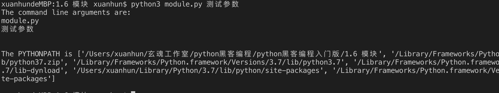
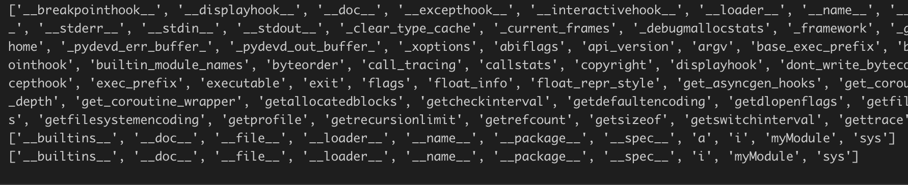

# 1.6 模块

我们已经学习了如何在你的程序中定义一次函数而重用代码。如果你想要在其他程序中重用很多函数，那么你该如何编写程序呢？你可能已经猜到了，答案是使用模块。模块基本上就是一个包含了所有你定义的函数和变量的文件。为了在其他程序中重用模块，模块的文件名必须以.py为扩展名。

模块可以从其他程序 导入以便利用它的功能。这也是我们使用Python标准库的方法。首先，我们将学习如何使用标准库模块。

先创建module.py文件用于练习和测试。

1.6.1 调用SYS模块

添加如下代码：

```Python
# -*- coding: UTF-8 -*-
 
import sys
 
print('The command line arguments are:')
for i in sys.argv:
    print(i)
 
print('\n\nThe PYTHONPATH is', sys.path, '\n')
```

在上面的代码中，我们利用import语句导入sys模块。sys模块包含了与Python解释器和它的环境有关的函数。当Python执行import sys语句的时候，它在sys.path变量中所列目录中寻找sys.py模块。如果找到了这个文件，这个模块的主块中的语句将被运行，然后这个模块将能够被你使用。注意，初始化过程仅在我们第一次输入模块的时候进行。
> sys.argv变量是一个字符串的列表，包含了命令行参数的列表。

>sys.path包含输入模块的目录名列表。我们可以观察到sys.path的第一个字符串是空的——这个空的字符串表示当前目录也是sys.path的一部分，这与PYTHONPATH环境变量是相同的。这意味着你可以直接输入位于当前目录的模块。否则，你得把你的模块放在sys.path所列的目录之一。

我们从终端使用python来运行，并输入参数“测试参数”，结果如下图所示：



## 1.6.2 FROM..IMPORT语句

上面的示例中我们通过sys.argv的方式来获取argv变量中的内容，那如果我们想直接调用argv，就可以获取变量内容或进行方法调用，该如何做呢？可以使用<b> from sys import argv </b>语句。还有一种更简单的方法<b> from sys import * </b>导入sys模块中所有可用的变量或方法。

一般说来，应该避免使用from..import而使用import语句，因为这样可以使你的程序更加易读，也可以避免名称的冲突。

## 1.6.3 __NAME__

每个模块都有一个名称，在模块中可以通过语句来找出模块的名称。前面说过，当一个模块被第一次导入的时候，这个模块的主块将被运行。假如我们只想在程序本身被使用的时候运行主块，而在它被别的模块输入的时候不运行主块，我们该怎么做呢？这可以通过模块的__name__属性完成。测试如下代码：

```Python
if __name__ == '__main__':
    print('当前代码被单独运行')
else:
    print('当前代码被导入运行')
```
每个Python模块都有它的__name__，如果它是'__main__'，这说明这个模块被用户单独运行，我们可以进行相应的恰当操作。运行结果如下：

```
当前代码被单独运行
```

## 1.6.4 创建模块

创建你自己的模块是十分简单的，你一直在这样做！每个以.py结尾的文件都是一个模块。下面我们先创建一个myModule.py的文件，内容如下：

```Python
def sayhi():
    print('Hi, this is mymodule speaking.')
version = '0.1'
```
从上面的代码可以看到，它与我们普通的Python程序相比并没有什么特别之处。我们接下来将看看如何在我们别的Python程序中使用这个模块。这个模块应该被放置在我们导入它的程序的同一个目录中，或者在sys.path所列目录之一。测试代码如下：
```Python
import myModule
 
myModule.sayhi()
print('Version', myModule.version)
```

运行结果如下：
```
Hi, this is newmodule speaking.
Version 0.1
```

## 1.6.5 DIR()函数

我们可以使用内建的dir函数来列出模块定义的标识符。标识符有函数、类和变量。当为dir()提供一个模块名的时候，它返回模块定义的名称列表。如果不提供参数，它返回当前模块中定义的名称列表。先看下面的代码：

```Python
print(dir(sys))
a=5
print(dir())
del a
print(dir())
```

首先，我们来看一下在导入的sys模块上使用dir。我们看到它包含一个庞大的属性列表。如下图：



接下来，我们不给dir函数传递参数，默认地，它返回当前模块的属性列表。
为了观察dir的作用，我们定义一个新的变量a并且给它赋一个值，然后检验dir，我们观察到在列表中增加了以上相同的值。我们使用del语句删除当前模块中的变量/属性，这个变化再一次反映在dir的输出中。对比如下：

```
['__builtins__', '__doc__', '__file__', '__loader__', '__name__', '__package__', '__spec__', 'a', 'i', 'myModule', 'sys']
['__builtins__', '__doc__', '__file__', '__loader__', '__name__', '__package__', '__spec__', 'i', 'myModule', 'sys']
```

## 1.6.6 小结

模块的用处在于它能为你在别的程序中重用它提供的服务和功能。Python附带的标准库就是这样一组模块的例子。我们已经学习了如何使用这些模块以及如何创造我们自己的模块。

本节的练习题如下：

1. 实现一个模块，提供基本的加、减、乘、除方法，在另一个文件中引入该模块，调用方法进行测试。

下一节我们学习异常处理。


           欢迎到关注微信订阅号，交流学习中的问题和心得


  


