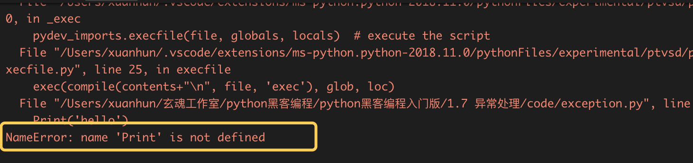
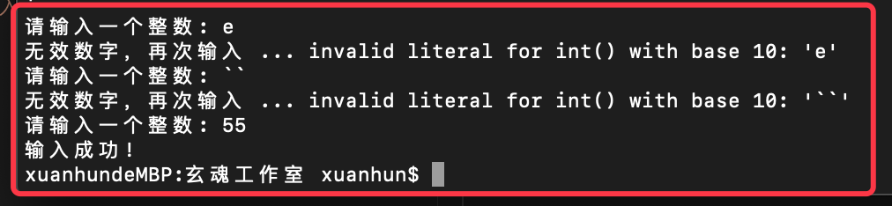
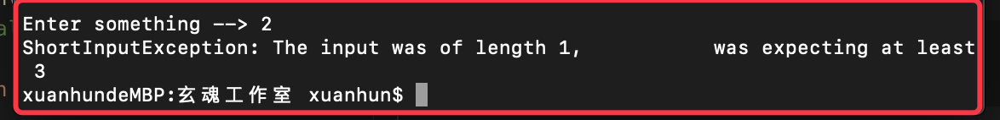

# 1.7 异常处理

异常是个很宽泛的概念，如果程序没有按预想的执行，都可以说是异常了。遇到一些特殊情况没处理会引发异常，比如读文件的时候文件不存在，网络连接超时。程序本身的错误也可以算作异常，比如把字符串当整数来处理，拼写错误。

不论是系统还是框架，都会对基本异常进行分类，比如IO异常，内存溢出等等。很多时候，针对特有的业务，我们也可以自定异常。

下面我们先看一个引发异常的例子：

```
Print('hello')
```

这个例子很简单，我们将print的首字母大写。这会引发一个错误：



我们可以观察到有一个NameError被引发，并且检测到的错误位置也被打印了出来。捕获错误，打印错误信息，这本身就是一种异常处理。那么我们如何在代码中处理异常呢？

新建exception.py文件用于测试。

## 2.7.1 异常捕获

我们把所有可能引发错误的语句放在try块中，然后在except从句中处理所有的错误和异常。except从句可以专门处理单一的错误或异常。如果没有给出错误或异常的名称，它会处理所有的错误和异常。对于每个try从句，至少都有一个相关联的except从句。

添加如下测试代码：

```Python
while True:
    try:
        n = input("请输入一个整数: ")
        n = int(n)
        break
    except ValueError as e:
        print("无效数字，再次输入 ...",e)
print("输入成功!")
```
上面的代码，我们通过“while True:”来构建一个死循环，循环内部通过input来接收用户的输入，通过int(n)来将用户输入转换为整数，如果输入的不是一个整数，这会引发ValueError异常，利用“except ValueError as e”来捕获这个异常。如果输入是整数，直接调用“break”，会跳出while循环，执行最后的print，程序退出。运行结果如下：



## 1.7.2 多异常捕获

上面的代码演示了基本的异常捕获，但是同一段代码，可能会引发多种异常，如何来处理这种情况呢？看下面的例子：

```Python
import sys

try:
    f = open('integers.txt')
    s = f.readline()
    i = int(s.strip())
except IOError as e:
    print("I/O error",e)
except ValueError:
    print("No valid integer in line.")
except:
    print("Unexpected error:", sys.exc_info()[0])
    raise
```

上面的代码中，我们打开一个文件，读取一行内容，然后将读取到的内容转换为整数，这可能会引发IOError或者ValueError，我们通过两个except来接收这两种异常情况。最后我们使用一个不带参数的except语句来接收其他异常。多个指定类型的异常，可以可以通过小括号的形式组合在一个except语句里。例如：

```Python
try:
    f = open('integers.txt')
    s = f.readline()
    i = int(s.strip())
except (IOError, ValueError):
    print("An I/O error or a ValueError occurred")
except:
    print("An unexpected error occurred")
    raise
```

## 1.7.3 制造异常

很多时候，我们可预知某种错误的时候，希望在调用方来处理异常，可以使用已有异常类型或者自定义异常，通过raise 抛出去。例如：

```
raise SyntaxError("Sorry, my fault!")
```

下面的代码演示了自定异常：

```Python
class ShortInputException(Exception):
    '''A user-defined exception class.'''
    def __init__(self, length, atleast):
        Exception.__init__(self)
        self.length = length
        self.atleast = atleast
 
try:
    s = raw_input('Enter something --> ')
    if len(s) < 3:
        raise ShortInputException(len(s), 3)
    # Other work can continue as usual here
except EOFError:
    print('\nWhy did you do an EOF on me?')
except ShortInputException as x:
    print('ShortInputException: The input was of length %d, \
          was expecting at least %d' % (x.length, x.atleast))
else:
    print('No exception was raised.')
```

这段代码中我们首先自定义了一个ShortInputException类，它继承自Exception类，构造函数接受两个参数输入字符串的长度和最小长度。接下来代码中，我们获取用户输入，判断长度是否小于3，如果小于3触发ShortInputException。我们从终端启动这个脚本，运行结果如下：



1.7.4 TRY..FINALLY

当我们需要不管是否有异常，都要执行某段代码的时候，就需要finally出场了。看下面的示例：
```Python
def test1():
   try:
      print('to do stuff')
      raise Exception('hehe')
   except Exception:
      print('process except')
      print('to return in except')
      return 'except'
   finally:
      print('to return in finally')
      return 'finally'
 
test1Return = test1()
print('test1Return : ' + test1Return)
```

在 try 中 raise一个异常，就立刻转入 except 中执行，在except 中遇到 return 时，就强制转到 finally 中执行， 在 finally 中遇到 return 时就返回。运行结果如下：


1.7.5 小结

本节我们学习了Python中基本的异常处理，和自定义异常的方法。

本节练习题如下：

1. 写一个函数，用来接收用户输入的字符串，判断是否是回文。如果是输出“yes”，如果不是，抛出一个异常，捕获该异常，打印结果，提示用户继续输入。

下一节我们学习面向对象编程。

            本系列教程全部内容在星球空间内发布，并提供答疑和辅导。

  

           欢迎到关注微信订阅号，交流学习中的问题和心得


  


