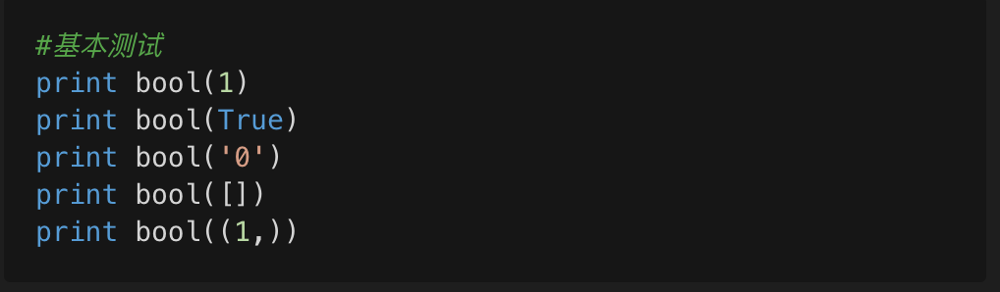
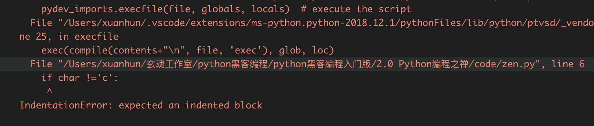
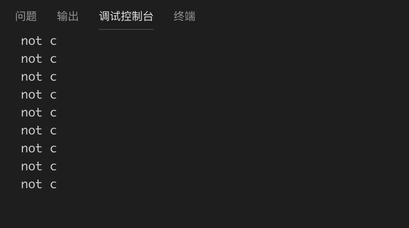

# Python编程之禅

本节的内容有些趣味性，涉及到很多人为什么会选择Python，为什么会喜欢这门语言。我带大家膜拜下Python作者的Python之禅，然后再来了解下Python的编程规范。

## 2.0.1 编程之禅

打开终端输入Python，然后输入imprt，一首诗便出现在我们面前了。



简单翻译如下：
```English
Beautiful is better than ugly.      
优美胜于丑陋
Explicit is better than implicit.   
明了胜于晦涩
Simple is better than complex.      
简单胜过复杂
Complex is better than complicated. 
复杂胜过凌乱
Flat is better than nested.　　　　　　
扁平胜于嵌套
Sparse is better than dense. 　　　　
 间隔胜于紧凑
Readability counts.　　　　　　　　　　
可读性很重要
Special cases aren't special enough to break the rules.  
即使假借特例的实用性之名，也不违背这些规则
Although practicality beats purity.　　　
虽然实用性次于纯度
Errors should never pass silently.　　　
错误不应该被无声的忽略
Unless explicitly silenced.　　　　　　　
除非明确的沉默　　　　　　　
In the face of ambiguity, refuse the temptation to guess.
当存在多种可能时，不要尝试去猜测
There should be one-- and preferably only one --obvious way to do it.
应该有一个，最好只有一个，明显能做到这一点
Although that way may not be obvious at first unless you're Dutch.
虽然这种 方式可能不容易，除非你是python之父
Now is better than never.   
现在做总比不做好
Although never is often better than *right* now. 
虽然过去从未比现在好
If the implementation is hard to explain, it's a bad idea. 
如果这个实现不容易解释，那么它肯定是坏主意
If the implementation is easy to explain, it may be a good idea.  
如果这个实现容易解释，那么它很可能是个好主意
Namespaces are one honking great idea -- let's do more of those! 
命名空间是一种绝妙的理念，应当多加利用
```

关于这段圣经般的描述，我这里也不做过多解释了，随着编程经验的丰富，理解也会越来越深刻。此刻，你只需默默的读一遍，然后放到自己的收藏夹里。

## 2.0.2 编码规范

下面的内容很重要，建议初学者当做金科玉律来遵守。新建zen.py文件，用于测试和练习。

对于初学者，我必须要强调的是，Python没有C语言那样的大括号，可以表示代码块和代码之间的层级关系，也没有VB那样的begin…end，它是靠缩进来表示这些的。对于用惯了大括号的的程序员来说，多少会有些不适应，因为有大括号的情况下，我们可以随意调整缩进，让代码按照我们的审美来排列，但是在Python里就不能这么做了。看下面一个简短的示例：

```Python
stringStest = 'abcdefghijk'
 
for char in stringStest[1:]:
if char !='c':
print 'not c'
```

这段代码很简单，首先声明了一个字符串变量stringStest，然后遍历字符串中的中的字符，判断是不是字母“c”，如果不是打印“not c”。运行之后，会看到如下错误:



简单的分析下，for循环和变量声明处于同级，二者目前作为测试代码的顶级，不需要缩进。if条件判断是for的子集，应该有4个空格的缩进，print语句是if的子集，应该和if参照再有4个空格的缩进。修改完毕的代码如下：

```Python
stringStest = 'abcdefghijk'
 
for char in stringStest[1:]:
    if char !='c':
        print('not c')
```

运行结果如下：



标准规范内容请大家参考PEP8。
下面我把PEP8的Python编码规范转引过来，感谢damnever的辛苦付出，请大家点击链接阅读原文。

[PEP8规范](http://damnever.github.io/2015/04/24/PEP8-style-guide-for-python-code/)。

## 2.0.3 小结

本节内容作为一个引子，非常简单。下面简单介绍下本章的主要内容。

本章的核心是系统级编程，主要涉及文件和目录的操作，线程与进程的创建，以及多线程和多进程应用的开发模式，子进程和进程间通信的相关内容，最后会利用上诉内容创建一个工具来进行综合性实践。


本节练习题如下：

1. 阅读PEP8规范。


2.1节我们来学习文件和目录操作。


           欢迎到关注微信订阅号，交流学习中的问题和心得


  



