## 2.1 文件和目录基本操作

Python的基本类库提供对文件和目录进行操作的功能，本节我们对这些基本方法进行学习。我们首先来学习文件操作。

### 2.1.1 文件操作

文件操作包含文件打开和关闭、读、写、重命名和删除，分别对应open、close、read、write几个方法。新建fileHandler.py,用于测试和练习。

想要对一个文件进行操作，要先使用open方法获取文件的访问权限,该方法的完整定义如下：

```Python
open(file, mode='r', buffering=-1, encoding=None, errors=None, newline=None, closefd=True, opener=None)
```

参数说明如下：

>file: 必需，文件路径（相对或者绝对路径）。\
mode: 可选，文件打开模式\
buffering: 设置缓冲\
encoding: 一般使用utf8\
errors: 报错级别\
newline: 区分换行符\
closefd: 传入的file参数类型\
opener:打开文件的一个回调函数，接收被打开文件的文件描述符


mode 参数可选值如下：

<table>
<tbody><tr><th style="width:10%">模式</th><th>描述</th></tr>
<tr><td>t</td><td>文本模式 (默认)。</td></tr>
<tr><td>x</td><td>写模式，新建一个文件，如果该文件已存在则会报错。</td></tr>
<tr><td>b</td><td>二进制模式。</td></tr>
<tr><td>+</td><td>打开一个文件进行更新(可读可写)。</td></tr>
<tr><td>U</td><td>通用换行模式（不推荐）。</td></tr>
<tr><td>r</td><td>以只读方式打开文件。文件的指针将会放在文件的开头。这是默认模式。</td></tr>
<tr><td>rb</td><td>以二进制格式打开一个文件用于只读。文件指针将会放在文件的开头。这是默认模式。一般用于非文本文件如图片等。</td></tr>
<tr><td>r+</td><td>打开一个文件用于读写。文件指针将会放在文件的开头。</td></tr>
<tr><td>rb+</td><td>以二进制格式打开一个文件用于读写。文件指针将会放在文件的开头。一般用于非文本文件如图片等。</td></tr>
<tr><td>w</td><td>打开一个文件只用于写入。如果该文件已存在则打开文件，并从开头开始编辑，即原有内容会被删除。如果该文件不存在，创建新文件。</td></tr>
<tr><td>wb</td><td>以二进制格式打开一个文件只用于写入。如果该文件已存在则打开文件，并从开头开始编辑，即原有内容会被删除。如果该文件不存在，创建新文件。一般用于非文本文件如图片等。</td></tr>
<tr><td>w+</td><td>打开一个文件用于读写。如果该文件已存在则打开文件，并从开头开始编辑，即原有内容会被删除。如果该文件不存在，创建新文件。</td></tr> 
<tr><td>wb+</td><td>以二进制格式打开一个文件用于读写。如果该文件已存在则打开文件，并从开头开始编辑，即原有内容会被删除。如果该文件不存在，创建新文件。一般用于非文本文件如图片等。</td></tr>


<tr><td>a</td><td>打开一个文件用于追加。如果该文件已存在，文件指针将会放在文件的结尾。也就是说，新的内容将会被写入到已有内容之后。如果该文件不存在，创建新文件进行写入。</td></tr> 
<tr><td>ab</td><td>以二进制格式打开一个文件用于追加。如果该文件已存在，文件指针将会放在文件的结尾。也就是说，新的内容将会被写入到已有内容之后。如果该文件不存在，创建新文件进行写入。</td></tr> 
<tr><td>a+</td><td>打开一个文件用于读写。如果该文件已存在，文件指针将会放在文件的结尾。文件打开时会是追加模式。如果该文件不存在，创建新文件用于读写。</td></tr> 
<tr><td>ab+</td><td>以二进制格式打开一个文件用于追加。如果该文件已存在，文件指针将会放在文件的结尾。如果该文件不存在，创建新文件用于读写。</td></tr>

</tbody></table>

## 2.1.1.1 文件读取

我们常用的前两个参数，其他参数根据应用情况进行选择，比如打开文件乱码，可能就要考虑设置合适的encoding了。我们新建一个test.txt文件，文件内添加三行内容：

```
a
b
c
玄魂
```

下面我们编写代码打开test.txt文件并读出其内容：

```Python
file = open('./test.txt','r')
print(file.read())
file.close()
```
上面代码的第一行，调用open方法返回一个file对象，这里open方法我们用了两个参数，第一个参数是文件的打开路径，第二个参数为模式，我们传入的'r'代表读模式。接着我们调用open方法返回的file对象的read方法来读取文件内容。read方法接收一个size参数（read(size)），表示读取文件的长度，在以二进制模式读取内容的时候，返回bytes对象，其他情况返回字符串对象。代码的最后调用了close方法来关闭文件访问，这也是我们必须要注意的地方。

<em>
注意：

 如果使用的是相对路径，VS Code进行调试的时候，如果遇到找不到文件的错误，注意当前路径的位置在哪里，一般是编辑器打开的文件路径（在VS Code 中打开终端所在的位置）。我们可以使用代码来获取当前上下文的路径：

```Python
import os

print(os.getcwd())
````
</em>


下面看一下代码的运行结果：

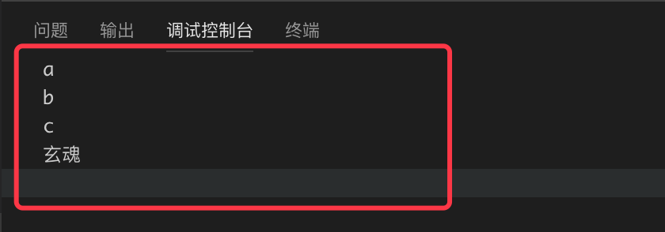

我们继续对代码做调整，添加如下代码查看输出内容：

```Python
print('读取部分内容.....')

file = open('./python黑客编程/python黑客编程入门版/2.1 文件和目录/code/test.txt','r')
print(file.read(3))
file.close()

print('二进制模式.....')

file = open('./test.txt','rb')
print(file.read())
file.close()
```
运行结果如下：

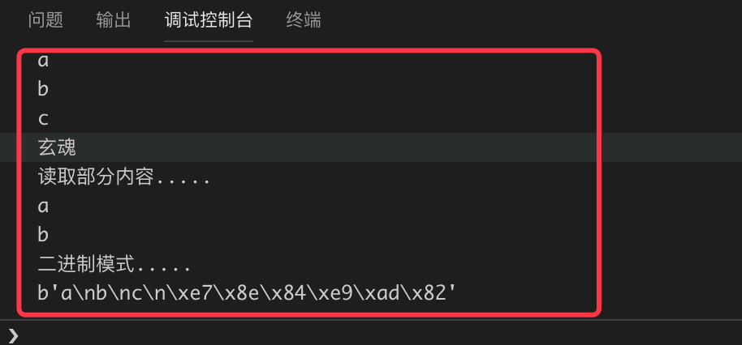

使用 for ... in 语句可以逐行读取文件内容。示例如下：
```Python
print('逐行读取.....')
file = open('./test.txt','r')
for c in file:
    print(c)
file.close()
```

上面的方法试用于较大文件的读取，如果是以read方法读取大文件，一般的形式如下：
```Python
print('分批读取.....')
with open('./test.txt','r') as f:
  while True:
    c = f.read(1)
    if not c:
      break
    print(c)
```
上面的代码中，我们每次读取一个字符，直到返回字符为空跳出循环。代码中没有调用close方法，但是我们使用了with表达式，有一些任务，可能事先需要设置，事后做清理工作。对于这种场景，Python的with语句提供了一种非常方便的处理方式。

```
基本思想是with所求值的对象必须有一个__enter__()方法，一个__exit__()方法。紧跟with后面的语句被求值后，返回对象的__enter__()方法被调用，这个方法的返回值将被赋值给as后面的变量。当with后面的代码块全部被执行完之后，将调用前面返回对象的__exit__()方法。
file对象的__exit__()会对资源进行清理。
```

## 2.1.1.2 文件写入

下面我们看一下文件的写入操作，回到上面的表格，想要对文件进行写入，open方法可传入的mode参数有‘a’系列和‘w’系列，'a'模式代表追加，在原文件的末尾添加内容，‘w’模式会清空原文件的内容，重新写入。 下面分别进行测试。

添加如下测试代码：
```Python
filePath = './test.txt'

print('a模式写入.....')

def printContent(path):
     with open(path,'r') as f:
         print(f.read())

with open(filePath,'a') as f:
    f.write("追加内容\r\n")
    
printContent(filePath)

```
这里我们先复习下函数的定义和调用，如果你忘了，请回到1.5节去看一下。上面的代码定义了一个printContent方法，接收一个传入的路径，然后打印文件的字符串内容。 下面使用追加模式打开文件，写入内容。运行结果如下：

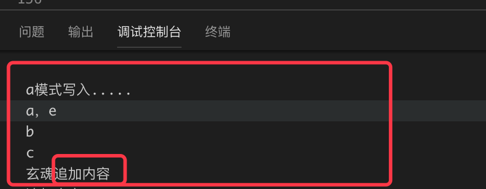

接下来尝试“w”模式：
```Python
print('w模式写入.....')
with open(filePath,'w') as f:
    f.write("追加内容\r\n")
printContent(filePath)
```

运行结果如下：

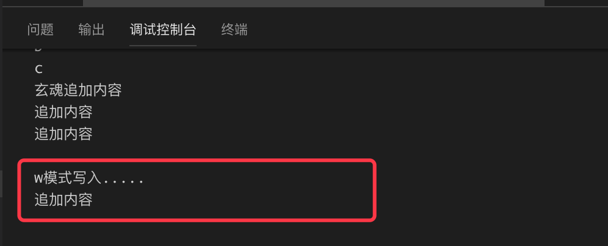

### 2.1.1.3 文件的创建、删除、重命名

文件内容的读写我们简单介绍到这，下面我们关注下文件本身的操作。创建文件我们在上面已经讲到了，使用‘w+’模式打开文件的时候，如果文件不存在就会创建。删除和重命名文件，使用os.remove和 os.rename方法。

os.remove() 方法用于删除指定路径的文件。如果指定的路径是一个目录，将抛出OSError。

remove()方法语法格式如下：
```
os.remove(path)#path:要删除的文件路径
```
os.rename() 方法用于命名文件或目录，从 src 到 dst,如果dst是一个存在的目录, 将抛出OSError。

rename()方法语法格式如下：
```
os.rename(src, dst)
```
src表示要修改的目录名，dst表示修改后的目录名。
上面两个方法示例如下：
```Python
import os

def removeTest():
    os.remove('./test.txt')

def renameTxt():
    os.rename('./test.txt','./abc.txt')
```

## 2.1.2 目录操作

目录操作我们经常遇到的任务为目录和目录下的文件遍历，包括枚举目录和文件的相关属性；创建和删除目录；对目录重命名等。新建directoryTrave.py文件，新建如下图的目录树：


用于测试和练习。测试的时候将终端的当前路径切换到sampleDirectory目录下，以便获得和教程一致的测试结果。

### 2.1.2.1 目录枚举

首先我们列出当前目录下的文件和子目录。代码如下：

```Python
# -*- coding: UTF-8 -*-

import sys
import os

os.chdir('/Users/xuanhun/玄魂工作室/python黑客编程/python黑客编程入门版/2.1 文件和目录/code/sampleDirectory')


def listCurrentDirectory(path):
    files = os.listdir(path)
    for name in files:
        print(name)
        
listCurrentDirectory('.')
```

上面的代码中，首先我们使用os.chdir方法，将程序上下文的当前路径指定到我们的测试目录上来。接着定义了一个listCurrentDirectory方法，该方法接收一个指定的路径，循环打印出该路径下的子目录和文件的名称。获取子目录和文件信息使用的是os.listdir方法。运行结果如下：

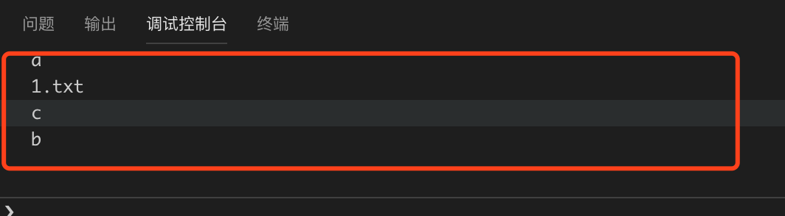

只能获取名字是不够的，我们希望能获取更详细的信息，可以使用os.stat方法。添加如下示例代码：

```Python
def listDirectoryDetail(path):
    files = os.listdir(path)
    for name in files:
        pathName = os.path.join(path,name)
        print(os.stat(pathName).st_mode)   #inode 保护模式
        print(os.stat(pathName).st_ino) #inode 节点号
        print(os.stat(pathName).st_dev )   # inode 驻留的设备
        print(os.stat(pathName).st_nlink)  #inode 的链接数
        print(os.stat(pathName).st_uid   ) #所有者的用户ID
        print(os.stat(pathName).st_gid    )#所有者的组ID
        print(os.stat(pathName).st_size  )#文件的大小，普通文件以字节为单位的大小；包含等待某些特殊文件的数据
        print(os.stat(pathName).st_atime  )#文件最后访问时间
        print(os.stat(pathName).st_mtime  )#文件最后修改时间
        print(os.stat(pathName).st_ctime  )#由操作系统报告的"ctime"。在某些系统上（如Unix）是最新的元数据更改的时间，在其它系统上（如Windows）是创建时间

listDirectoryDetail('.')
```

上面的代码中列举了os.stat方法可以枚举的信息，运行结果如下：

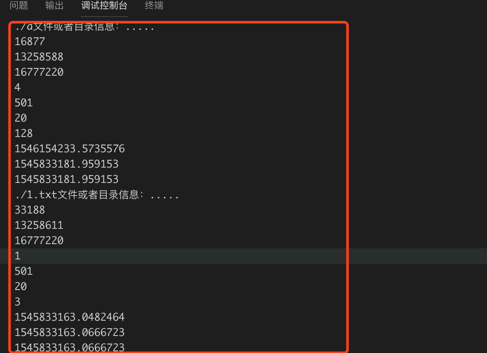

从打印的数据看，我们仍然无法知道当前路径是文件还是目录、权限等信息，此时需要引入stat模块对st_mode进行解析，我们先看示例。

```Python
import stat
def listCurrentDirectoryMode(path):
    files = os.listdir(path)
    for name in files:
         pathName = os.path.join(path, name)
         mode = os.stat(pathName).st_mode
         if S_ISDIR(mode):
            # 如果是目录
            print('%s是文件夹' % pathName)
         elif S_ISREG(mode):
            # 如果是文件
             print('%s是文件'%pathName)
         else:
            # 未知类型
            print('未知目录类型 %s' % pathName)

listCurrentDirectoryMode('.')
```

上面代码中我们使用了S_ISDIR来判断是否是文件夹，使用S_ISREG来判断是否是文件，运行结果如下：

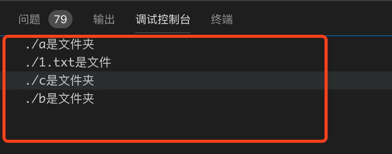

其他类型的判断如下：

```Python
if stat.S_ISREG(mode):           #判断是否一般文件
   print 'Regular file.'
elif stat.S_ISLNK (mode):         #判断是否链接文件
   print 'Shortcut.'
elif stat.S_ISSOCK (mode):        #判断是否套接字文件    
   print 'Socket.'
elif stat.S_ISFIFO (mode):        #判断是否命名管道
   print 'Named pipe.'
elif stat.S_ISBLK (mode):         #判断是否块设备
   print 'Block special device.'
elif stat.S_ISCHR (mode):         #判断是否字符设置
　　print 'Character special device.'
elif stat.S_ISDIR (mode):         #判断是否目录
　　print 'directory.'
```

通过函数filemode可以很方便的打印文件的mode信息：

```Python
def printChmode(path):
       files = os.listdir(path)
       for name in files:
         pathName = os.path.join(path, name)
         mode = os.stat(pathName).st_mode
         print(filemode(mode))

printChmode('.')
```
运行结果如下：

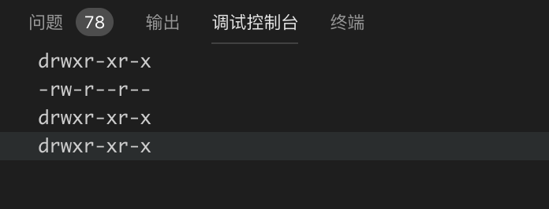


### 2.1.2.2 目录遍历

上面的代码实现了枚举当前目录下的一级子目录的信息，但是多级目录，我们如何进行一层层的遍历呢？ 上面我们已经知道了当前路径是目录还是文件，如果是文件就可以继续调用当前方法，实现递归调用，此种实现方法，留给大家当做作业，下面我们看一种简单的方法，使用os.walk()方法。

walk()方法语法格式如下：

```
os.walk(top[, topdown=True[, onerror=None[, followlinks=False]]])
```

各参数说明如下：


>top -- 是你所要遍历的目录的地址, 返回的是一个三元组(root,dirs,files)。

>>root 所指的是当前正在遍历的这个文件夹的本身的地址<br />
>>dirs 是一个 list ，内容是该文件夹中所有的目录的名字(不包括子目录)<br />
>>files 同样是 list , 内容是该文件夹中所有的文件(不包括子目录)<br />

>topdown --可选，为 True，则优先遍历 top 目录，否则优先遍历 top 的子目录(默认为开启)。如果 topdown 参数为 True，walk 会遍历top文件夹，与top 文件夹中每一个子目录。

>onerror -- 可选，需要一个 callable 对象，当 walk 需要异常时，会调用。

>followlinks -- 可选，如果为 True，则会遍历目录下的快捷方式(linux 下是软连接 symbolic link )实际所指的目录(默认关闭)，如果为 False，则优先遍历 top 的子目录。

下面我们做简单的测试：

```Python
def walkDir(path):
        for dirName, subdirList, fileList in os.walk(path):
                print('发现目录: %s' % dirName)
                for fname in fileList:
                        print('\t%s' % fname)

walkDir('.')
```

运行结果如下：

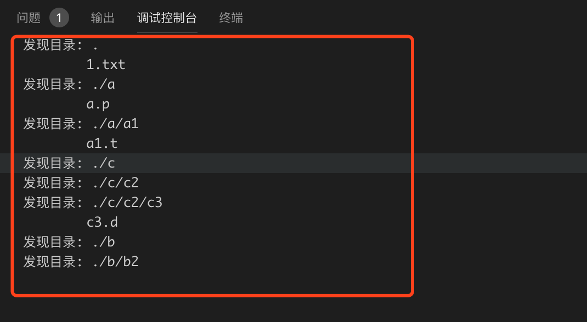

### 2.1.3 修改权限

os.chmod() 方法用于更改文件或目录的权限,语法格式如下：

```
os.chmod(path, mode)
```
参数说明如下：

>path -- 文件名路径或目录路径。

>flags -- 可用以下选项按位或操作生成， 目录的读权限表示可以获取目录里文件名列表， ，执行权限表示可以把工作目录切换到此目录 ，删除添加目录里的文件必须同时有写和执行权限 ，文件权限以用户id->组id->其它顺序检验,最先匹配的允许或禁止权限被应用。

>>stat.S_IXOTH: 其他用户有执行权0o001<br/>
stat.S_IXOTH: 其他用户有执行权0o001<br/>
stat.S_IWOTH: 其他用户有写权限0o002<br/>
stat.S_IROTH: 其他用户有读权限0o004<br/>
stat.S_IRWXO: 其他用户有全部权限(权限掩码)0o007<br/>
stat.S_IXGRP: 组用户有执行权限0o010<br/>
stat.S_IWGRP: 组用户有写权限0o020<br/>
stat.S_IRGRP: 组用户有读权限0o040<br/>
stat.S_IRWXG: 组用户有全部权限(权限掩码)0o070<br/>
stat.S_IXUSR: 拥有者具有执行权限0o100<br/>
stat.S_IWUSR: 拥有者具有写权限0o200<br/>
stat.S_IRUSR: 拥有者具有读权限0o400<br/>
stat.S_IRWXU: 拥有者有全部权限(权限掩码)0o700<br/>
stat.S_ISVTX: 目录里文件目录只有拥有者才可删除更改0o1000<br/>
stat.S_ISGID: 执行此文件其进程有效组为文件所在组0o2000<br/>
stat.S_ISUID: 执行此文件其进程有效用户为文件所有者0o4000<br/>
stat.S_IREAD: windows下设为只读<br/>
stat.S_IWRITE: windows下取消只读<br/>

下面的代码用来测试修改文件的权限：

```Python
# 设置文件可以通过用户组执行

os.chmod("./1.txt", stat.S_IXGRP)

# 设置文件可以被其他用户写入
os.chmod("./a/a1/a1.t", stat.S_IWOTH)
```

### 2.1.4 目录的重命名、创建和删除

#### 2.1.4.1 目录重命名

通过前面介绍的os.rename方法可以实现对文件和目录的重命名，相似的方法还有os.renames方法。下面测试下两种方法的区别：
```Python
def renameTest():
        walkDir('.')
        os.rename('1.txt','2.txt')
        try:
                os.rename('./a/a.p','./b2/b.p')
        except FileNotFoundError as e:
                print(e)
        os.renames('./a/a1/a1.t','b/b2/b1.t')
        walkDir('.')

renameTest()
```

上面的代码中，我们首先打印当前目录结构：

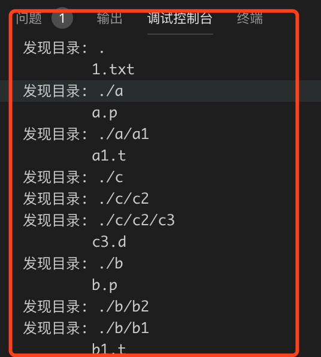

然后使用rename方法对当前目录下的1.txt文件重命名为2.txt，这是正常使用方法，没有问题。接下来将'./a/a.p'重命名到'./b2/b.p'，注意此时并不存在'./b2'这个路径，会抛出异常：

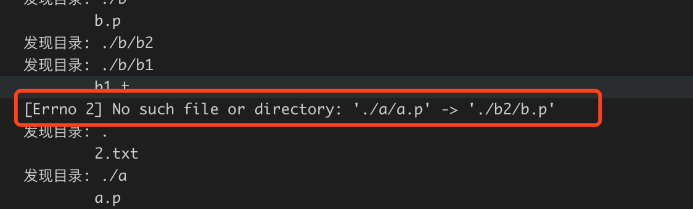

接着用os.renames方法去做重命名，将'./a/a1/a1.t'重命名到不存在的路径'b/b2/b1.t'。最后打印的结果如下：


我们发现，整个a目录不存在了，os.renames方法实现了递归重命名。

#### 2.1.4.2 目录创建

os.mkdirs方法可用于创建目录,定义如下：
```
makedirs(name, mode=0o777, exist_ok=False)
```

继续添加代码测试：
```Python
def createPath(p):
    try:
        os.makedirs(p)
    except OSError as e:
        print('创建目录失败', e)
    else:
        print('目录%s创建成功' % p)

createPath('./a/')
```
上面的代码中，我们调用os.makedirs方法在当前目录下创建'./a/'路径，因为该路径已经存在，所以会抛出异常。结果如下：


下面我们修改代码，判断路径是否已经存在。

```Python
def createPath2(p):
    try:
        if not os.path.exists(p):
            os.makedirs(p)
            print('%s创建成功' % p)
        else:
            print('%s已经存在' % p)
    except OSError as e:
        print('创建目录失败', e)


createPath2('./a/')
createPath2('./a/b')
```
上面的代码中，我们使用os.path.exists方法来判断路径是否存在，从而减少异常情况的发生。运行结果如下：

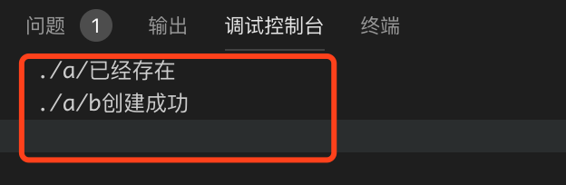

下面看一下os.makedirs第二个参数的使用：

```Python
def createPath3(p, mode):
    try:
        if not os.path.exists(p):
            os.makedirs(p,mode)
            print('%s创建成功' % p)
            mode = os.stat(p).st_mode
            print(stat.filemode(mode))
        else:
            print('%s已经存在' % p)
    except OSError as e:
        print('创建目录失败', e)

createPath3('./a/b/c',0o755)
```

这里我们传入0o755 的mode值，创建该路径。运行结果如下：

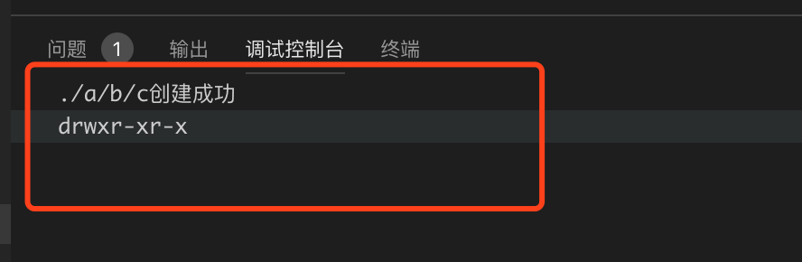

此外，os.makedirs的第三个参数exist_ok在递归创建目录的时候非常有用，如果其值传为true的时候，遇到已经存在的路径，不会抛出异常，程序继续执行。

在程序运行过程中，我们经常会使用系统的临时目录，通过tempfile模块可以创建临时目录。看下面的示例：

```Python
import tempfile
def createTempDirectory():
    with tempfile.TemporaryDirectory() as directory:
        print('临时目录 %s' % directory)


createTempDirectory()
```

上面的代码中使用tempfile.TemporaryDirectory()方法创建了一个临时目录，由于使用了with表达式，在方法执行完毕后，该临时目录会被清空。运行结果如下：

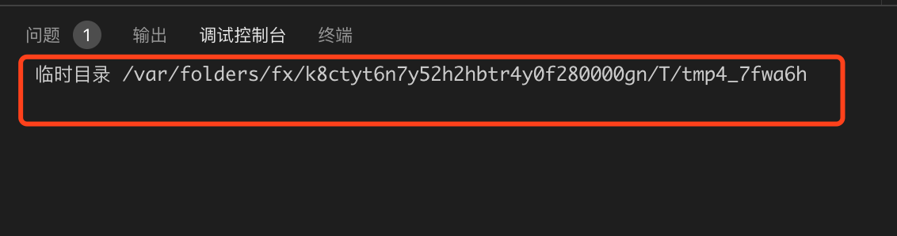

#### 2.1.4.3 目录删除

目录删除使用os.rmdir方法：
```Python
def removeDir(path):
    try:
        os.rmdir(path)
    except OSError:
        print("删除 %s 失败" % path)
    else:
        print("删除 %s成功" % path)
```

如果想要递归删除一个文件夹，则需要调用os.removedirs方法。

#### 2.1.5 小节

本节我们学习了基本的文件和目录的创建，删除重命名等操作。还有一些相关的模块，比如os.path模块，pathlib库，shutil库，可以用于实现很多高级的文件和目录操作。这里暂时不做介绍，后面涉及到的地方会再做讲解。本节的作业如下：

1. 不使用os.walk()实现目录遍历
2. 学习pathlib库，实现对文件和目录的基本操作（https://docs.python.org/3/library/pathlib.html#concrete-paths）
3. 学习shutil库（https://docs.python.org/3/library/shutil.html#module-shutil），实现拷贝，移动等高级操作

下一节我们学习多线程编程。


            本系列教程全部内容在星球空间内发布，并提供答疑和辅导。

 

           欢迎到关注微信订阅号，交流学习中的问题和心得


  
