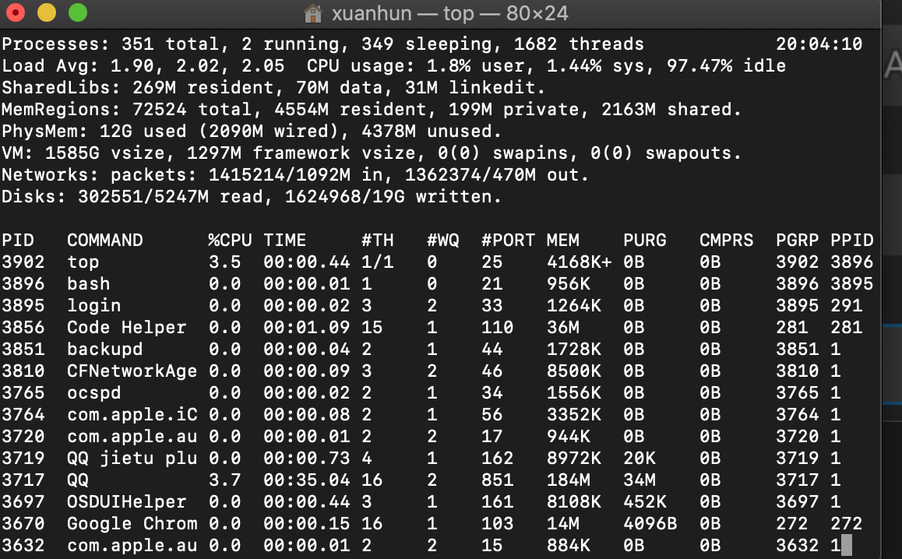
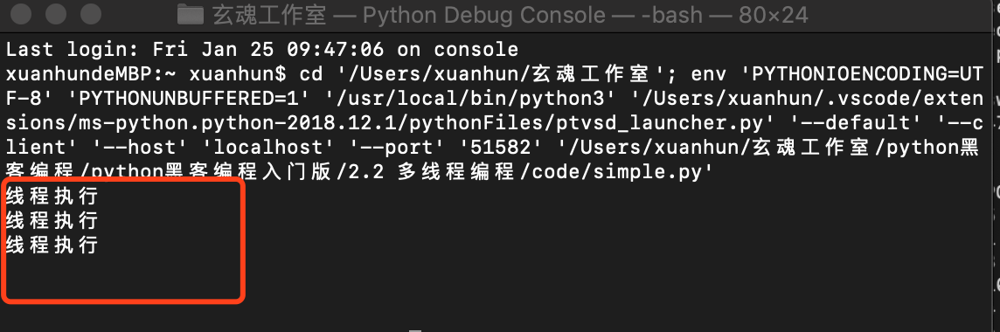
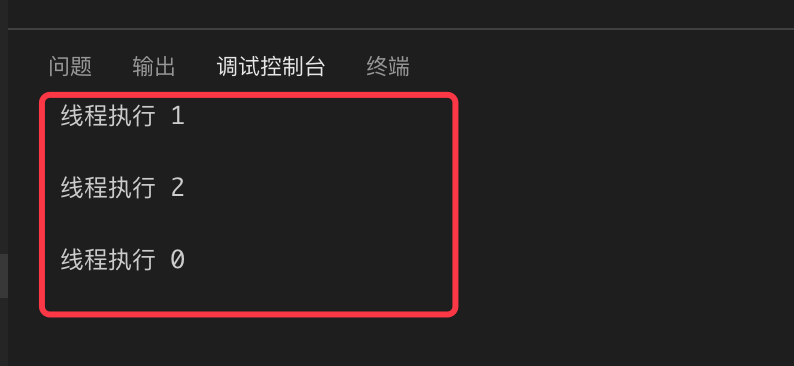
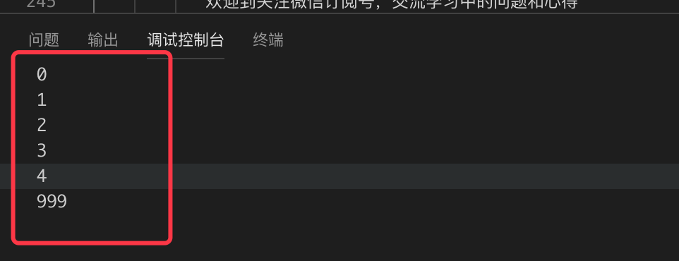
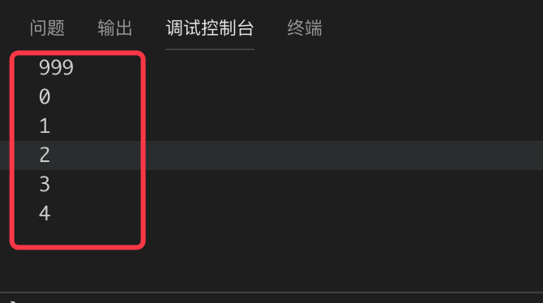
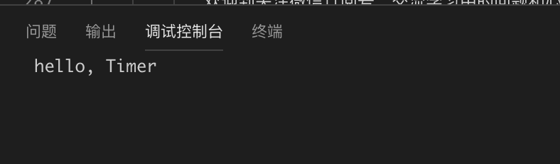

## 2.2 多线程编程

在具体讲解Python的多线程概念之前，我们有必要先搞清楚通常意义上的进程和线程的概念。其实从根本上讲清楚进程和线程并不是一件容易的事情，这里我尽可能的简单去阐述，方便我们写代码即可。

每一个应用程序在未执行的时候，只是一个二进制文件，当被执行的时候，操作系统会创建一个该应用的“活体”，就是进程，只有进程才能执行具体的任务。一个进程包括二进制镜像文件、虚拟内存、需要访问的内核资源、安全上下文等等，操作系统会为进程分配一个唯一id。 在linux 系统中使用top 命令可以查看进程信息。



线程是程序运行的最小调度单元，线程包含在进程中，它包括虚拟处理器、栈、应用程序状态信息等。

一个进程至少包含一个线程。多线程进程中，理论上每个线程代表单独的任务，多个任务可以同时执行。

在操作系统中两个重要的虚拟化概念是是虚拟内存和虚拟处理器。这两个虚拟化给每个进程一个错觉，就是它们都在独享这个计算机资源。通过虚拟内存，每个进程可以操作的内存地址空间都被认为是整个内存资源（包括磁盘上的交互内存），然后映射到实际的物理内存上，这样将物理内存访问和应用程序的内存访问隔离开。假如计算机上只有4G内存，你起了10个进程，每个进程都认为自己拥有4G内存的空间可以访问。虚拟处理器，让进程认为它独占处理器资源，运行过程中不用关心是否和其他进程发生争抢，不必去处理实际的资源分配问题。虚拟处理器模型，可以很方便的在多处理器架构上，让多个进程并行执行。

虚拟内存和进程的概念是直接关联的，一个进程中的多个线程共享同一个虚拟内存空间。虚拟处理器和线程是直接关联的，每一个线程是一个独立的调度单元。

Python的多线程和其他语言还是有很大区别的，原则上讲是假的多线程。下面的解释引自知乎：

```
Python代码的执行由Python虚拟机（解释器）来控制。Python在设计之初就考虑要在主循环中，同时只有一个线程在执行，就像单CPU的系统中运行多个进程那样，内存中可以存放多个程序，但任意时刻，只有一个程序在CPU中运行。同样地，虽然Python解释器可以运行多个线程，只有一个线程在解释器中运行。对Python虚拟机的访问由全局解释器锁（GIL）来控制，正是这个锁能保证同时只有一个线程在运行。在多线程环境中，Python虚拟机按照以下方式执行。

1.设置GIL。
2.切换到一个线程去执行。
3.运行。
4.把线程设置为睡眠状态。
5.解锁GIL。
6.再次重复以上步骤。

对所有面向I/O的（会调用内建的操作系统C代码的）程序来说，GIL会在这个I/O调用之前被释放，以允许其他线程在这个线程等待I/O的时候运行。如果某线程并未使用很多I/O操作，它会在自己的时间片内一直占用处理器和GIL。也就是说，I/O密集型的Python程序比计算密集型的Python程序更能充分利用多线程的好处。


作者：DarrenChan陈驰
链接：https://www.zhihu.com/question/23474039/answer/269526476
```

基本概念介绍到这里，下面我们开始学习Python的多线程编程。

Python中可以使用thread(_thread)模块和threading模块来创建底层线程，由于threading完全可以替代thread模块，同时提供了更为丰富的功能，所以我们这里只介绍threading模块。

### 2.1.1  创建线程

#### 直接初始化Thread类

threading模块中的Thread类代表一个线程，该类的实现在http://hg.python.org/cpython/file/3.4/Lib/threading.py可以看到。

Thread类__init__方法定义如下：
```Python
def __init__(self, group=None, target=None, name=None,
             args=(), kwargs=None, *, daemon=None):
```
我们先使用最简单的直接初始化的方法来创建线程，先看如下代码：

```Python
# -*- coding: UTF-8 -*-
import threading

class SimpleCreator():
    def f(self):
        print('线程执行\n')
        return
    def __init__(self):
        return
        
    def creatThread(self):
        for i in range(3):
            t = threading.Thread(target=self.f)
            t.start()
    


if __name__ == '__main__':
    sc = SimpleCreator()
    sc.creatThread()
```

上面的代码中，我们创建了一个简单的测试类SimpleCreator，先定义了一个方法f，该方法被调用时打印“线程执行”。creatThread方法循环创建三个Thread类的实例，构造函数中只传入 了target参数，值为方法f。接下来每个Thread类的实例会调用start方法，该方法的作用是启动线程。在Thread类内部，satrt方法最终会调用run方法，run方法调用传入的target值。我们继续看最后的三行代码：

```Python
if __name__ == '__main__':
    sc = SimpleCreator()
    sc.creatThread()
```

首先使用“if __name__ == '__main__'” 来判断当前文件是否是入口文件，在多个.py文件组成的应用中，或者编写给第三方调用的模块的时候，判断应用程序入口是十分必要的，不然很多代码会被引用一次就执行一次。接下来初始化了SimpleCreator的实例sc，然后调用了实例方法creatThread，creatThread按照上面的分析创建线程，线程调用f方法打印文字。最终运行结果如下：



#### 传参


为了让线程能执行更多的任务，我们需要利用args参数给线程传参,修改上面的代码如下：

```Python

class SimpleCreator():
    def f(self,id):
        print('线程执行 %s \n' %id)
        return
    def __init__(self):
        return
        
    def creatThread(self):
        for i in range(3):
            t = threading.Thread(target=self.f,args=(i,))
            t.start()
```

如上，修改f方法接收一个id参数，该参数由creatThread在创建Thread实例的时候通过args参数传入。f被调用的时候打印id值。执行结果如下：




#### 继承threading.Thread

我们可以创建一个自定义类，继承threading.Thread类，通过重写hreading.Thread类的run方法来控制线程的执行。 新建一个extend.py文件，添加如下代码：

```Python
# -*- coding: UTF-8 -*-
from threading import Thread


class MyThread(Thread):
    def __init__(self, id):
        super(MyThread, self).__init__()  # 重构run函数必须要写
        self.id = id

    def run(self): #重写run方法
        print("task", self.id)

#调用自定义类
if __name__ == "__main__":
    t1 = MyThread("t1")
    t2 = MyThread("t2")

    t1.start()
    t2.start()
```

上面的代码中，我们声明了一个类MyThread，该类继承threading.Thread,关于继承的概念和方法，如果还不理解请重写学习1.8节。这里注意两个地方，使用继承的方法创建线程，我们通常重写run方法，在run方法中完成该线程要做的事情；第二，重写run方法，必须要在构造函数中手动调用父类的构造函数。

运行结果如下：

```
task t1
task t2
```

### 2.1.2  Identify

每个线程默认都有唯一的标识符，可以通过Thread的getName方法获取到。新建Identify.py文件，添加如下代码：

```Python
# -*- coding: UTF-8 -*-
from threading import Thread,currentThread


class MyThread(Thread):
    def __init__(self, n):
        if n != "":
            super(MyThread, self).__init__(name=n)  # 重构run函数必须要写
        else:
            super(MyThread, self).__init__()  # 重构run函数必须要写


    def run(self):
        print("name:%s\n"  %self.getName())#获取名称


if __name__ == "__main__":
    t1 = MyThread("")
    t2 = MyThread("t2")

    t1.start()
    t2.start()
    print(currentThread().getName())#获取当前线程的名字
```

如上面代码，我们仍然通过自定义线程类来进行测试，构造函数对传入的参数进行的判断，如果值不为空则赋值给Thread类的name参数，该操作会修改默认的线程名称。后续的测试代码线程t1没有重命名线程，t2对线程命名为t2。最后，我们调用threading.currentThread()方法来获取当前线程（主线程）的实例。运行结果如下：


### 2.1.3  setDaemon

程序运行中，执行一个主线程，如果主线程又创建一个子线程，主线程和子线程就分兵两路，分别运行，那么当主线程完成想退出时，会校验子线程是否完成。如果子线程未完成，则主线程会等待子线程完成后再退出。但是有时候我们需要主线程完成了，不管子线程是否完成，都要和主线程一起退出，这时就可以用setDaemon方法了。

主线程A中，创建了子线程B，并且在主线程A中调用了B.setDaemon(),这个的意思是，把主线程A设置为守护线程，这时候，要是主线程A执行结束了，就不管子线程B是否完成,一并和主线程A退出。要特别注意的：<b>必须在start() 方法调用之前设置</b>。

新建setDaemon.py文件，添加如下代码：

```Python
# -*- coding: UTF-8 -*-

from threading import Thread
import time
class MyThread(Thread):
        def __init__(self):
                super(MyThread, self).__init__()
        def run(self):
                time.sleep(5)
                print("我是子线程：" + self.getName())
 
if __name__ == "__main__":
        t1=MyThread()
        t1.setDaemon(True)
        t1.start()
print("我是主线程！")
```

从上面的代码可以看出，子线程t1中的内容并未打出。t1.setDaemon(True)的操作，将父线程设置为了守护线程。根据setDaemon()方法的含义，父线程打印内容后便结束了，不管子线程是否执行完毕了。运行结果如下：


### 2.1.4 join

主线程A中，创建了子线程B，并且在主线程A中调用了B.join()，那么，主线程A会在调用的地方等待，直到子线程B完成操作后，才可以接着往下执行，那么在调用这个线程时可以使用被调用线程的join方法。

创建join.py文件，添加如下代码：

```Python
# -*- coding: UTF-8 -*-

import threading
import time
class MyThread(threading.Thread):
        def __init__(self,id):
                super(MyThread, self).__init__()
                self.id = id
        def run(self):
                time.sleep(3)
                print(self.id)
 
if __name__ == "__main__":
        t1=MyThread(999)
        t1.start()
        for i in range(5):
            print(i)

```
注意上面代码我们调用了 time.sleep方法，该方法会挂起当前线程指定秒数之后在继续执行。

运行结果如下：



运行过程中我们可以感知到打印4和999之间，有明显的停顿，会等待3秒钟。线程t1 start后，主线程并没有等线程t1运行结束后再执行，而是先把5次循环打印执行完毕（打印到4），然后sleep（3）后，线程t1把传进去的999才打印出来。下面我们加入join方法，看看它是如何影响运行流程的。

```Python
if __name__ == "__main__":
        t1=MyThread(999)
        t1.start()
        t1.join()#此处增加join调用
        for i in range(5):
            print(i)
```

如上，我们修改启动线程的地方，start之后调用t1.join()。运行过程中，程序会先等待3秒，然后打印999，最后才执行循环打印，实现了子线程调用和主线程的串行执行。运行结果如下：



### 2.1.5 Timer

Timer（定时器）是Thread的派生类，用于在指定时间后调用一个方法。

创建timer.py文件，添加如下代码：

```Python
# -*- coding: UTF-8 -*-

import threading
import time

def hello():
    print("hello, Timer")

if __name__ == '__main__':
    t = threading.Timer(3.0, hello)
    t.start()
```

上面的代码中，我们调用hreading.Timer创建一个线程t，第一个参数3.0代表start之后3秒钟，该线程才开始执行，第二个参数hello是该线下要调用的函数。运行结果如下：



 ### 2.1.6 锁

 由于线程之间是进行随机调度，当多个线程同时修改同一条数据时可能会出现脏数据，所以，出现了线程锁，即同一时刻只允许一个线程执行操作。线程锁用于锁定资源，你可以定义多个锁,  当你需要独占某一资源时，任何一个锁都可以锁这个资源，就好比你用不同的锁都可以把相同的一个门锁住是一个道理。


 互斥锁是一种同一时刻只允许一个线程访问资源的锁。创建mutex.py文件，添加下面的代码：

```Python
# -*- coding: UTF-8 -*-

import threading
import time

num = 0
def run(n):
    lock.acquire()  #获取锁
    global num
    print('start:', num)
    num += 1
    print('end', num)
    lock.release()  #释放锁

lock = threading.Lock()  # 实例化一个锁对象
for i in range(200):
    t = threading.Thread(target=run, args=("t-%s" % i,))
    t.start()
    t.join()
```
注意上面代码中调用了lock.acquire() 获取锁，通过lock.release()释放锁，两者之间的代码同时只能被一个线程访问。当前线程未推出时，其他线程会等待其执行。另外，通过threading.RLock()可以获得递归锁，RLcok类的用法和Lock类一模一样，但它支持嵌套，，在多个锁没有释放的时候一般会使用使用RLcok类。

### 2.1.7 小结

多线程是Python编程的难点之一，这里我们简单介绍了基础概念，还有很多概念没有介绍，同学们在有精力的情况下可以自己扩展，没有精力也不必着急，只需把本篇文章中的内容练习掌握即可。扩展内容在后续涉及到的时候会继续讲解。

本节作业：

1. 结合2.1节内容，写一个多线程版本的文件枚举程序，同时输入多个目录，每个线程负责一个目录递归获取该目录下的所有文件。

下一篇文章我们继续学习多进程编程，多进程学习完毕之后统一安排练习项目。

下一节我们学习多线程编程。


            本系列教程全部内容在星球空间内发布，并提供答疑和辅导。

 

           欢迎到关注微信订阅号，交流学习中的问题和心得


  
