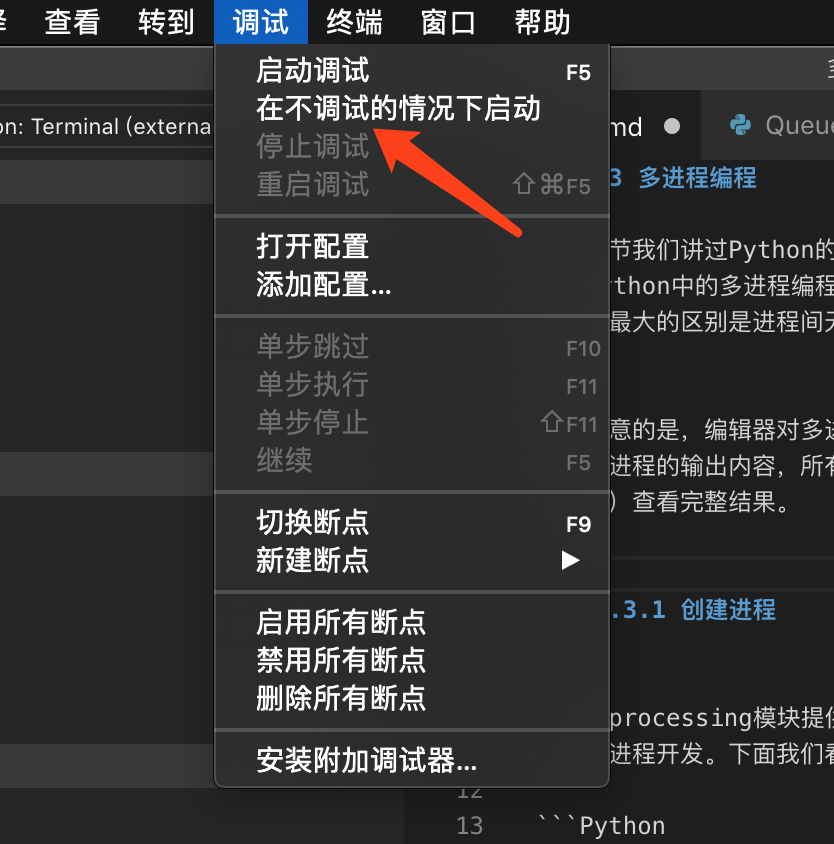
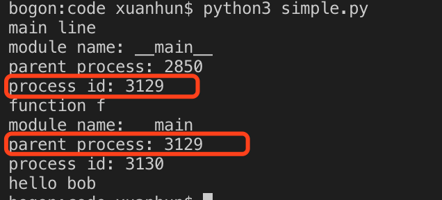
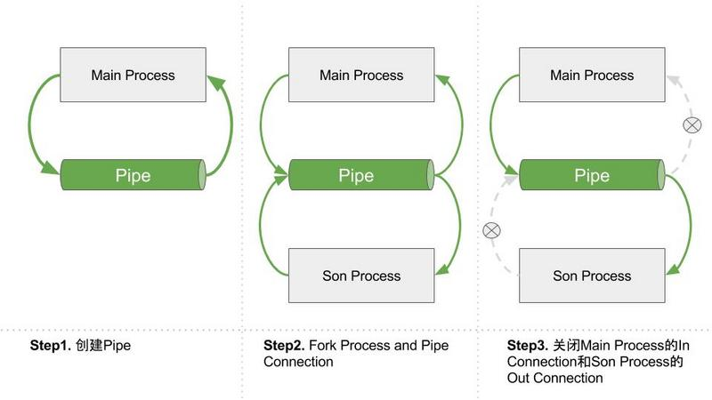
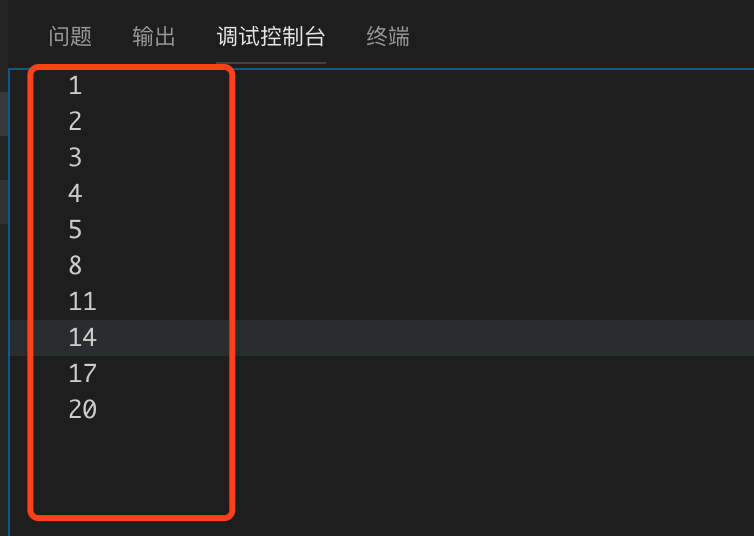

## 2.3 多进程编程

在上一节我们讲过Python的多线程由于全局线程锁的存在并不能实现真正的并行编程，但是Python中的多进程编程模式是可以实现这个目标的。多进程模式下进行上下文切换的损耗要远远大于线程。进程间无法直接共享数据，需要通过Queue、Pipe或则Manager方式做进程间通信。

需要注意的是，编辑器对多进程调试的支持一般都不太好，在vscode中的调试控制台只能打印主进程的输出内容，所有需要在命令行运行脚本（或者在调试菜单中选择不调试模式下运行）查看完整结果。


### 2.3.1 创建进程


multiprocessing模块提供了类似threading模块中多线程编程模式的功能，辅助我们进行多进程开发。下面我们看创建子进程的示例（创建simple.py）：

```Python
# -*- coding: UTF-8 -*-

from multiprocessing import Process
import os

def info(title):
    print(title)
    print('module name:', __name__)
    print('parent process:', os.getppid())
    print('process id:', os.getpid())

def f(name):
    info('function f')
    print('hello', name)

if __name__ == '__main__':
    print('main line')
    p = Process(target=f, args=('bob',))#创建进程
    p.start()
    p.join()
```

Process类定义在multiprocessing模块中，使用方法和Thread类基本类似，具体参数这里就不详细介绍了，参考2.2节即可。和Thread类似，我们使用start方法来启动子进程，使用join方法等待子进程执行完毕才退出。代码中我们使用os.getppid()来获取当前进程的父进程id，使用os.getpid()来获取当前进程的id。和多线程类似，我们可以同时创建多个进程来实现真正的并行任务。

如果想要手动终止进程可以调用p.terminate()。

运行结果如下：



### 2.3.2 进程间通信

多进程之间的通信通过Queue()或Pipe()来实现。

#### Queue

通过Queue可以实现多个进程间的数据共享，Queue类提供了put方法存放数据，get方法获取数据，get方法获取数据的同上会清空队列。新建Queue.py文件，添加如下代码：

```Python
# -*- coding: UTF-8 -*-

from multiprocessing import Process, Queue
import time

def f(q, data):
    q.put(data)#添加数据
def out(q):
    time.sleep(4)
    print(q.get())#获取数据

if __name__ == '__main__':
    q = Queue()#创建Queue实例
    p = Process(target=f, args=(q, [1, 2, 3]))
    p.start()
   
    p.join()

    p1 = Process(target=out,args=(q,))
    p1.start()
    
    p1.join()
  ```
在上面的代码中，我们首先调用Queue()来创建一个Queue的实例，接下来创建了两个子进程p和p1。进程p绑定的函数为f，向Queue中添加数据；进程p1绑定函数out，从Queue中获取数据。运行结果如下：


从运行结果看，两个进程间通过Queue完成了数据共享。

#### Pipe

multiprocessing.Pipe()即管道模式，调用Pipe()返回管道的两端的Connection。Pipe的本质是进程之间的数据传递，而不是数据共享，这和socket有点像。pipe()返回两个连接对象分别表示管道的两端，每端都有send()和recv()方法。如果两个进程试图在同一时间的同一端进行读取和写入那么，这可能会损坏管道中的数据。

新建Pipe.py,添加如下代码：

```Python
# -*- coding: UTF-8 -*-
import multiprocessing 

def consumer(pipe):
    output_p,input_p=pipe
    input_p.close() #关闭管道的输入端
    while True:
        try:
            item=output_p.recv()
            print(item)
        except EOFError:
            break


#生产项目并将其放置到队列上，sequence是代表要处理项目的可迭代对象
def producer(sequence,input_p):
    for item in sequence:
        #将项目放置在队列上
        input_p.send(item)
if __name__=="__main__":
    (output_p,input_p)=multiprocessing.Pipe(True)
    #启动使用者进程
    cons_p=multiprocessing.Process(target=consumer,args=((output_p,input_p),))
    cons_p.start()

    #关闭生产者中的输出管道
    output_p.close()
    print("生产者关闭")
    #生产项目
    sequence=[1,2,3,4]
    producer(sequence,input_p)
    #关闭输入管道，表示完成
    input_p.close()
    #等待使用者进程关闭
    cons_p.join()
```
上面的代码中在主进程中调用multiprocessing.Pipe(True)创建了管道，并返回元组（conn1,conn2），其中conn1和conn2是表示管道两端的Connection对象。Pipe接收一个布尔型参数，默认为true，表示是全双工通信，如果将置为False，conn1只能用于接收，而conn2只能用于发送。必须在创建和启动使用管道的Process对象之前调用Pipe()方法。 

当主进程创建Pipe的时候，Pipe的两个Connections连接的的都是主进程。
当主进程创建子进程后，Connections也被拷贝了一份。此时有了4个Connections。
此后，关闭主进程的一个Out Connection，关闭一个子进程的一个In Connection。那么就建立好了一个输入在主进程，输出在子进程的管道。
原理示意图如下：


应该特别注意管道端点的正确管理问题。如果是生产者或消费者中都没有使用管道的某个端点，就应将它关闭。这也说明了为何在生产者中关闭了管道的输出端，在消费者中关闭管道的输入端。如果忘记执行这些步骤，程序可能在消费者中的recv（）操作上挂起。管道是由操作系统进行引用计数的，必须在所有进程中关闭管道后才能生成EOFError异常。因此，在生产者中关闭管道不会有任何效果，除非消费者也关闭了相同的管道端点。

运行结果如下：


### 2.3.3 进程锁

和多线程编程一样，当多个进程需要访问共享资源的时候，Lock可以用来避免访问的冲突。新建Lock.py，添加如下代码：

```Python
# -*- coding: UTF-8 -*-
import multiprocessing 
import time

def job(v, num, l):
    l.acquire() # 锁住
    for _ in range(5):
        time.sleep(0.1) 
        v.value += num # 获取共享内存
        print(v.value)
    l.release() # 释放

def multicore():
    l = multiprocessing.Lock() # 定义一个进程锁
    v = multiprocessing.Value('i', 0) # 定义共享内存
    p1 = multiprocessing.Process(target=job, args=(v,1,l)) # 需要将lock传入
    p2 = multiprocessing.Process(target=job, args=(v,3,l)) 
    p1.start()
    p2.start()
    p1.join()
    p2.join()

if __name__ == '__main__':
    multicore()
```

上面的代码中，我们通过multiprocessing.Lock()来创建一个进程锁，然后调用
“multiprocessing.Value('i', 0) ”定义了一个共享内存变量v，初始值为0。接下来启动两个线程p1和p2,同时对共享变量v进行操作，为了保证二者互不影响，在方法job中调用了acquire方法和release方法，对期间的代码块加锁，保证同时只能有一个进程修改v的值。运行结果如下：




### 2.3.4 进程池

由于进程启动的开销比较大，使用多进程的时候会导致大量内存空间被消耗。为了防止这种情况发生可以使用进程池。进程池会缓存一些进程在池子中，使用的时候直接拿来用，使用完毕回收到池子中。


进程池中常用方法：
```
apply() 同步执行（串行）
apply_async() 异步执行（并行）
terminate() 立刻关闭进程池
join() 主进程等待所有子进程执行完毕。必须在close或terminate()之后。
close() 等待所有进程结束后，才关闭进程池。
```

新建Pool.py,添加如下代码：

```Python
# -*- coding: UTF-8 -*-

from  multiprocessing import Process,Pool
import time
 
def Foo(i):
    time.sleep(2)
    return i+100
 
def Bar(arg):
    print('-->exec done:',arg)
 
pool = Pool(5)  #允许进程池同时放入5个进程
 
for i in range(10):
    pool.apply_async(func=Foo, args=(i,),callback=Bar)  #func子进程执行完后，才会执行callback，否则callback不执行（而且callback是由父进程来执行了）
 
print('end')
pool.close()
pool.join() #主进程等待所有子进程执行完毕。必须在close()或terminate()之后。
```

进程池内部维护一个进程序列，当使用时，去进程池中获取一个进程，如果进程池序列中没有可供使用的进程，那么程序就会等待，直到进程池中有可用进程为止。在上面的程序中产生了10个进程，但是只能有5同时被放入进程池，剩下的都被暂时挂起，并不占用内存空间，等前面的五个进程执行完后，再执行剩下5个进程。

### 2.3.5 小结

本节介绍了Python中多进程编程的基本概念，后续课程中会继续使用多进程来开发应用。
#### 本节作业
1. 结合2.1，2.2节内容，写一个多进程版本的文件枚举程序，同时输入多个目录，每个子进程负责一个目录递归获取该目录下的所有文件。

下一节我们通过一个综合训练，巩固本章学习的内容。

           欢迎到关注微信订阅号，交流学习中的问题和心得


  


            本系列教程全部内容在星球空间内发布，并提供答疑和辅导。

 


