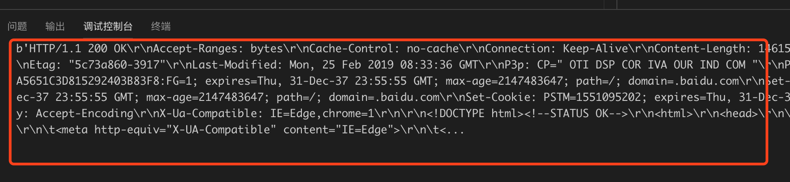
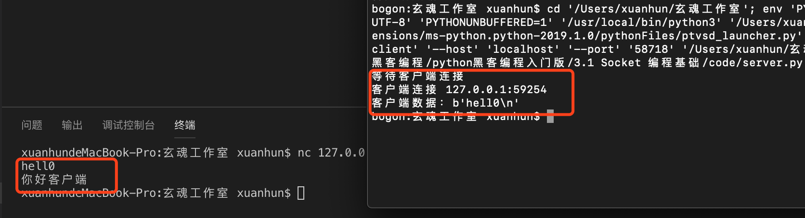

## 3.1 Socket编程基础

从本节开始，我们正式打开网络编程的大门。需要注意的是，网络编程的基础是网络协议，本系列文章中不会系统的讲解协议，希望各位同学努力补充TCP/IP协议的相关内容。

Socket（套接字）编程是众多c/s架构程序基础，游戏、web服务器、绝大多数的木马程序都是基于Socket来实现的。在讲解什么是Socket之前，我们先来简单了解下TCP/IP分层模型。

国际标准化组织（ISO）在1978年提出了“开放系统互联参考模型”，即著名的OSI/RM模型（Open System Interconnection/Reference Model）。它将计算机网络体系结构的通信协议划分为七层，自下而上依次为：物理层（Physics Layer）、数据链路层（Data Link Layer）、网络层（Network Layer）、传输层（Transport Layer）、会话层（Session Layer）、表示层（Presentation Layer）、应用层（Application Layer）。其中第四层完成数据传送服务，上面三层面向用户。

除了标准的OSI七层模型以外，常见的网络层次划分还有TCP/IP四层协议以及TCP/IP五层协议，它们之间的对应关系如下图所示：


四层模型和五层是现实世界中真实存在的，本系列教程遵循4层模型来写作。本章内容集中在网络接口层，实际对应到5层的数据链路层。

Socket（套接字）是一种编程接口，一般面向网络层和传输层协议（套接字并不限于TCP/IP），每个套接字绑定一个ip一个端口。在Internet上的主机一般运行了多个服务软件，同时提供几种服务。每种服务都打开一个Socket，并绑定到一个端口上，不同的端口对应于不同的服务。比如QQ服务端对外绑定8000端口，web服务器一般对外绑定80端口。

Socket（套接字）为BSD UNIX系统核心的一部分，而且他们也被许多其他类似UNIX的操作系统包括Linux所采纳。许多非BSD UNIX系统（如ms-dos，windows，os/2，mac os及大部分主机环境）都以库形式提供对套接字的支持。

了解了基本概念之后，我们来了解下Python的Socket编程接口。

3.1.1 socket 类

Python 提供了两个基本的 socket 模块：

* `socket` 它提供了标准的BSD Socket API。
* `socketserver` 为服务器端编程提供了进一步封装，可以简化网络服务器的开发。

调用socket.socket可以创建一个Socket实例，socket类构造函数声明如下：

```
socket(family, type[,protocal])
```

我们看到socket构造函数接收三个参数，第一个为family。family表示套接字对象使用的地址族，可选值：AF_INET——IPv4地址族，AF_INET6——IPv6地址族，AF_UNIX——针对类UNIX系统的套接字。第二个为type，可使用的类型如下：

socket 类型 | 描述 
:--- | :---
socket.SOCK_STREAM | 基于TCP的流式socket通信
socket.SOCK_DGRAM | 基于UDP的数据报式socket通信
socket.SOCK_RAW | 原始套接字，普通的套接字无法处理ICMP、IGMP等网络报文，而SOCK_RAW可以；其次SOCK_RAW也可以处理特殊的IPV4报文；此外，利用原始套接字，可以通过IP_HDRINCL套接字选项由用户构造IP头
socket.SOCK_SEQPACKET | 可靠的连续数据包服务

第三个参数protocal是协议类型，默认是0表示套接字，在套接字编程中不需要关心该参数。

创建TCP Socket的方法如下：
```Python
sock = socket.socket(socket.AF_INET, socket.SOCK_STREAM)
```
创建UDP Socket的方法如下：
```
sock = socket.socket(socket.AF_INET, socket.SOCK_DGRAM)
```

接下来我们基于socket类来实现简单的客户端和服务端。

### 3.1.2 客户端编程

新建client.py文件，添加如下代码：

```Python
# -*- coding: UTF-8 -*-

import socket
import sys

#测试类
class Client:
    def __init__(self,host):
        self.host=host #待连接的远程主机的域名
    def connet(self): #连接方法
        try:
            s = socket.socket(socket.AF_INET, socket.SOCK_STREAM)
        except socket.error as e:
            print("Failed to create socket. Error: %s"%e)

        sys.exit() #退出进程


if __name__ == '__main__':
    cl = Client('www.baidu.com')
    cl.connet()
```

我们定义一个测试类名为Client，构造函数接收一个域名，用于连接测试。定义了connet方法，创建一个tcp类型的socket实例，向服务端发起连接。该方法最后调用sys.exit()退出。下面我们完善connet方法：

```Python
 def connet(self): #连接方法
        try:
            s = socket.socket(socket.AF_INET, socket.SOCK_STREAM)
        except socket.error as e:
            print("Failed to create socket. Error: %s"%e)
            sys.exit() #退出进程
        try:
            remote_ip = socket.gethostbyname(self.host)#根据域名获取ip
        except socket.gaierror:
            print('主机无法被解析')
            sys.exit() #退出进程
        try:
            s.connect((remote_ip,80))#连接
            message = b"GET / HTTP/1.1\r\n\r\n"
            s.sendall(message)#发送数据
            reply = s.recv(4096)#接收数据
            print(reply)
            s.close()#关闭连接
        except socket.error:
            sys.exit() #退出进程
```
如上，一个简单的客户端完成了，我们首先调用socket.gethostbyname方法，利用传入的host参数获取其远程服务器的ip。接下来调用s.connect方法连接远程主机，注意connect方法的参数为一个元组，由ip和端口组成。主机连接完成，调用 s.sendall方法一次性发送所有数据到服务端，这里需要注意发送的数据必须是二进制格式。当数据比较大的时候需要使用send方法循环发送。接收服务器的响应使用s.recv方法，该方法的参数为一次接收的数据大小，当数据很大或者不知道具体大小的时候，需要循环接收。 最后调用s.close方法关闭连接。这个最简单客户端程序，实际上是发出了一个Http 的get请求，我们看下运行结果：



现在简单总结下Socket客户端编程的基本步骤：
1. 创建套接字

2. 连接服务端

3. 发送数据

4. 接收数据

5. 关闭连接

下面我们再看最基本的服务端编程。

### 3.1.3 服务端编程

新建server.py文件，添加如下代码：

```Python
# -*- coding: UTF-8 -*-

import socket
import sys

class server:
    def __init__(self,ip,port):
        self.port=port
        self.ip=ip
    def start(self):
        s = socket.socket(socket.AF_INET,socket.SOCK_STREAM)#创建socket
        try:
            s.bind((self.ip,self.port))#绑定
            s.listen(10)#监听
            print('等待客户端连接')
            conn, addr = s.accept()#接收连接
            print('客户端连接 ' + addr[0] + ':' + str(addr[1]))
            data = conn.recv(1024)#接收数据
            print("客户端数据：%s"%data)
            conn.sendall(bytes("你好客户端\n\r", encoding = "utf8"))#发送数据
            conn.close()#关闭连接
           
        except socket.error as e:
            print(e)
            sys.exit()
        finally:
             s.close() #关闭服务端


if __name__ == '__main__':
    s = server('',8800)
    s.start()

```
server类的start方法创建了一个简单的服务端。和客户端编程类似，我们首先创建一个socket对象。随后，我们要把socket绑定到传入的IP和端口上，调用bind方法，传入ip和端口号。服务端不会主动连接其他主机，而是等待客户端连接，这需要进入监听状态，listen方法接收一个参数，用来指定可以同时挂起的连接数。监听模式之后，如果有客户端连接进来，如何接收连接呢？需要使用accept方法。accept方法会返回一个代表当前链接的connection对象和客户端的ip地址。接下来就可以使用conn对象来接收和发送数据了，最后调用conn.close()关闭和客户端的连接。下面我们启动服务端，然后再命令行启动nc，来连接服务端。



从上图我们可以看到，通过nc连接到服务端之后，服务端会打印连接的客户端信息，客户端输入“hello”，服务端接收后返回“你好客户端”，然后关闭连接。

### 3.1.4  小结

本节我们完成了最简单的客户端和服务端编程，同学们需要掌握建立客户端和服务端的基本步骤和api的使用。 下一节我们会继续改善本节的内容，创建基于多线程和多进程的服务端，使我们的客户端和服务端能正常通信，反复交流。

           欢迎到关注微信订阅号，交流学习中的问题和心得


  

            本系列教程全部内容在星球空间内发布，并提供答疑和辅导。

 