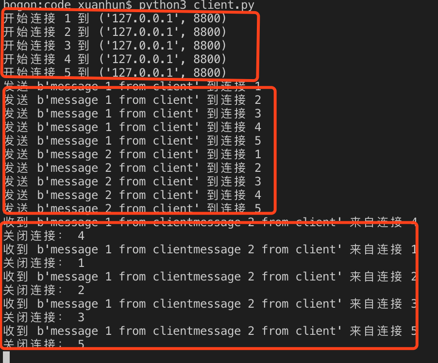
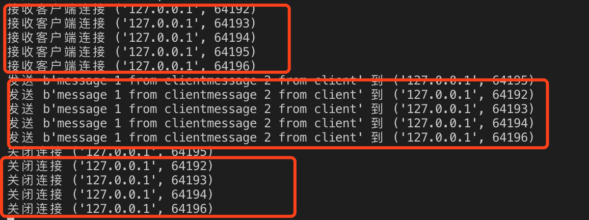
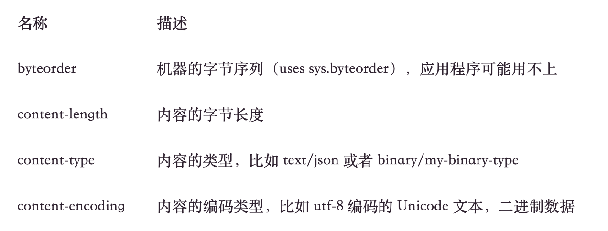
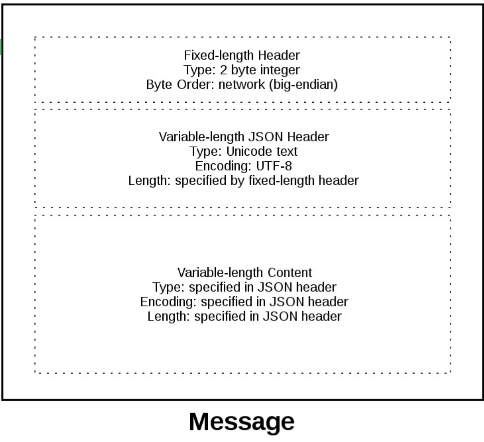

## 3.3 多连接、非阻塞的服务端、客户端编程

上一节我们在基本的客户端和服务端编程模型基础上，实现了一个简单的木马。多客户端同时连接服务端的场景下，处理起来要复杂得多，通常的解决方案是利用多线程或者多进程来解决并发问题，但是编程难度成倍提升。在Python中我们还有一个折中的选择就是selectors模块，该模块基于Unix经典的select系统调用模型，它可以监听I/O操作的结果以实现异步调用，基于此种方案可以同时挂起多个socket连接，根据读写状态进行回调。内部原理我们在本系列文章中不做过多解释，同学们掌握基本用法即可。模块参考：https://docs.python.org/3/library/selectors.html。

同时在数据收发上，可能会出现“粘包”的情况，需要自定义数据封包协议来解决这样的问题。

```
什么是粘包？

1.发送端为了将多个发往接收端的包，更有效的发到对方，使用了优化方法（Nagle算法），将多次间隔较小、数据量小的数据包，合并成一个大的数据包发送(把发送端的缓冲区填满一次性发送)。

2接收端底层会把tcp段整理排序交给缓冲区，这样接收端应用程序从缓冲区取数据就只能得到整体数据而不知道怎么拆分

比如发送端发送了一个由2个100字节组成的200字节的数据包到接受端的缓冲区，接受端从缓冲去一次取80字节的数据，那么第一次取的就是一个不完整的数据包，第二次取就会带上第一个数据包的尾部和下一个数据包的头部数据。

```

下面我们开始基于selectors构建服务端和客户端。

### 3.3.1 服务端编程

首先创建server.py 文件，添加如下代码：

```Python
# -*- coding: UTF-8 -*-

import socket
import sys
import selectors#导入selectors模块

class server:
    def __init__(self,ip,port):
        self.port=port
        self.ip=ip
        self.selector  = selectors.DefaultSelector()#初始化selector

    def start(self):
        s = socket.socket(socket.AF_INET,socket.SOCK_STREAM)
        try:
            s.bind((self.ip,self.port))
            s.listen()
            print('等待监听：',(self.ip,self.port))
            s.setblocking(False) # 非阻塞
            self.selector.register(s,selectors.EVENT_READ,None)#注册I/O对象
           
        except socket.error as e:
            print(e)
            sys.exit()
        finally:
             s.close() 


if __name__ == '__main__':
    s = server('',8800)
    s.start()
```

上面的代码和3.1，3.2节略有差异，基本的socket初始化、绑定、监听都是一致的，不再重复讲解。注意代码中四处添加注释的地方：

1. 
```Python
import selectors#导入selectors模块
```
导入selectors模块

2. 
```Python
self.selector  = selectors.DefaultSelector()#初始化selector
```
初始化selector有多种方法，我们选择最简单的一种方案，直接调用DefaultSelector()方法。

3. 
```Python
s.setblocking(False) # 非阻塞
```
这一步很关键，调用之后，socket调用将不再阻塞当前程序。

4. 

```Python
 self.selector.register(s,selectors.EVENT_READ,data=None)#注册I/O对象
```
注册s到selector中，监听事件为selectors.EVENT_READ，通过监听该事件，服务端socket接收到新连接请求会被selector捕获到。data参数用来存储socket中的数据，当 select() 返回的时候它也会被返回。我们将使用 data 来跟踪 socket 上发送或者接收的数据。

监听数据收发，需要建立一个while...true循环，不停的询问各个连接的状态，目前我们只注册了一个服务端socket，下面我们在循环中获取新的客户端连接并注册到selector中。继续完善start方法：

```Python
  def start(self):
        s = socket.socket(socket.AF_INET,socket.SOCK_STREAM)
        try:
            s.bind((self.ip,self.port))
            s.listen()
            print('等待监听：',(self.ip,self.port))
            s.setblocking(False) # 非阻塞
            self.selector.register(s,selectors.EVENT_READ,None)#注册I/O对象
            while True:
                events = self.selector.select(timeout=None)#阻塞调用，等待新的读/写事件
                for key, mask in events:
                    if key.data is None:#新的连接请求
                        self.accept_wrapper(key.fileobj)
                    else:#收到客户端连接发送的数据
                        self.service_connection(key, mask)
        except socket.error as e:
            print(e)
            sys.exit()
        finally:
             s.close() #关闭服务端

  def accept_wrapper(self,sock):
        pass

  def service_connection(self,key, mask):
        pass
```
<i>sel.select(timeout=None)</i> 调用会阻塞直到新的消息进来。它返回一个(key, events) 元组，每个 socket 一个。key 就是一个包含 fileobj 属性的具名元组。key.fileobj 是一个 socket 对象，mask 表示一个操作就绪的事件掩码。

如果<i>key.data</i>为空，我们就可以知道它来自于监听服务端的socket（代码中的s），我们需要调用 accept()方法来授受连接请求。这里我们将定义一个新的<i>accept_wrapper</i>方法来处理请求并注册到selector中。
如果<i>key.data</i>不为空，那它一定是一个已经被接收的客户端socket，我们定义一个新的<i>service_connection(key, mask)</i>方法来处理收据的收发。

<i>accept_wrapper()</i>方法内容如下：

```Python
def accept_wrapper(self,sock):
        conn, addr = sock.accept()  # Should be ready to read
        print('接收客户端连接', addr)
        conn.setblocking(False) #非阻塞
        data = types.SimpleNamespace(addr=addr, inb=b'', outb=b'')#socket数据
        events = selectors.EVENT_READ | selectors.EVENT_WRITE #监听读写
        self.selector.register(conn, events, data=data)#注册客户端socket
```

上面的代码中，我们调用<i>types.SimpleNamespace</i>来创建一个动态对象，保存我们需要的信息，这里定义了addr（ip地址）、inb（传入数据）、outb（传出数据）三个字段。接下来注册的事件选择读和写，可以在循环中获取连接的可读、可写状态。

下面我们来看一下service_connection方法的内部逻辑：

```Python
def service_connection(self,key, mask):
        sock = key.fileobj
        data = key.data
        if mask & selectors.EVENT_READ:
            recv_data = sock.recv(1024)  # 接收数据
            if recv_data:
                data.outb += recv_data
            else:#客户端断开连接
                print('closing connection to', data.addr)
                self.selector.unregister(sock)#取消注册，防止出错
                sock.close()
        if mask & selectors.EVENT_WRITE:
            if data.outb:
                print('echoing', repr(data.outb), 'to', data.addr)
                sent = sock.send(data.outb)  
                data.outb = data.outb[sent:] #情况缓存数据
```
这里是多连接服务端的核心部分，key是select()方法返回的一个元组，它包含了socket对象「fileobj」和数据对象；mask包含了获取状态的类型。
```Python
if mask & selectors.EVENT_READ
```

如果socket就绪而且可以被读取，mask & selectors.EVENT_READ 就为真，就调用sock.recv()接收客户端发送过来的数据。所有读取到的数据都会被追加到data.outb里面，作为测试data.outb随后被发送回客户端。如果没有接收到数据，证明客户端已经断开连接，这里除了要调用sock.close()关闭连接之外，还要调用selector.unregister方法进行注销。

随后，判断当前socket处于可写状态的话，就会调用sock.send发送数据，发送之后清空缓存数据。

服务端程序基本完成，下面继续编写客户端程序。

### 3.3.2 客户端编程

新建client.py 文件，添加如下代码：

```Python
# -*- coding: UTF-8 -*-

import socket
import sys
import selectors
import types

# 测试类


class Client:
    def __init__(self, host, port, numConn):
        self.host = host  # 待连接的远程主机的域名
        self.port = port
        self.message = [b'message 1 from client', b'message 1 from client']
        self.numConn = numConn
        self.selector = selectors.DefaultSelector()

    def connet(self):  # 连接方法
        server_addr = (self.host, self.port)
        for i in range(0, self.numConn):
            connid = i + 1
            print('开始连接', connid, '到', server_addr)
            sock = socket.socket(socket.AF_INET, socket.SOCK_STREAM)
            sock.setblocking(False)
            sock.connect_ex(server_addr)#连接服务端
            events = selectors.EVENT_READ | selectors.EVENT_WRITE
            data = types.SimpleNamespace(connid=connid,
                                     msg_total=sum(len(m) for m in self.message),
                                     recv_total=0,
                                     messages=list(self.message),
                                     outb=b'')
            self.selector.register(sock, events, data=data)

        try:
            while True:
                events = self.selector.select(timeout=1)
                if events:
                    for key, mask in events:
                        self.service_connection(key, mask)

        finally:
            self.selector.close()
        
    def service_connection(self,key, mask):
        sock = key.fileobj
        data = key.data
        if mask & selectors.EVENT_READ:
            recv_data = sock.recv(1024)  
            if recv_data:
                print("收到", repr(recv_data), "来自连接", data.connid)
                data.recv_total += len(recv_data)
            if not recv_data or data.recv_total == data.msg_total:#根据接收数据的长度，判断是否关闭客户端
                print("关闭连接：", data.connid)
                self.selector.unregister(sock)
                sock.close()
        if mask & selectors.EVENT_WRITE:
            if not data.outb and data.messages:
                data.outb = data.messages.pop(0)
            if data.outb:
                print("发送", repr(data.outb), "到连接", data.connid)
                sent = sock.send(data.outb)  #发送数据
                data.outb = data.outb[sent:]#清空数据


if __name__ == '__main__':
    cl = Client('127.0.0.1', 8800, 5)
    cl.connet()
```
客户端代码涉及到的知识点和和服务端基本相同。在连接服务端的时候，由于connect()方法会立即触发一个 BlockingIOError异常，所以我们使用connect_ex()方法取代它。connect_ex()会返回一个错误指示 errno.EINPROGRESS，不像connect()方法直接在进程中返回异常。一旦连接成功socket就可以进行读写并且通过select()方法返回。

在service_connection方法中客户端会跟踪从服务器接收的字节数，根据结果来决定是否关闭socket连接。

###  3.3.3 测试服务端和客户端

下面我首先启动服务端：


再启动客户端：



对应的服务端打印数据为：



### 3.3.4 还有哪些问题需要解决？

当使用 TCP 连接时，会从一个连续的字节流读取的数据，好比从磁盘上读取数据，不同的是你是从网络读取字节流。然而，和使用 f.seek() 读文件不同，没法定位 socket 的数据流的位置，如果可以像文件一样定位数据流的位置（使用下标），那你就可以随意的读取你想要的数据。当字节流入你的 socket 时，会需要有不同的网络缓冲区，如果想读取他们就必须先保存到其它地方，使用 recv() 方法持续的从 socket 上读取可用的字节流相当于从 socket 中读取的是一块一块的数据，你必须使用 recv() 方法不断的从缓冲区中读取数据，直到你的应用确定读取到了足够的数据。

什么时候算“足够”这取决于你的定义，就 TCP socket 而言，它只通过网络发送或接收原始字节，它并不了解这些原始字节的含义。

这可以让我们定义一个应用层协议，来解决这个问题，类似于HTTP协议。简单来说，你的应用会发送或者接收消息，这些消息其实就是你的应用程序的协议。这些消息的长度、格式可以定义应用程序的语义和行为，这和我们之前说的从socket 中读取字节部分内容相关，当你使用 recv() 来读取字节的时候，你需要知道读的字节数，并且决定什么时候算读取完成。这些都是怎么完成的呢？在每条消息前面追加一个头信息，头信息中包括消息的长度和其它我们需要的字段。这样做的话我们只需要追踪头信息，当我们读到头信息时，就可以查到消息的长度并且读出所有字节。


让我们来定义一个完整的协议头：

1. 可变长度的文本
2. 基于 UTF-8 编码的 Unicode 字符集
3. 使用 JSON 序列化的一个 Python 字典

其中必须具有的头应该有以下几个：



这些头信息告诉接收者消息数据，这样的话你就可以通过提供给接收者足够的信息让他接收到数据的时候正确的解码的方式向它发送任何数据，由于头信息是字典格式，你可以随意向头信息中添加键值对。

不过还有一个问题，由于我们使用了变长的头信息，虽然方便扩展但是当你使用 recv() 方法读取消息的时候怎么知道头信息的长度呢？

我们前面讲到过使用 recv() 接收数据和如何确定是否接收完成，我说过定长的头可能会很低效，的确如此。但是我们将使用一个比较小的 2 字节定长的头信息前缀来表示头信息的长度。
为了给你更好地解释消息格式，让我们来看看消息的全貌：



消息以 2字节的固定长度的头开始，这两个字节是整型的网络字节序列，表示下面的变长 JSON 头信息的长度，当我们从 recv() 方法读取到 2 个字节时就知道它表示的是头信息长度的整形数字，然后在解码 JSON 头之前读取固定长度的字节数。JSON 头包含了头信息的字典。其中一个就是 content-length，这表示消息内容的数量（不是JSON头），当我们使用 recv() 方法读取到了 content-length 个字节的数据时，就表示接收完成并且读取到了完整的消息。

另外数据传输还涉及大小端的问题，不同的CPU架构处理网络传输数据的字节顺序是不一样的，下面引用维基百科的解释：
```
字节顺序，又称端序或尾序（英语：Endianness），在计算机科学领域中，指存储器中或在数字通信链路中，组成多字节的字的字节的排列顺序。

在几乎所有的机器上，多字节对象都被存储为连续的字节序列。例如在C语言中，一个类型为int的变量x地址为0x100，那么其对应地址表达式&x的值为0x100。且x的四个字节将被存储在存储器的0x100, 0x101, 0x102, 0x103位置。[1]

字节的排列方式有两个通用规则。例如，一个多位的整数，按照存储地址从低到高排序的字节中，如果该整数的最低有效字节（类似于最低有效位）在最高有效字节的前面，则称大端序；反之则称小端序。在网络应用中，字节序是一个必须被考虑的因素，因为不同机器类型可能采用不同标准的字节序，所以均按照网络标准转化。

例如假设上述变量x类型为int，位于地址0x100处，它的值为0x01234567，地址范围为0x100~0x103字节，其内部排列顺序依赖于机器的类型。大端法从首位开始将是：0x100: 01, 0x101: 23,..。而小端法将是：0x100: 67, 0x101: 45,..
```

在小端机器上执行
```
$ python3 -c 'import sys; print(repr(sys.byteorder))'
'little'
```
可以得到’little'的结果。如果我把这段代码跑在可以模拟大字节序 CPU「PowerPC」的虚拟机上的话，应该是下面的结果：
```
$ python3 -c 'import sys; print(repr(sys.byteorder))'
'big'
```
如果不想处理字节序的问题，可以通过传输unicode编码的数据来规避，比如我们使用的UTF-8编码。

### 3.3.5 小结

本节学习了基于selectors模块，结合while...true实现事件循环，最终实现多连接非阻塞的客户端/服务端程序的编写。对于TCP数据传输“粘包”的问题没有给出代码实现，但是给出了自定义协议的解决方案。本节的作业如下：

1. 将自定义协议的方案整合到客户端和服务端中，实现发送任意长度的数据

下一节我们学习网络工具包Scapy的基本使用。


           欢迎到关注微信订阅号，交流学习中的问题和心得


  

            本系列教程全部内容在玄说安全--入门圈发布，并提供答疑和辅导。

 
