## 3.4 Scapy基础

Scapy是一个强大的交互式数据包处理程序（使用python编写）。它能够伪造或者解码大量的网络协议数据包，能够发送、捕捉、匹配请求和回复包等等。它可以很容易地处理一些典型操作，比如端口扫描，tracerouting，探测，单元 测试，攻击或网络发现（可替代hping，NMAP，arpspoof，ARP-SK，arping，tcpdump，tethereal，P0F等）。 最重要的他还有很多更优秀的特性——发送无效数据帧、注入修改的802.11数据帧、在WEP上解码加密通道（VOIP）、ARP缓存攻击（VLAN）等，这也是其他工具无法处理完成的。

本章的大部分工具开发都是基于Scapy来开发的，所以各位同学务必熟悉Scapy的基本使用方法。

Scapy可以通过命令行和Python调用两种方式来进行使用。在使用之前请确保已经安装Scapy。

### 3.4.1 Scapy安装

通过命令

```shell
pip3 install scapy
```
来安装scapy。

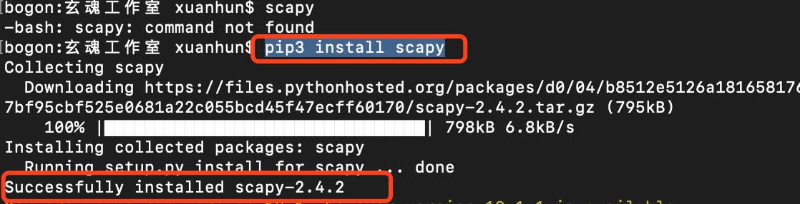

安装之后可以在终端启动。因为发送数据包需要root权限，所以使用sudo启动。

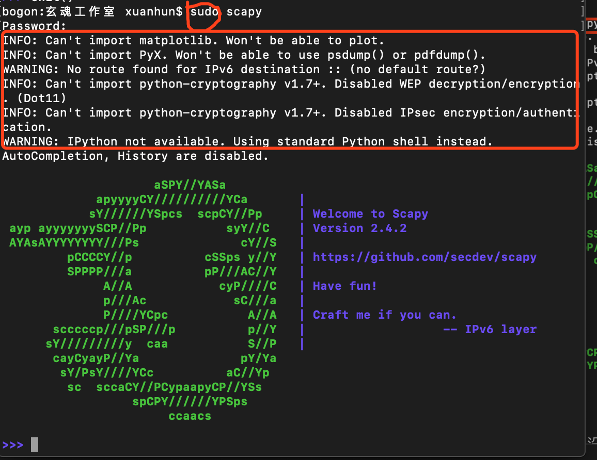

注意上图中的INFO信息，如果没有安装可选包，部分功能不可用，在需要的时候单独安装即可。

### 3.4.2 基本命令

ls()显示scapy支持的所有协议。

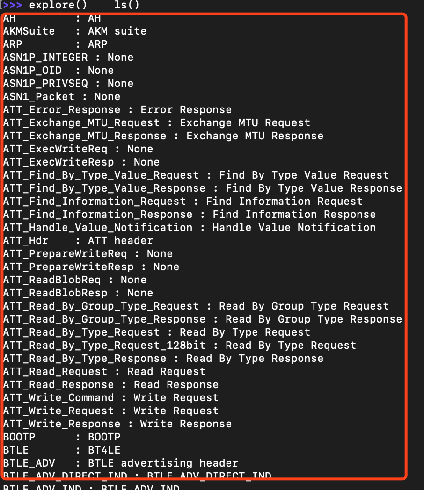

这个命令足以体现Scapy的强大，上百种网络协议，直接秒杀其他工具。ls()函数的参数还可以是上面支持的协议中的任意一个的类型属性，也可以是任何一个具体的数据包，如ls(TCP),ls(newpacket)等。输入ls(TCP)会显示TCP方法构造对象的内容属性。

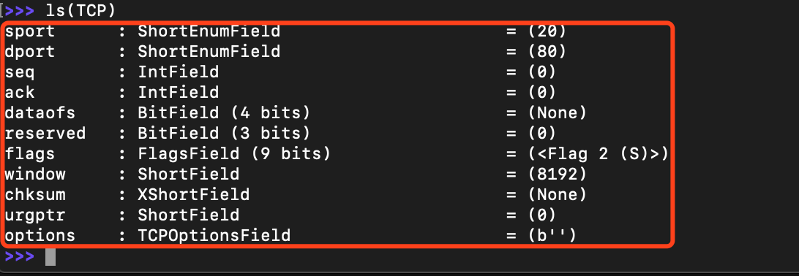

lsc()列出scapy支持的所有的命令。

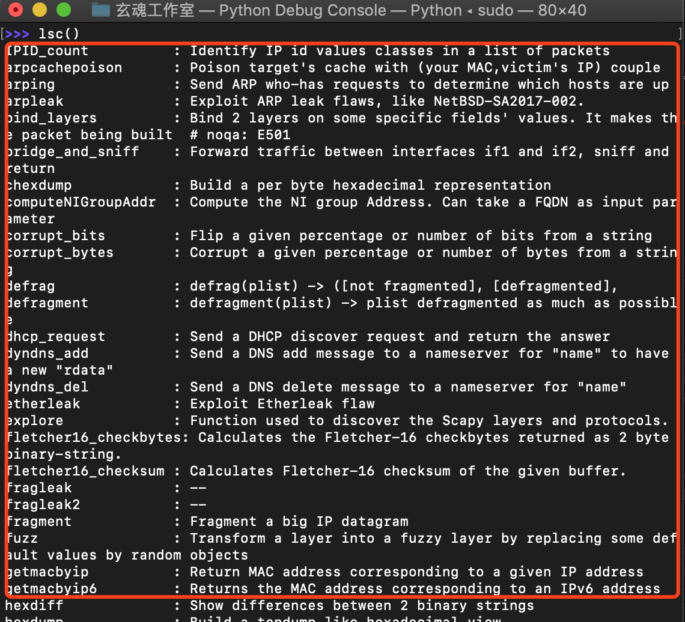

help()显示某一命令的使用帮助，如help(sniff)。

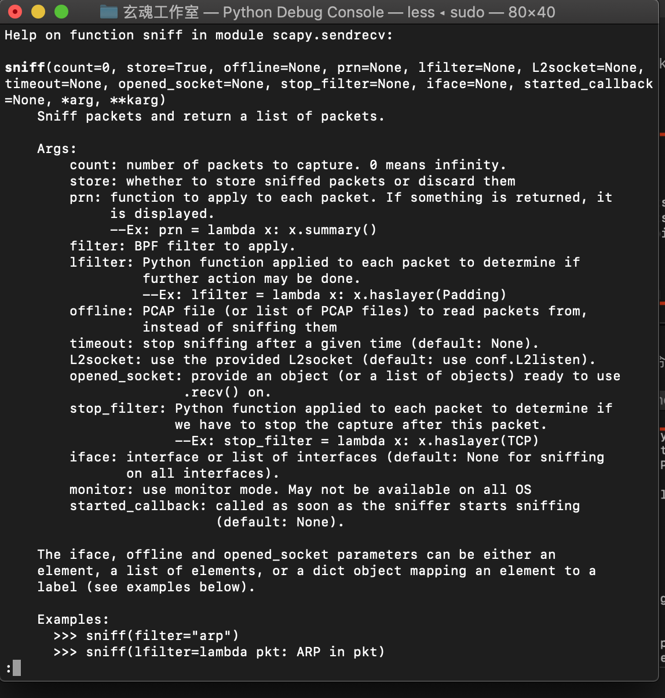

show()显示指定数据包的详细信息。例如，这里我们先创建一个IP数据包，然后调用show方法。

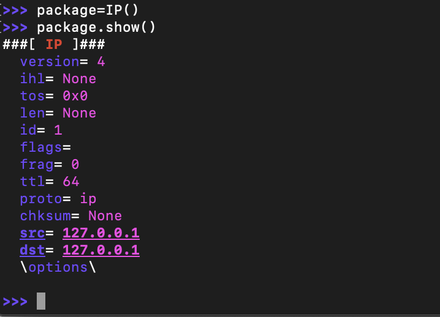

### 3.4.3 综合练习

下面我们通过几个小例子，来加深对Scapy的理解。

我们可以使用Scapy来构造从数据链路层到应用层的任一层的数据包，需要各位同学参考不同协议的报文格式来练习。下面我构造一个IP数据包，先使用ls命令显示IP命令的参数。

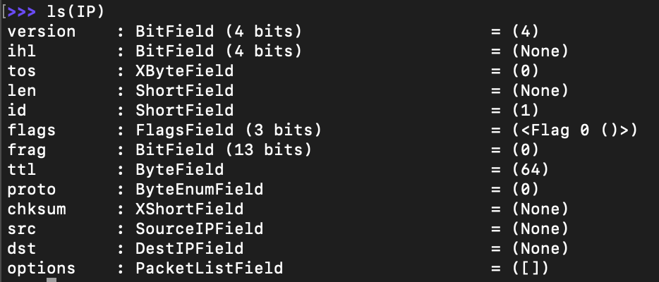

每个字段是和IP协议一一对应的如下图：

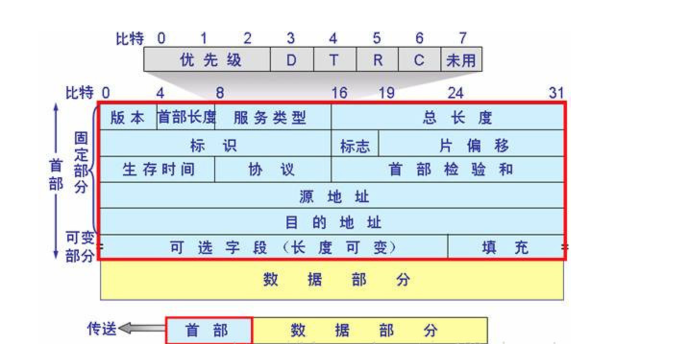

构造其他协议的数据包类似，只需要传入我们想要设置的值就可以了,返回的数据包对象可以再次修改。例如：

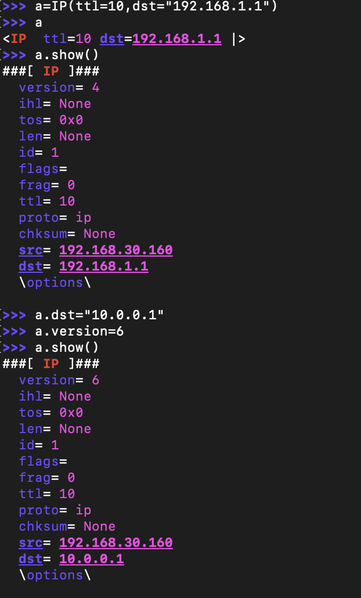


因为网络数据包是层层包裹的，根据情况需要，也需要我们构建不同层的数据报文然后组合起来发送出去。使用"/"可以组合不同层的报文。 比如下面wireshark捕获的一个https报文：


如果想从数据链路层将数据发送出去，就需要构造以太网帧数据，IP数据报文和TCP报文，并将三者组合起来发送出去。看下面的示例：

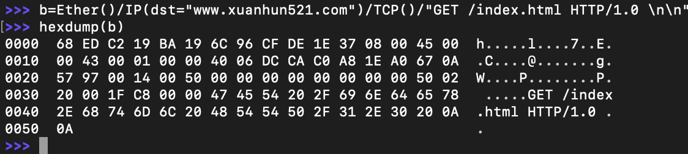
上图中我们使用了hexdump()函数， 使用hexdump()函数会以经典的hexdump格式输出数据包。

发送数据包可以使用的方法有两个send()和sendp()。send()函数将会在第3层发送数据包，也就是说它会为你处理路由和第2层的数据。sendp()函数将会工作在第2层。我们可以根据实际情况来决定使用哪个方法来发送数据。使用方法如下：

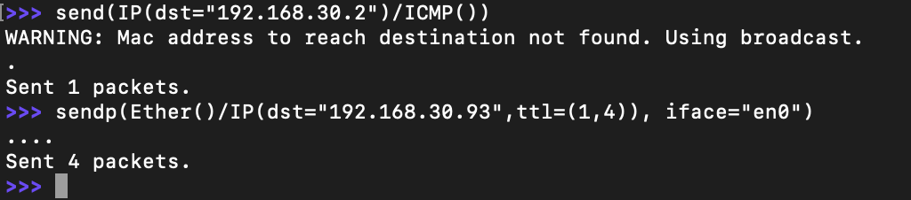

如果想要发送数据之后等待响应，可以使用sr()、sr1()或者srp()方法。sr()函数是用来发送数据包和接收应答。该函数返回一对数据包及其应答，还有无应答的数据包。sr1()函数是一种变体，用来返回一个应答数据包。发送的数据包必须是第3层报文（IP，ARP等）。srp()则是使用第2层报文（以太网，802.3等）。下面发送一个DNS查询的报文出去，接收查询结果。

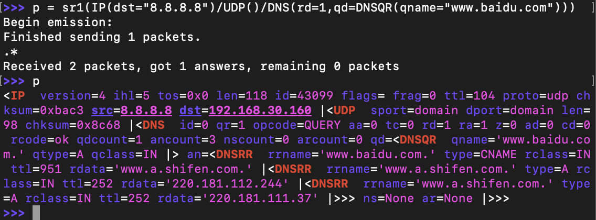

注意上图中我们使用了DNS()方法帮助构造应用层（DNS）的报文内容。

实际上接收的数据返回两个列表，第一个就是发送的数据包及其应答组成的列表，第二个是无应答数据包组成的列表。为了更好地呈现它们，它们被封装成一个对象，并且提供了一些便于操作的方法。 下面我们实现一个简单的SYN端口扫描：

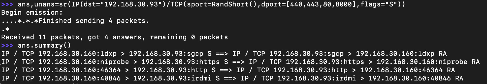

通常我们需要将数据包文件导出为pcap文件备用，需要的时候再导入，方法如下：

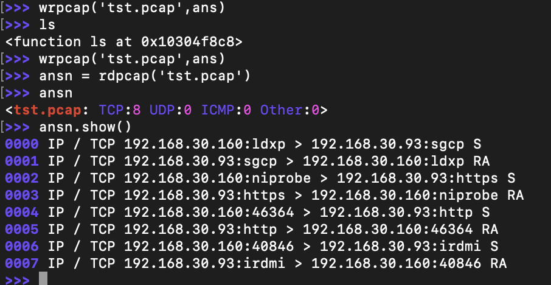

使用str()函数可以将整个数据包转换成十六进制字符串：

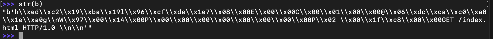

使用export_object()函数，Scapy可以数据包转换成base64编码的Python数据结构：

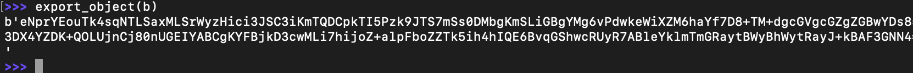

除此之外，如果您已经安装PyX，您可以做一个数据包的图形PostScript/ PDF转储,完整的输出命令列表如下：

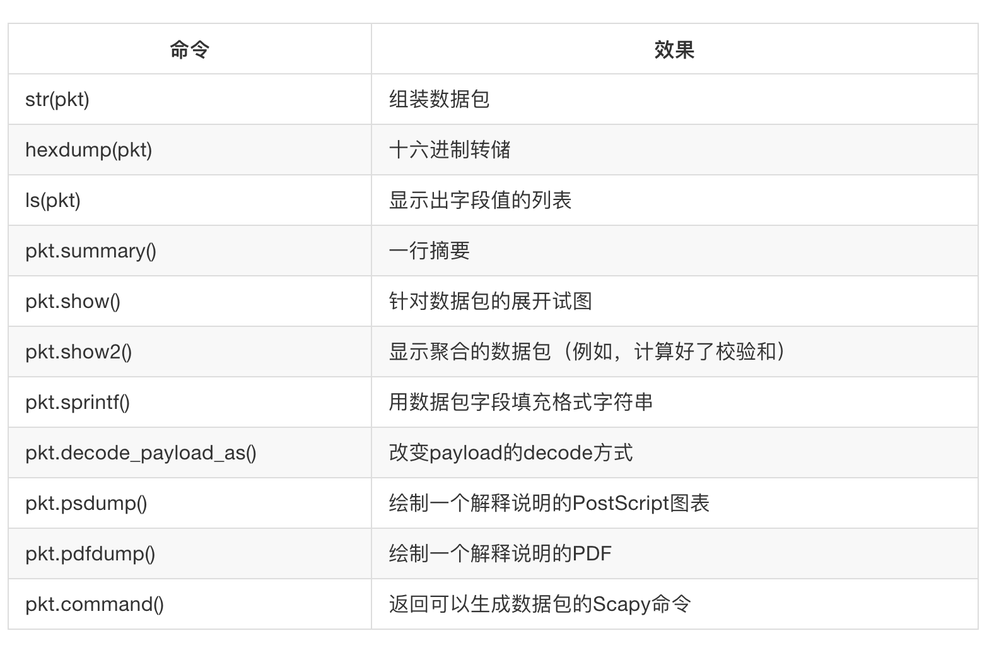

输出pdf示例如下：

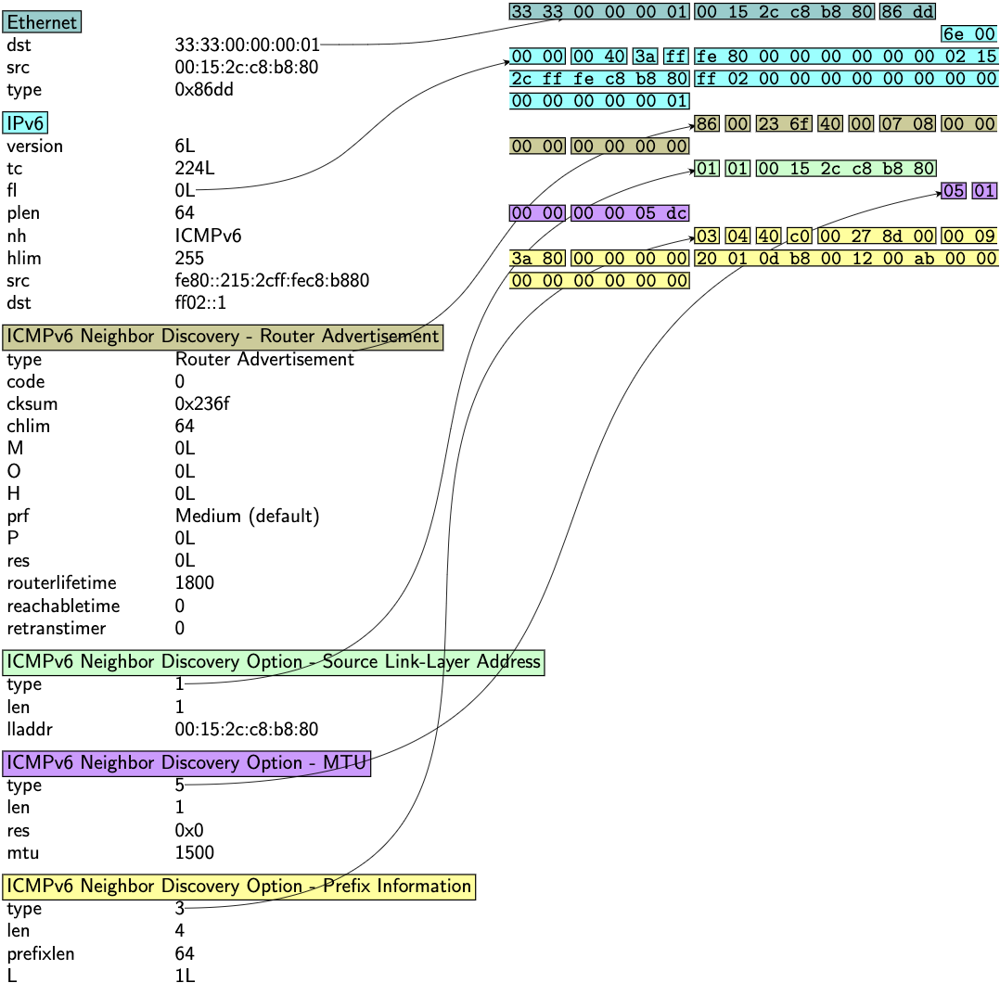

### 3.4.4 在Python中使用Scapy

在Python中调用Scapy很简单，只需要导入模块即可。

新建useScapy.py文件，添加如下代码：

```Python
# -*- coding: UTF-8 -*-

import sys
from scapy.all import *

p=sr1(IP(dst='192.168.1.1')/ICMP())
if p:
    p.show()
```

结果如下：

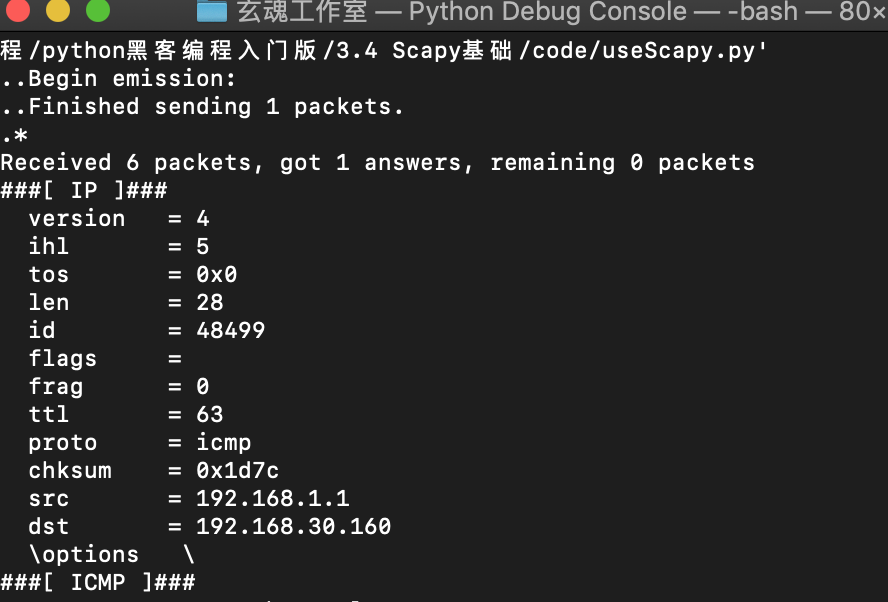

### 3.4.5 小结

本节作为后面几个小节的前置知识，介绍了Scapy工具包的基本使用，更多的功能会在后面的章节继续介绍，同时建议各位同学阅读官方文档，全面了解。本节作业如下：

1. 安装Scapy
2. 属性基本的命令操作
3. 在Python中进行调用，实现ARP数据包的发送


下一节我们下沉到网络接口层，实现ARP欺骗工具。


           欢迎到关注微信订阅号，交流学习中的问题和心得


  

            本系列教程全部内容在玄说安全--入门圈发布，并提供答疑和辅导。

 