## 3.6 网络嗅探

网络嗅探，是监听流经本机网卡数据包的一种技术，嗅探器就是利用这种技术进行数据捕获和分析的软件。

编写嗅探器，捕获数据是前置功能，数据分析要建立在捕获的基础上。本节就数据捕获的基本原理和编程实现做详细的阐述。

### 3.6.1 以太网网卡的工作模式

]

以太网网卡是我们日常生活中见得最多的网卡，常用的以太网卡支持以下工作模式：广播模式、多播模式、直接模式和混杂模式。

1. 广播模式（Broad Cast Model）:它的物理地址（MAC）地址是 0Xffffff 的帧为广播帧，工作在广播模式的网卡接收广播帧。它将会接收所有目的地址为广播地址的数据包，一般所有的网卡都会设置为这个模式。

2. 多播传送（MultiCast Model）：多播传送地址作为目的物理地址的帧可以被组内的其它主机同时接收，而组外主机却接收不到。但是，如果将网卡设置为多播传送模式，它可以接收所有的多播传送帧，而不论它是不是组内成员。当数据包的目的地址为多播地址，而且网卡地址是属于那个多播地址所代表的多播组时，网卡将接纳此数据包，即使一个网卡并不是一个多播组的成员，程序也可以将网卡设置为多播模式而接收那些多播的数据包。

3. 直接模式（Direct Model）:工作在直接模式下的网卡只接收目地址是自己 Mac地址的帧。只有当数据包的目的地址为网卡自己的地址时，网卡才接收它。

4. 混杂模式（Promiscuous Model）:工作在混杂模式下的网卡接收所有的流过网卡的帧，信包捕获程序就是在这种模式下运行的。网卡的缺省工作模式包含广播模式和直接模式，即它只接收广播帧和发给自己的帧。如果采用混杂模式，网卡将接受同一网络内所有主机发送的数据包。

利用网卡混杂模式的特性，就可以到达对于网络信息监听捕获的目的。

需要注意的是，并不是任何情况下，网络中的数据都会流经你的网卡，比如交换机网络，交换机会绑定端口和MAC，此时就需要上一章讲到的ARP欺骗了。

### 3.6.2 设置网卡为混杂模式

在Linux中，我们可以通过ifconfig和iwconfig配置网络接口的信息。正常情况下输入ifconfig，虚拟机中显示如下：

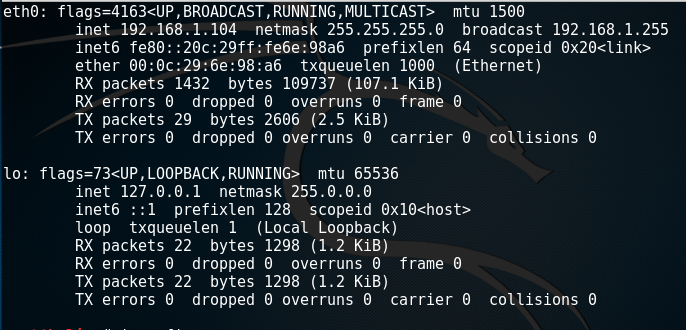]

通过命令
```
ifconfig eth0 promisc
```
可以将eth0设置为混杂模式,下图中圈红的部分，表示当前网卡处于混杂模式。
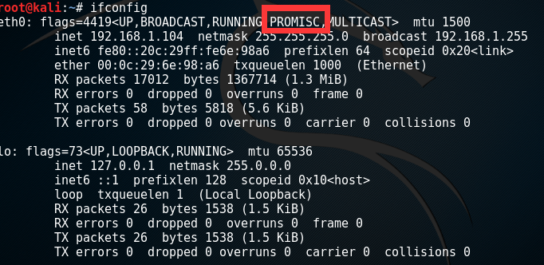]

通过
```
ifconfig eth0 -promisc
```
可以取消网卡的混杂模式。

ifconfig 对无线网卡同样适用。

windows 下设置混杂模式的手工模式如下：

 1. 打开网络和共享中心,点击“本地连接”，选择“属性”，选择“配置”。
 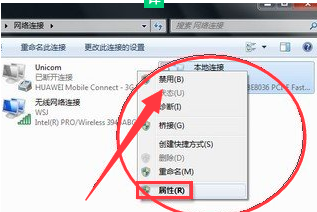]
  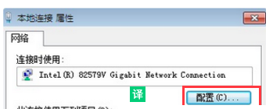]
 2. 选择“高级”选项卡，选择“速度和双工”，“值”选择“自动协商”，保存设置。
 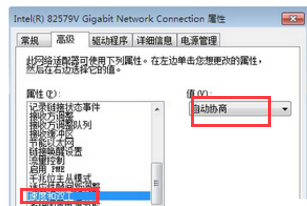]


 ### 3.6.3 无线网卡的监听模式

 对于无线网卡，我们可以使用iwconfig的mode参数来配置混杂模式，mode的选项值如下：

1) Ad-hoc：不带AP的点对点无线网络

2) Managed：通过多个AP组成的网络，无线设备可以在这个网络中漫游

3) Master：设置该无线网卡为一个AP

4) Repeater：设置为无线网络中继设备，可以转发网络包

5) Secondary：设置为备份的AP/Repeater

6) Monitor：监听模式

7) Auto：由无线网卡自动选择工作模式   

使用如下命令可以设置无线网卡为监听模式：

```
ifconfig wlan0 down
iwconfig wlan0 mode monitor
ifconfig wlan0 up
```

在 kali linux中我们通过iwconfig来设置监听模式，可能会遇到点困难，无线网卡设置成监听模式后，过几秒又变成manage模式了。这是由于Network Manage服务造成，我们可以关闭该服务。

监听模式和上文的混杂模式有什么区别呢？

<b>混杂模式是在wifi连接到指定网络中，监听子网中的数据传输；监听模式下wifi会断网，进而监听某一个信道内所有传输流量，因此可以用来扫描wifi热点，破解wifi密码等工作。</b>

### 3.6.4 基于Raw Socket的Sniffer开发

Raw Socket是一种较为底层的socket编程接口，可以用来获取IP层以上的数据，所以可以用来编写Sniffer。一个完整的sniffer代码组成，大致分为创建socket对象，接收数据，分析数据三个部分。其中开启网卡的混杂模式，需要配置socket对象的属性。在开启混杂模式方面，Linux上要比windows上复杂一点，我们先从简单的情况开始。

#### 3.6.4.1 可以在windows上运行的Sniffer

我们先实现一个在windows上能运行的嗅探器。新建sniffer_windows.py文件，先定义核心类的基本结构：

```Python
# -*- coding: UTF-8 -*-
import  os
import  socket
import  ctypes

class PromiscuousSocket (object): 
  def __init__(self):
      pass
  
  def __enter__(self):
      pass

  def __exit__(self, *args, **kwargs):
      pass

def sniffer(count,iface, bufferSize=65565, showPort=False, showRawData=False):
    pass

def printPacket(package, showPort, showRawData):
    pass
```

在上面的代码中，我们首先定义了一个类——PromiscuousSocket，这个类负责创建一个绑定到当前主机名绑定的网卡上的raw socket对象，并设置启动混杂模式。PromiscuousSocket类有三个方法，分别为类的构造函数，另外两个函数是用于with关键字的块作用域的起止函数。sniffer函数会创建PromiscuousSocket类的实例，并使用它接收和分析数据。printPacket方法用来显示捕获的数据内容。

接下来我们来完善核心的PromiscuousSocket类，在__init__方法中，我们创建socket对象，并绑定到对象的s字段上。实现如下

```Python
 def __init__(self):
      HOST = socket.gethostbyname(socket.gethostname())
      s = socket.socket(socket.AF_INET, socket.SOCK_RAW,socket.IPPROTO_IP)
      s.setsockopt(socket.SOL_SOCKET, socket.SO_REUSEADDR, 1)
      s.bind((HOST, 0))
      s.setsockopt(socket.IPPROTO_IP, socket.IP_HDRINCL, 1)
      s.ioctl(socket.SIO_RCVALL, socket.RCVALL_ON)

      self.s = s
```
上面的代码中，我们首先获取本机的IP地址，随后调用如下代码创建一个原始套接字：

```Python
s = socket.socket(socket.AF_INET, socket.SOCK_RAW, socket.IPPROTO_IP)
```
一个字段family我们选择ipv4；第二个字段type，选择raw socket。

接下来调用setsockopt方法对原始套接字的相关属性进行设置。setsockopt函数是用来对socket对象进行补充选项的设置，三个参数的分别为level、选项名称和值。level支持SOL_SOCKET、IPPROTO_TCP、IPPROTO_IP和IPPROTO_IPV6。不同协议对应的选项不同，具体内容可以参考 https://docs.microsoft.com/zh-cn/windows/desktop/WinSock/socket-options。

先来设置SO_REUSEADDR选项：
```
      s.setsockopt(socket.SOL_SOCKET, socket.SO_REUSEADDR, 1)
```
该选项可以让多个socket对象绑定到相同的地址和端口上。之后我们调用bind方法，来绑定socket。

```Python
      s.bind((HOST, 0))
```
接下来再次调用setsockopt：

```Python

      s.setsockopt(socket.IPPROTO_IP, socket.IP_HDRINCL, 1)
```
设置ip协议层的IP_HDRINCL选项，该选项只能和原始套接字配合使用。当开启该参数时，我们可以从IP报文首部第一个字节开始依次构造整个IP报文的所有选项，但是IP报文头部中的标识字段(设置为0时)和IP首部校验和字段总是由内核自己维护的，不需要我们关心。如果不开启该参数：我们所构造的报文是从IP首部之后的第一个字节开始，IP首部由内核自己维护，首部中的协议字段被设置成调用socket()函数时我们所传递给它的第三个参数。

最后调用ioctl函数来开启网卡的混杂模式:
```
      s.ioctl(socket.SIO_RCVALL, socket.RCVALL_ON)
```
调用ioctl传入的两个参数，第一个指定设置的类型为接收所有数据，第二个参数要和第一个对应，使用RCVALL_ON来开启。

至此，我们完成了原始套接字的构造工作，下面看__enter__和__exit__方法。

```Python
 def __enter__(self):
      return self.s

  def __exit__(self, *args, **kwargs):
      self.s.ioctl(socket.SIO_RCVALL, socket.RCVALL_OFF)
```
__enter__方法很简单，返回创建的socket对象。__exit__方法中，我们调用ioctl方法通过RCVALL_OFF来关闭混杂模式。

接下来完善sniffer函数：

```Python
def sniffer(count, bufferSize=65565, showPort=False, showRawData=False):
    with PromiscuousSocket() as s:
        for i in range(count):
          package = s.recvfrom(bufferSize)
          print(package)
```

sniff方法创建PromiscuousSocket的一个实例，利用其接收数据包，然后打印捕获的内容。想要进一步解析捕获的数据包内容，需要依照协议逐字节去解析，不是文本的重点就不要再深入讲解了。完整代码如下：

```Python
# -*- coding: UTF-8 -*-
import  os
import  socket
import  ctypes

class PromiscuousSocket (object): 
  def __init__(self):
      HOST = socket.gethostbyname(socket.gethostname())
      s = socket.socket(socket.AF_INET, socket.SOCK_RAW, socket.IPPROTO_IP)
      s.setsockopt(socket.IPPROTO_IP, socket.IP_HDRINCL, 1)
      s.bind((HOST, 0))
      s.ioctl(socket.SIO_RCVALL, socket.RCVALL_ON)

      self.s = s
  
  def __enter__(self):
      return self.s

  def __exit__(self, *args, **kwargs):
      self.s.ioctl(socket.SIO_RCVALL, socket.RCVALL_OFF)

def sniffer(count, bufferSize=65565):
    with PromiscuousSocket() as s:
        for i in range(count):
          package = s.recvfrom(bufferSize)
          print(package)


if __name__ == '__main__':
    sniffer(count=10) 

```

上面的代码在Linux上运行唯一的问题是ioctl函数并没有被暴露出来，无法调用。

#### 3.6.4.2 解决Linux上开启网卡混杂模式的问题

上面设置混杂模式的代码：
```
  s.ioctl(socket.SIO_RCVALL, socket.RCVALL_ON)
```
在linux上无法运行，ioctl函数和socket.SIO_RCVALL, socket.RCVALL_ON都没有被暴露出来，但是系统底层的C结构体是有这样的定义的，我们可以通过fcntl模块的fcntl.ioctl方法来配置选项。和上面类似，我们搭建基本的程序结构。如下：

```Python
import  os
import  socket
import  ctypes
import fcntl 

class ifreq(ctypes.Structure):
    pass


class FLAGS(object):
  pass


class PromiscuousSocketManager(object): 
  def __init__(self):
    pass
  
  def __enter__(self):
    pass

  def __exit__(self, *args, **kwargs):
    pass

def sniffer(count, bufferSize=65565):
    pass

```

和windows的实现对比，我们新增了ifreq类和FLAGS类。我们先将需要用到的枚举值封装到FLAGS类中：

```Python
class FLAGS(object):
  # linux/if_ether.h
  ETH_P_ALL     = 0x0003 # all protocols
  ETH_P_IP      = 0x0800 # IP only
  # linux/if.h
  IFF_PROMISC   = 0x100
  # linux/sockios.h
  SIOCGIFFLAGS  = 0x8913 # get the active flags
  SIOCSIFFLAGS  = 0x8914 # set the active flags
```

由于fcntl.ioctl只是linux系统调用的的一个接口，其对应的c接口接收参数为结构体，我们定义ifreq类来实现结构体封装：

```Python
class ifreq(ctypes.Structure):
    _fields_ = [("ifr_ifrn", ctypes.c_char * 16),
                ("ifr_flags", ctypes.c_short)]
```
该类继承自ctypes.Structure类，使用它我们可以通过字符串中转c结构体字段的值。

下面来看PromiscuousSocketManager类的实现：

```Python
class PromiscuousSocketManager(object): 
  def __init__(self):
    import fcntl # posix-only
    # htons: converts 16-bit positive integers from host to network byte order
    s = socket.socket(socket.PF_PACKET, socket.SOCK_RAW, socket.htons(FLAGS.ETH_P_ALL))
    ifr = ifreq()
    ifr.ifr_ifrn = b'en0' #写死了，可以通过参数传递进来
    fcntl.ioctl(s, FLAGS.SIOCGIFFLAGS, ifr) # 获取标记字段的名称
    ifr.ifr_flags |= FLAGS.IFF_PROMISC # 添加混杂模式的值
    fcntl.ioctl(s, FLAGS.SIOCSIFFLAGS, ifr) # 更新socket
    self.ifr = ifr
    self.s = s
  
  def __enter__(self):
    return self.s

  def __exit__(self, *args, **kwargs):
    self.ifr.ifr_flags ^= FLAGS.IFF_PROMISC # mask it off (remove)
    fcntl.ioctl(self.s, FLAGS.SIOCSIFFLAGS, self.ifr) # update
```
上面的代码中，注意几个地方。htons方法用来将16bit的正数的字节顺序转换为网络传输的顺序（所谓的大端，小端）。我们创建了一个ifreq类的实例 ifr，接下来设置绑定的网卡的名字，这里程序写死了，需要根据实际情况调整。通过
```Python
fcntl.ioctl(s, FLAGS.SIOCGIFFLAGS, ifr) # 获取标记字段的名称
```
将当前socket已经有的Flag获取到，然后加上设置混杂模式的数值，再通过
```
fcntl.ioctl(s, FLAGS.SIOCSIFFLAGS, ifr) # 更新
```
更新给socket对象，从而开启混杂模式。

在__exit__方法中，取消混杂模式的代码也和windows下不同，设置上关闭标志，然后更新socket对象：

```Python
def __exit__(self, *args, **kwargs):
    self.ifr.ifr_flags ^= FLAGS.IFF_PROMISC # mask it off (remove)
    fcntl.ioctl(self.s, FLAGS.SIOCSIFFLAGS, self.ifr) # update
```

Linux下的嗅探器开发完毕了，完整代码如下：

```Python
import  os
import  socket
import  ctypes
import fcntl 
###
# 结构体封装

class ifreq(ctypes.Structure):
    _fields_ = [("ifr_ifrn", ctypes.c_char * 16),
                ("ifr_flags", ctypes.c_short)]
###
# 需要用到的枚举值

class FLAGS(object):
  # linux/if_ether.h
  ETH_P_ALL     = 0x0003 # all protocols
  ETH_P_IP      = 0x0800 # IP only
  # linux/if.h
  IFF_PROMISC   = 0x100
  # linux/sockios.h
  SIOCGIFFLAGS  = 0x8913 # get the active flags
  SIOCSIFFLAGS  = 0x8914 # set the active flags


class PromiscuousSocketManager(object): 
  def __init__(self):
    import fcntl # posix-only
    # htons: converts 16-bit positive integers from host to network byte order
    s = socket.socket(socket.PF_PACKET, socket.SOCK_RAW, socket.htons(FLAGS.ETH_P_ALL))
    ifr = ifreq()
    ifr.ifr_ifrn = b'en0' #写死了，可以通过参数传递进来
    fcntl.ioctl(s, FLAGS.SIOCGIFFLAGS, ifr) # get the flags
    ifr.ifr_flags |= FLAGS.IFF_PROMISC # add the promiscuous flag
    fcntl.ioctl(s, FLAGS.SIOCSIFFLAGS, ifr) # update
    self.ifr = ifr
    self.s = s
  
  def __enter__(self):
    return self.s

  def __exit__(self, *args, **kwargs):
    self.ifr.ifr_flags ^= FLAGS.IFF_PROMISC # mask it off (remove)
    fcntl.ioctl(self.s, FLAGS.SIOCSIFFLAGS, self.ifr) # update

def sniffer(count, bufferSize=65565):

    with PromiscuousSocketManager() as s:
      for i in range(count):
          package = s.recvfrom(bufferSize)
          print(package)


if __name__ == '__main__':
    sniffer(count=10) 
```

基于原始套接字从头来实现嗅探器比较繁琐，还有一个大的问题就是数据解析，捕获到的数据需要按照协议来逐字节进行解析才能取到可读的内容。下面我们来看看如何基于scapy来实现嗅探功能。

### 3.6.5 基于scapy实现sniffer

scapy的sniff方法可以直接被用来实现嗅探功能，我们可以在scapy的交互窗口中使用help来查看sniff方法的说明。

```Py
sniff(count=0, store=True, offline=None, prn=None, lfilter=None, L2socket=None, timeout=None, opened_socket=None, stop_filter=None, iface=None, started_callback=None, *arg, **karg)
    Sniff packets and return a list of packets.
    
    Args:
        count: number of packets to capture. 0 means infinity.
        store: whether to store sniffed packets or discard them
        prn: function to apply to each packet. If something is returned, it
             is displayed.
             --Ex: prn = lambda x: x.summary()
        filter: BPF filter to apply.
        lfilter: Python function applied to each packet to determine if
                 further action may be done.
                 --Ex: lfilter = lambda x: x.haslayer(Padding)
        offline: PCAP file (or list of PCAP files) to read packets from,
                 instead of sniffing them
        timeout: stop sniffing after a given time (default: None).
        L2socket: use the provided L2socket (default: use conf.L2listen).
        opened_socket: provide an object (or a list of objects) ready to use
                      .recv() on.
        stop_filter: Python function applied to each packet to determine if
                     we have to stop the capture after this packet.
                     --Ex: stop_filter = lambda x: x.haslayer(TCP)
        iface: interface or list of interfaces (default: None for sniffing
               on all interfaces).
        monitor: use monitor mode. May not be available on all OS
        started_callback: called as soon as the sniffer starts sniffing
                          (default: None).
    
    The iface, offline and opened_socket parameters can be either an
    element, a list of elements, or a dict object mapping an element to a
    label (see examples below).
    
    Examples:
      >>> sniff(filter="arp")
      >>> sniff(lfilter=lambda pkt: ARP in pkt)
      >>> sniff(iface="eth0", prn=Packet.summary)
      >>> sniff(iface=["eth0", "mon0"],
      ...       prn=lambda pkt: "%s: %s" % (pkt.sniffed_on,
      ...                                   pkt.summary()))
      >>> sniff(iface={"eth0": "Ethernet", "mon0": "Wifi"},
      ...       prn=lambda pkt: "%s: %s" % (pkt.sniffed_on,
      ...                                   pkt.summary()))
```

参数说明已经很清楚了，过滤数据包可以使用filter，lfilter，stop_filter,filter是过滤表达式， lfilter 和stopfilter 是python函数。前两者作用一样，用来过滤我们需要的数据包，stopfilter返回布尔值，表示是否终止监听。 prn是数据包的处理函数，我们要在此做数据包的解析，分析等工作。 新建sniffer_scapy.py文件，添加测试代码：

```Python
# -*- coding: UTF-8 -*-
from scapy.all import *

scapy.config.conf.sniff_promisc=True #设置混杂模式

def packetHandler(pkt):
    dport = pkt[IP][TCP].dport
    if dport==80 and pkt[IP][TCP].payload:
        print('捕获http请求：',pkt[IP][TCP].payload)
if __name__ == '__main__':
    sniff(filter='tcp and port 80',prn=packetHandler,iface='en0')
```

上面的代码我们调用 sniff 函数，通过 'tcp and port 80' 表达式来过滤http请求。通过iface传入网卡名称。prn指向自定义的函数packetHandler。在packetHandler函数中，我们通过对数据包对象（pkt）进行分层解析来得到http协议的数据。运行结果如下：

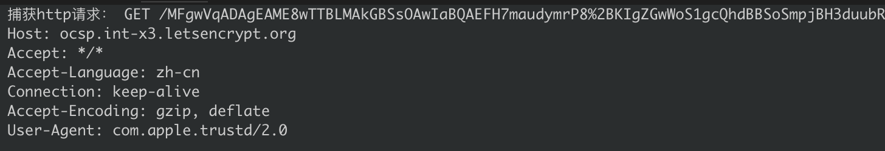

关于filter表达式语法，下面简单说明一下：

<div style="background-color:gray">
1.  type(定义了类型)

可选值：host, net, port, portrange

例如：
```
host hostnameA
net 172.31  //相当于172.31.0.0/16,又例如：192.168.1相当于192.168.1.0/24
port 80
portrange 6000-6010
```

2.  zdir(direction，定义了传输方向)

可选值：src, dst, src or dst, src and dst

例如：
```
src net 172.31
src or dst port 21
```

3.  proto(protocol定义了网络协议)

可选值：ether, fddi, tr, wlan, ip, ip6, arp, rarp, decnet, tcp, udp, icmp
(fddi, tr, wlan是ether的别名, 包结构很类似)

例如：
```
ether src hostnameA
arp net 172.31
udp portrange 7000-8000
```
 

4.  连接词：and, or, not

例如：
```
tcp or udp
not icmp
```


常用的一些表达式（[]表示可选项，/表示并列可选项）：
格式               | 说明
------------------|-----
[src/dst] host host        | IPv4/v6的[源/目的]主机为host，既可以是IP地址又可以是hostname，前面可以追加ip,arp, rarp或ip6，例如：ip host host
ether host/src/dstehost | 以太网地址/源地址/目的地址为ehost，ehost可以是名称或number
gateway host | 报文以host作为gateway
[src/dst] net net |IPv4/v6[源/目的]地址的网络号为net，net既可以是一个网络名也可以是一个网络号，IPv4的网络号可以写成点分式，例如：192.168.1.0，或者192.168.1(等价于192.168.1.0/24)，或者172.16(等价于172.16.0.0/16)，或者10(等价于10.0.0.0/8)。IPv6的掩码为ff:ff:ff:ff:ff:ff，所以IPv6的地址匹配模式为全匹配，需要完全匹配对应的主机IPv6地址
net net mask netmask|匹配网络号和掩码，掩码格式例如：255.255.0.0，IPv6不支持此语法
net net/len |netmask的另一种写法，len指定子网掩码的长度
[src/dst] port port | 匹配[源/目的]端口号
[src/dst] portrangeport1-port2 | 匹配[源/目的]端口范围
less length | 报文长度小于等于length，等价于len <= length
greater length | 报文长度大于等于length，等价于len>= length
ip proto protocol | 匹配IPv4，协议类型为protocol，protocol可取值为：icmp, icmp6, igmp, igrp, pim, ah,esp, vrrp, udp, tcp，注意icmp, tcp, udp也是关键字，所以需要使用“\”进行转义
ip6 proto protocol | 匹配IPv6的协议
ip/ip6 protochain protocol | 匹配IPv4/v6协议，协议中的protocolheader chain中包含protocol，例如：ip6 protochain 6(注：6代表TCP) 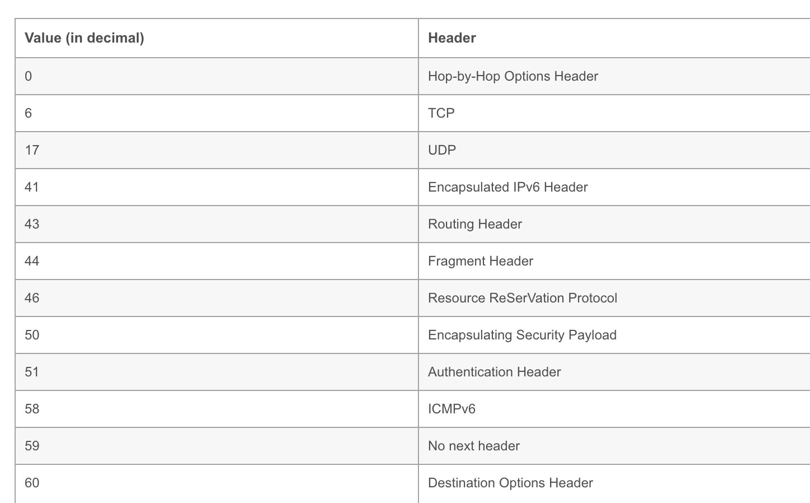
ether broadcast | 匹配以太网广播报文
ip broadcast | 匹配IPv4广播报文

</div>

scapy对数据包进行很好的对象封装，我们可以对照协议来进行数据包分析。一个标准的以太网数据包（包含用户层协议）整体结构如下：


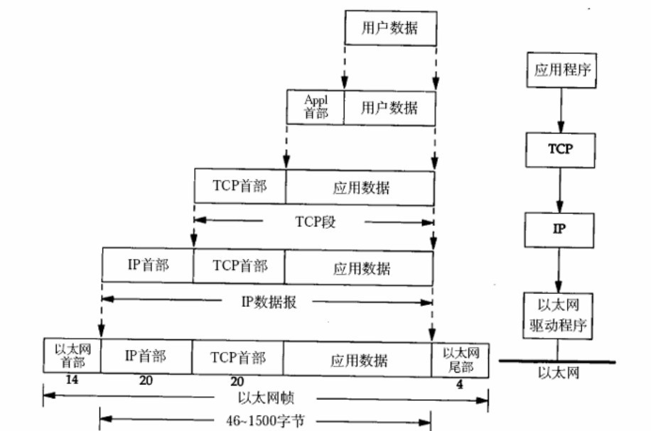

我们在做数据包解析的时候，也是按照上图的层级一层层的向上解析。下面以上面捕获http报文为例进行分析，我们在源码打下断点，然后启动调试。

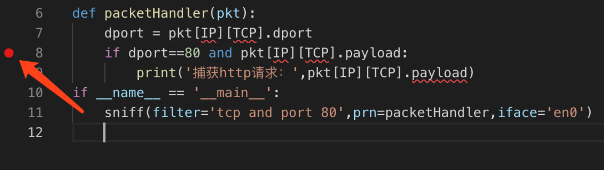

程序起来之后打开浏览器，打开一个http站点，程序捕获80端口的数据之后会自动断住。根据我们已有的知识进行预判，我们会先捕获Tcp三次握手的数据包，然后才是浏览器的http请求报文。

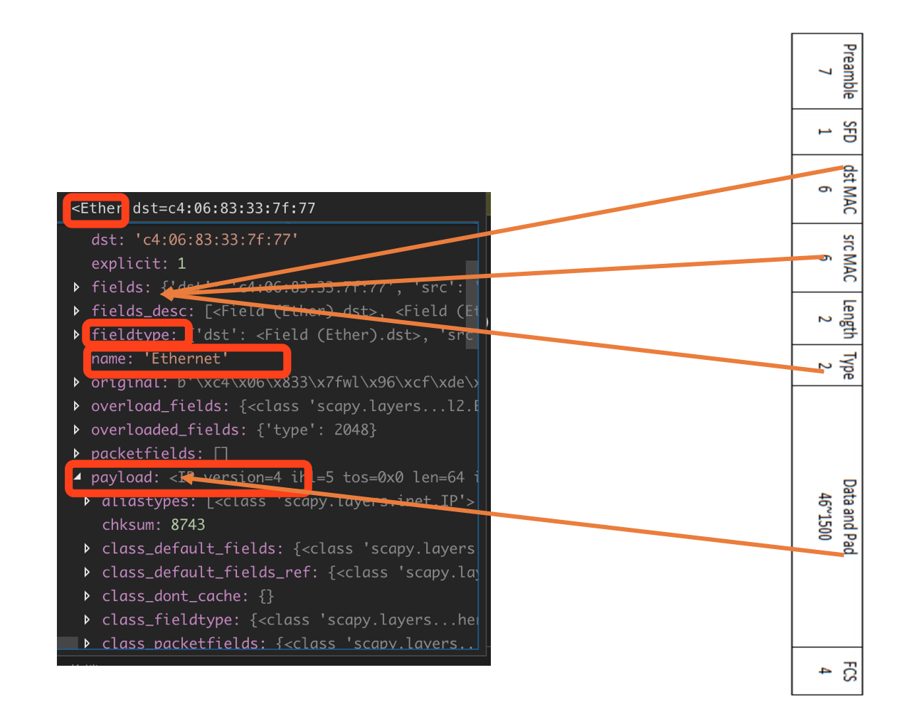

断点断住之后，我们查看pkt对象，在调试信息窗口可以看到这是一个以太网数据包，payload字段是IP层报文。下面展开payload，对照IP数据报再来分析。

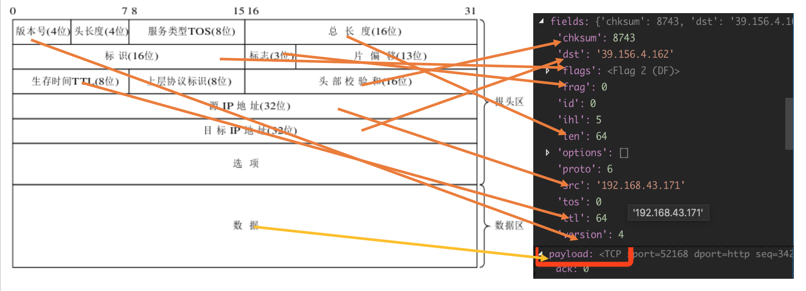

IP报文的payload是一个TCP报文，我们 继续展开，对照TCP报文继续分析。

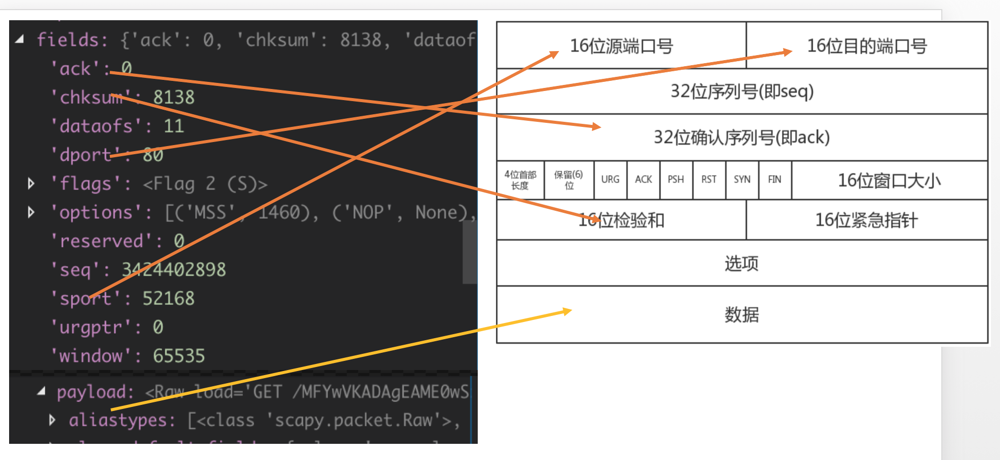

TCP的payload字段就是http协议的报文了，scapy没有对http协议做进一步的解析，我们可以使用一些scapy的增强插件来做进一步分析，后续教程会有介绍。
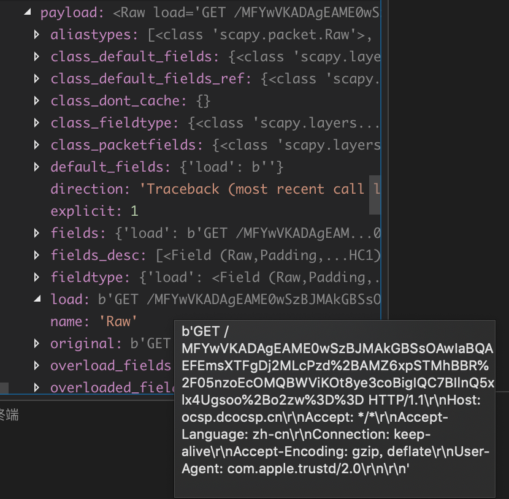

### 3.6.6 小结

本节中我们学习了原始套接字编程基础，基于原始套接字实现了简单的嗅探工具，同时学习了scapy的sniff函数的的使用方法，以及scappy的数据分析基础。本节作业如下：

1. 将我们基于原始套接字实现的windows和linux系统下的两套代码整合成一套
2. 使用scapy实现自己的嗅探工具
3. 结合3.5节 ARP欺骗的内容，思考中间人攻击的实现原理s

下一节，我们一同学如何开发一个端口扫描器。

           欢迎到关注微信订阅号，交流学习中的问题和心得


  

            本系列教程全部内容在玄说安全--入门圈发布，并提供答疑和辅导。

 


