## 3.7 端口扫描

端口扫描是信息搜集重要的一步，因为端口绑定的是服务，比如80一般是web服务，21是ftp，3389是windows远程桌面等等。只有端口开放，才能做进一步的指纹识别。
端口扫描最常用的工具是nmap，nmap提供了十几种扫描方式，详情可以参考 https://nmap.org/man/zh/man-port-scanning-techniques.html 。

本节我们参考nmap的端口扫描原理，来实现我们的自己的端口扫描工具。

### 3.7.1 前置知识

在动手开发之前，我们还是要重点复习一下协议相关的内容，这样才能真正理解不同端口扫描方式的原理。

TCP（Transmission Control Protocol）传输控制协议是一种面向连接的、可靠的、基于字节流的传输层协议。下图是TCP报文格式：
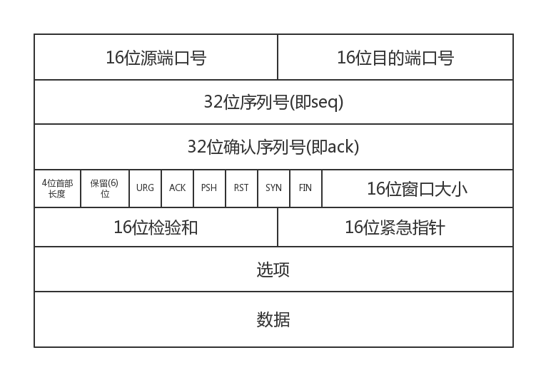

一个报文段分为首部和数据两部分,几乎TCP所有功能都从首部来体现,首部字段说明如下：

1. 源端口与目标端口:分别写入源端口号和目标端口号. 
2. 32位序列号:也就是我们tcp三次握手中的seq,表示的是我们tcp数据段发送的第一个字节的序号,范围[0,2^32 - 1],例如,我们的seq = 201,携带的数据有100,那么最后一个字节的序号就为300,那么下一个报文段就应该从301开始. 
3. 32位确认序列号:也就是ack(假设为y),它的值是seq+1,表示的意义是y之前的数据我都收到了,下一个我期望收到的数据是y.也就是我回过去的seq = y. 
4. 首部长度:占4位.也叫数据偏移,因为tcp中的首部中有长度不确定的字段. 
5. URG:紧急指针标志位,当URG=1时,表明紧急指针字段有效.它告诉系统中有紧急数据,应当尽快传送,这时不会按照原来的排队序列来传送.而会将紧急数据插入到本报文段数据的最前面. 
6. ACK:当ACK=1时,我们的确认序列号ack才有效,当ACK=0时,确认序号ack无效,TCP规定:所有建立连接的ACK必须全部置为1. 
7. PSH:推送操作,很少用,没有了解. 
8. RST:当RST=1时,表明TCP连接出现严重错误,此时必须释放连接,之后重新连接,又叫重置位. 
9. SYN:同步序列号标志位,tcp三次握手中,第一次会将SYN=1,ACK=0,此时表示这是一个连接请求报文段,对方会将SYN=1,ACK=1,表示同意连接,连接完成之后将SYN=0 
10. FIN:在tcp四次挥手时第一次将FIN=1,表示此报文段的发送方数据已经发送完毕,这是一个释放链接的标志. 
11. 16位窗口的大小:win的值是作为接收方让发送方设置其发送窗口大小的依据. 
12. 紧急指针:只有当URG=1时的时候,紧急指针才有效,它指出紧急数据的字节数.


在TCP/IP协议中，TCP协议提供可靠的连接服务，采用三次握手建立一个连接，下图。

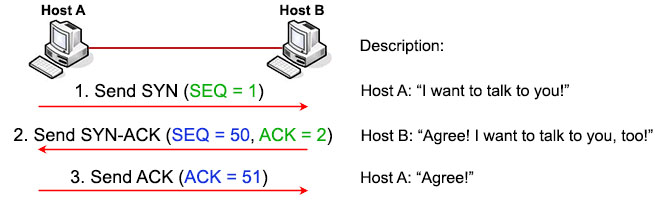


结合报文内容，解释如下：

（1） 第一次握手：建立连接时，客户端A发送SYN包(SYN=j)到服务器B，以及初始序号X,保存在包头的序列号(Sequence Number)字段里,并进入SYN_SEND状态，等待服务器B确认。

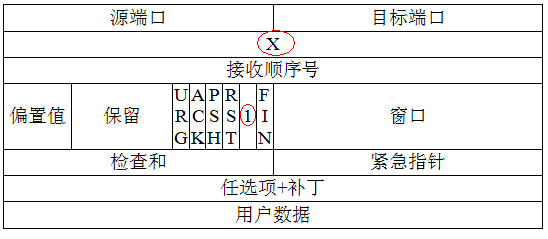

 （2）第二次握手：服务器B收到SYN包，必须确认客户A的SYN(ACK=j+1)，同时自己也发送一个SYN包(SYN=k)，即SYN+ACK包，此时服务器B进入SYN_RECV状态。


 （3） 第三次握手：客户端A收到服务器B的SYN＋ACK包，向服务器B发送确认包ACK(ACK=k+1)，此包发送完毕，客户端A和服务器B进入ESTABLISHED状态，完成三次握手。


（4）完成三次握手，客户端与服务器开始传送数据。

TCP建立连接的流程，同学们可以使用我们上一节编写的嗅探程序来捕获TCP建立连接的报文，观察各个字段的值。

下面我们新建portScan.py文件，添加如下代码：
```Python
# -*- coding: UTF-8 -*-

import argparse
from scapy.all import *


#打印端口状态
def print_ports(port, state):
	print("%s | %s" % (port, state))

def tcpScan(target,ports):
    pass
def synScan(target,ports):
    pass
def ackScan(target,ports):
    pass
def windowScan(target,ports):
    pass
def nullScan(target,ports):
    pass
def finScan(target,ports):
    pass
def xmaxScan(target,ports):
    pass

def udpScan(target,ports):
    pass


if __name__ == '__main__':

    parser = argparse.ArgumentParser("")
    parser.add_argument("-t", "--target", help="目标IP", required=True)
    parser.add_argument("-p", "--ports", type=int, nargs="+", help="指定端口列表 (21 23 80 ...)")
    parser.add_argument("-s", "--scantype", help="""
    "T":全连接扫描
    "S":syn扫描
    "A":ack扫描
    "W":TCPwindow扫描
    "N":NULL扫描
    "F":FIN扫描
    "X":Xmas扫描
    "U":UDP扫描
    """, required=True)
    args = parser.parse_args()

    target = args.target
    scantype = args.scantype
    if args.ports:
	    ports = args.ports
    else:
	    ports = range(1, 65535)

    # 扫码方式
    if scantype == "T":#全连接扫描
	    pass
    elif scantype == "S":#syn扫描
	    pass
    elif scantype == "A":#ack扫描
	    pass
    elif scantype == "W":#TCPwindow扫描
	    pass
    elif scantype == "N":#NULL扫描
	    pass
    elif scantype == "F":#FIN扫描
	    pass
    elif scantype == "X":#Xmas扫描
	    pass
    elif scantype == "U":#UDP扫描
	    pass
    else:
	    print("不支持当前模式")

```

上面的代码中我们定义了8种端口扫描方式，要求用户在使用脚本的时候必须指定扫描方式，端口如果不指定会扫描1到65535所有端口的状态。定义了print_ports函数，用来打印端口状态。下面我们依次实现各个扫描方法。

### 3.7.2 TCP Connect扫描
TCP Connect扫描又叫做全连接扫描，客户端与服务器建立 TCP 连接要进行一次三次握手，如果进行了一次成功的三次握手，则说明端口开放。

假设客户端想与服务端的80端口进行通信，首先客户端会发送一个带有SYN标识和端口号的TCP数据包给服务器，如果服务器这个端口是开放的，则会接受这个连接并返回一个带有SYN和ACK标识的数据包给客户端，随后客户端会发送带有ACK和RST标识的数据包给服务点，此时客户端与服务器建立了连接。如果端口不开放则会返回一个RST标识的数据包给客户端。

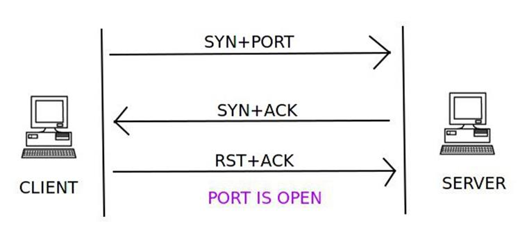

当客户端发送一个带有 SYN 标识和端口号的 TCP 数据包给服务器后，如果服务器端返回一个带 RST 标识的数据包，则说明端口处于关闭状态。


实现如下：

```Python
def tcpScan(target,ports):
    print("tcp全连接扫描 %s with ports %s" % (target, ports))
    for port in ports:
        send=sr1(IP(dst=target)/TCP(dport=port,flags="S"),timeout=2,verbose=0)
        if (send is None):
            print_ports(port,"closed")
        elif send.haslayer("TCP"):
            
            if send["TCP"].flags == "SA":
                send_1 = sr1(IP(dst=target) / TCP(dport=port, flags="AR"), timeout=2, verbose=0)
                print_ports(port,"open")
            elif send["TCP"].flags == "RA":
                print_ports(port,"close")
```
上面的代码，组合IP和TCP报文，依据三次握手的流程对端口状态做判断。主义TCP标志位的设置和判断。使用scapy发送tcp数据包的时候使用如下简写形式：

* F : FIN - 结束; 结束会话
* S : SYN - 同步; 表示开始会话请求
* R : RST - 复位;中断一个连接
* P : PUSH - 推送; 数据包立即发送
* A : ACK - 应答
* U : URG - 紧急
* E : ECE - 显式拥塞提醒回应
* W : CWR - 拥塞窗口减少

### 3.7.3 TCP SYN 扫描

TCP SYN扫描又称半开式扫描，该过程不会和服务端建立完整的连接，首先客户端会发送一个带有SYN标识和端口号的TCP数据包给服务器，如果服务器这个端口是开放的，则会接受这个连接并返回一个带有SYN和ACK标识的数据包给客户端，随后客户端会返回带有RST标识的数据包而不是返回一个带有ACK和RST标识的数据包。

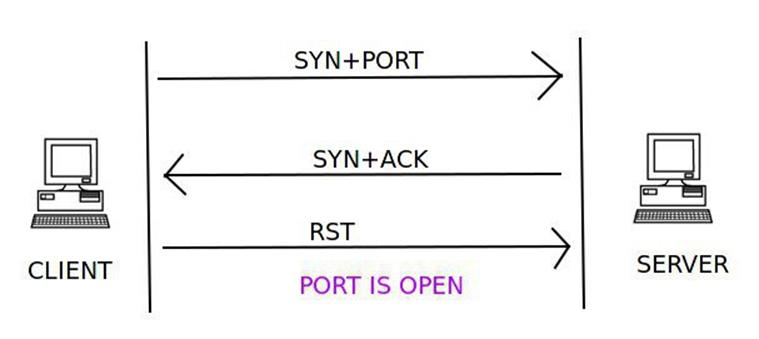

如果目标端口处于关闭状态，则服务端会返回一个RST标识的数据包。

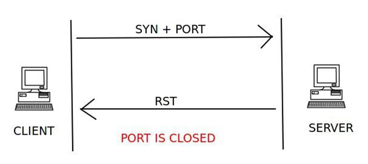

实现如下：

```Python
def synScan(target,ports):
    print("tcp全连接扫描 %s with ports %s" % (target, ports))
    for port in ports:
        send=sr1(IP(dst=target)/TCP(dport=port,flags="S"),timeout=2,verbose=0)
        if (send is None):
            print_ports(port,"closed")
        elif send.haslayer("TCP"):
            print(send["TCP"].flags)
            if send["TCP"].flags == "SA":
                send_1 = sr1(IP(dst=target) / TCP(dport=port, flags="R"), timeout=2, verbose=0)#只修改这里
                print_ports(port,"opend")
            elif send["TCP"].flags == "RA":
                print_ports(port,"closed")
```

上面的代码实现实现上和全连接扫描区别不大，只是在结束到服务端响应数据包之后直接发送RST包结束连接即可。

### 3.7.4 TCP ACK扫描

能说明端口是否被过滤。如果你用nmap -sA就会发现他只会返回两种结果unfiltered和filtered，因为nmap -sA就是ACK扫描的。

判断端口是否被过滤，分为两种情况：

1. 发送一个flags为ACK报文，open(开放的)和closed(关闭的) 端口 都会返回RST报文，至于他们是open还是closed状态我们无法确定。不响应的端口，或者发送特定的ICMP错误消息(类型3，代号1，2，3，9，10， 或者13)的端口，标记为 filtered(被过滤的)。大致的流程如下图：

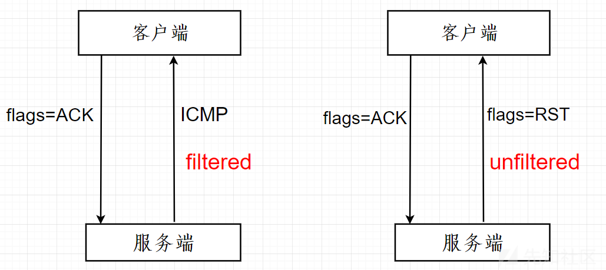

上面那种情况下是服务器REJECT掉数据包，所以客户端会有个ICMP包返回，如果是直接DROP掉的话，就会什么也不会返回，所以我们要判断该主机是否存在，因为如果一个主机存在的话，向它发送一个flags为ACK包的话，无论端口是否关闭都会有返回一个flags为RST包，如果是DROP是话就会一个数据包都不会返回，所以我们可以利用这一点去判断端口是否被过滤了，大致流程如下：

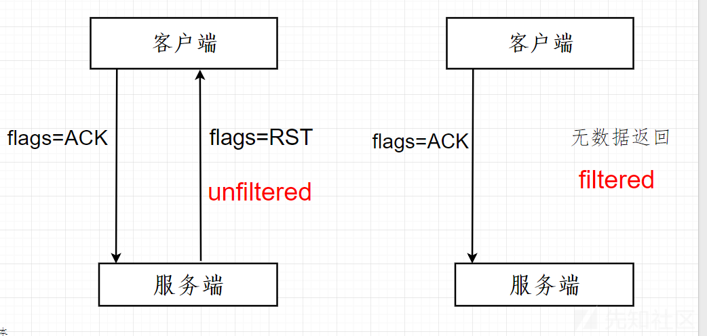

实现如下：

```Python
def ackScan(target,ports):
    print("tcp ack扫描 %s with ports %s" % (target, ports))
    for port in ports:
        ack_flag_scan_resp = sr1(IP(dst=target)/TCP(dport=port,flags="A"),timeout=5)
        print(str(type(ack_flag_scan_resp)))
        if (str(type(ack_flag_scan_resp))=="<class 'NoneType'>"):
            print_ports(port,"filtered")
        elif(ack_flag_scan_resp.haslayer(TCP)):
            if(ack_flag_scan_resp.getlayer(TCP).flags == "R"):
                print_ports(port,"unfiltered")
        elif(ack_flag_scan_resp.haslayer(ICMP)):
            if(int(ack_flag_scan_resp.getlayer(ICMP).type)==3 and int(ack_flag_scan_resp.getlayer(ICMP).code) in [1,2,3,9,10,13]):
                print_ports(port,"filtered")
        else:
            print_ports(port,"filtered")
```

### 3.7.5  TCP Window扫描

TCP 窗口扫描的流程同 ACK 扫描类似，同样是客户端向服务器发送一个带有 ACK 标识和端口号的 TCP 数据包，但是这种扫描能够用于发现目标服务器端口的状态。在 ACK 扫描中返回 RST 表明没有被过滤，但在窗口扫描中，当收到返回的 RST 数据包后，它会检查窗口大小的值。如果窗口大小的值是个非零值，则说明目标端口是开放的。


如果返回的 RST 数据包中的窗口大小为0，则说明目标端口是关闭的。

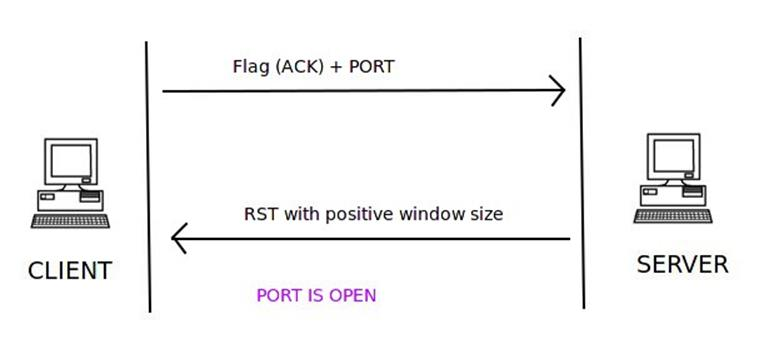

实现如下：

```Python
def windowScan(target,ports):
    print("tcp window扫描 %s with ports %s" % (target, ports))
    for port in ports:
        window_scan_resp = sr1(IP(dst=target)/TCP(dport=port,flags="A"),timeout=5)
        print(str(type(window_scan_resp)))
        if (str(type(window_scan_resp))=="<class 'NoneType'>"):
            print_ports(port,"close")
        elif(window_scan_resp.haslayer(TCP)):
            if(window_scan_resp.getlayer(TCP).window == 0):
                print_ports(port,"close")
            elif(window_scan_resp.getlayer(TCP).window > 0):
                print_ports(port,"open")
        else:
            print_ports(port,"close")
```
windowScan的实现和ACK扫描方式流程基本一致，区别在于判断窗口值。

### 3.17.6  TCP Null扫描

在空扫描中，客户端发出的 TCP 数据包仅仅只会包含端口号而不会有其他任何的标识信息。如果目标端口是开放的则不会回复任何信息。

如果服务器返回了一个 RST（或者RST+ACK) 数据包，则说明目标端口是关闭的。
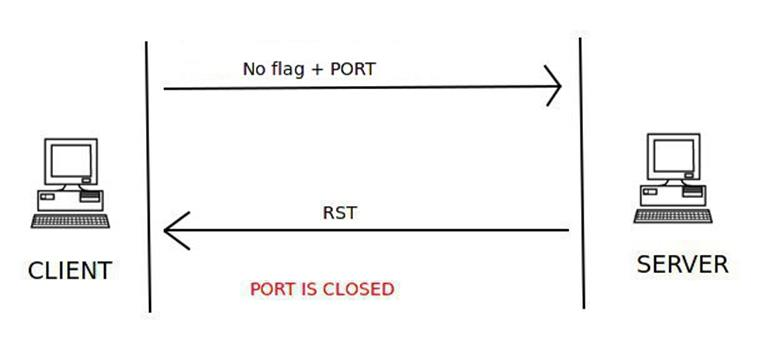
如果返回 ICMP 错误类型3且代码为1，2，3，9，10或13的数据包，则说明端口被服务器过滤了。
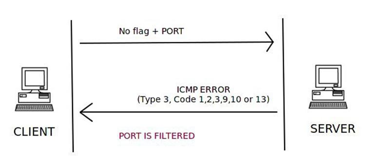

实现如下：
```Python
def nullScan(target,ports):
    print("tcp NULL 扫描 %s with ports %s" % (target, ports))
    for port in ports:
        null_scan_resp = sr1(IP(dst=target)/TCP(dport=port,flags=""),timeout=5)
        if (str(type(null_scan_resp))=="<class 'NoneType'>"):
            print_ports(port,"Open|Filtered") 
        elif(null_scan_resp.haslayer(TCP)):
            if(null_scan_resp.getlayer(TCP).flags == "R" or null_scan_resp.getlayer(TCP).flags == "A"):
                print_ports( port,"Closed")
        elif(null_scan_resp.haslayer(ICMP)):
            if(int(null_scan_resp.getlayer(ICMP).type)==3 and int(null_scan_resp.getlayer(ICMP).code) in [1,2,3,9,10,13]):
                print_ports(port, "Filtered")
```

### 3.17.7 TCP FIN扫描

FIN 扫描会向服务器发送带有 FIN 标识和端口号的 TCP 数据包。如果没有服务器端回应则说明端口开放。

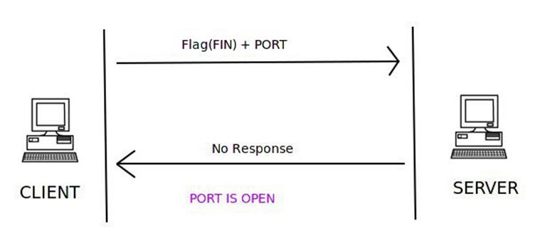

如果服务器返回一个 RST 数据包，则说明目标端口是关闭的。

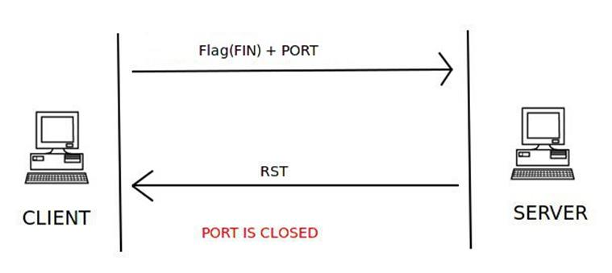

如果服务器返回了一个 ICMP 数据包，其中包含 ICMP 目标不可达错误类型3以及 ICMP 代码为1，2，3，9，10或13，则说明目标端口被过滤了无法确定端口状态。

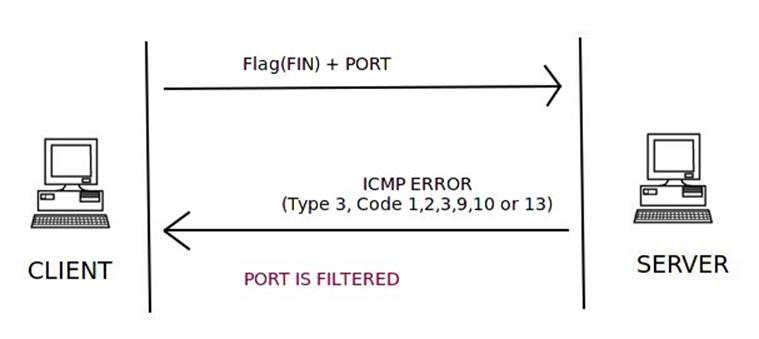

实现如下：

```Python
def finScan(target,ports):
    print("tcp FIN 扫描 %s with ports %s" % (target, ports))
    for port in ports:
        fin_scan_resp = sr1(IP(dst=target)/TCP(dport=port,flags="F"),timeout=5)
        if (str(type(fin_scan_resp))=="<class 'NoneType'>"):
            print_ports(port, "Open|Filtered")
        elif(fin_scan_resp.haslayer(TCP)):
            if(fin_scan_resp.getlayer(TCP).flags == 0x14):
                print_ports(port, "Closed")
        elif(fin_scan_resp.haslayer(ICMP)):
            if(int(fin_scan_resp.getlayer(ICMP).type)==3 and int(fin_scan_resp.getlayer(ICMP).code) in [1,2,3,9,10,13]):
                print_ports(port, "Filtered")
```

### 3.17.8 TCP 圣诞树(Xmas)扫描

在发送的数据包中设置PSH,FIN,URG标志位，如果目标端口是开放的则不会回复任何信息。
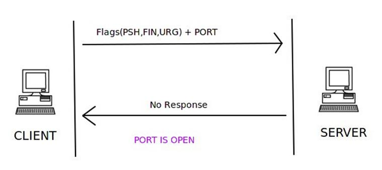
如果目标端口关闭则会返回一个RST+ACK的数据包。
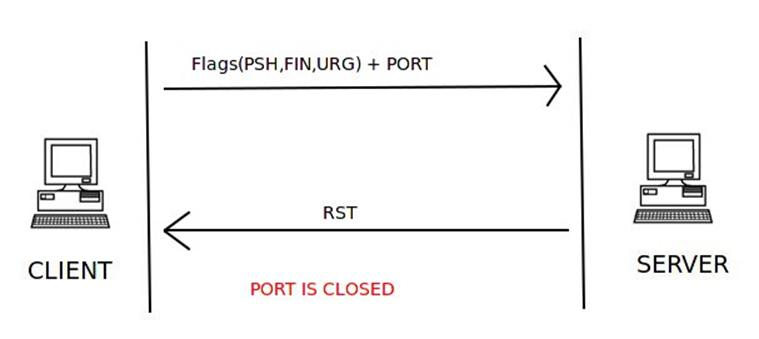
但如果服务器返回了一个 ICMP 数据包，其中包含 ICMP 目标不可达错误类型3以及 ICMP 状态码为1，2，3，9，10或13，则说明目标端口被过滤了无法确定是否处于开放状态。
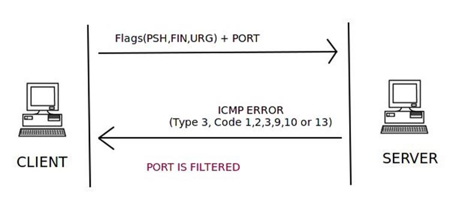

实现如下：

```Python
def xmaxScan(target,ports):
    print("tcp xmax 扫描 %s with ports %s" % (target, ports))
    for port in ports:
        fin_scan_resp = sr1(IP(dst=target)/TCP(dport=port,flags="FPU"),timeout=5)
        if (str(type(fin_scan_resp))=="<class 'NoneType'>"):
            print_ports(port, "Open|Filtered")
        elif(fin_scan_resp.haslayer(TCP)):
            if(fin_scan_resp.getlayer(TCP).flags == "R"):
                print_ports(port, "Closed")
        elif(fin_scan_resp.haslayer(ICMP)):
            if(int(fin_scan_resp.getlayer(ICMP).type)==3 and int(fin_scan_resp.getlayer(ICMP).code) in [1,2,3,9,10,13]):
                print_ports(port, "Filtered")
```


### 3.17.9 UDP 扫描

TCP 是面向连接的协议，而UDP则是无连接的协议。

面向连接的协议会先在客户端和服务器之间建立通信信道，然后才会开始传输数据。如果客户端和服务器之间没有建立通信信道，则不会有任何产生任何通信数据。

无连接的协议则不会事先建立客户端和服务器之间的通信信道，只要客户端到服务器存在可用信道，就会假设目标是可达的然后向对方发送数据。

客户端会向服务器发送一个带有端口号的 UDP 数据包。如果服务器回复了 UDP 数据包，则目标端口是开放的。
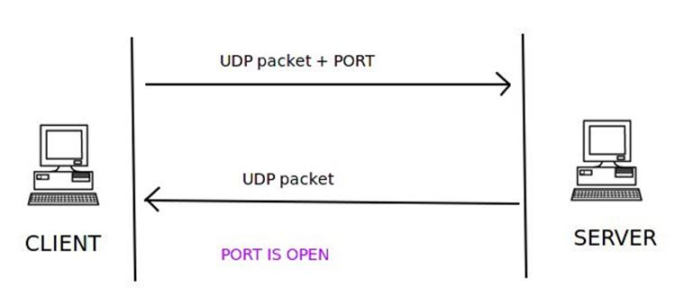

如果服务器返回了一个 ICMP 目标不可达的错误和代码3，则意味着目标端口处于关闭状态。

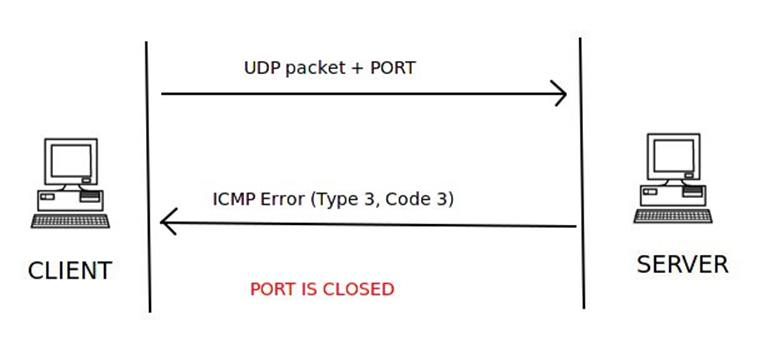

如果服务器返回一个 ICMP 错误类型3且代码为1，2，3，9，10或13的数据包，则说明目标端口被服务器过滤了。

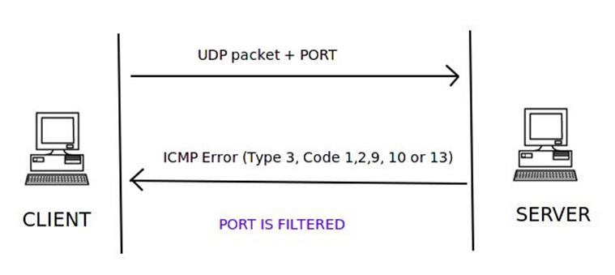

但如果服务器没有任何相应客户端的 UDP 请求，则可以断定目标端口可能是开放或被过滤的，无法判断端口的最终状态。

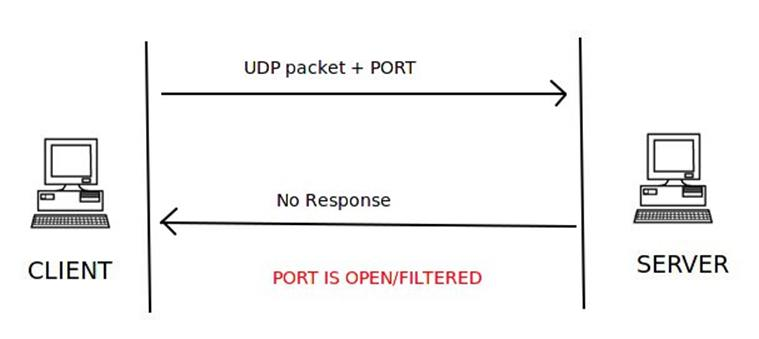

实现如下：

```Python
def udpScan(target,ports):
    print("UDP 扫描 %s with ports %s" % (target, ports))
    for port in ports:
        udp_scan_resp = sr1(IP(dst=target)/UDP(dport=port),timeout=5)
        if (str(type(udp_scan_resp))=="<class 'NoneType'>"):
            print_ports(port, "Open|Filtered")
        elif(udp_scan_resp.haslayer(UDP)):
            if(udp_scan_resp.getlayer(TCP).flags == "R"):
                print_ports(port, "Open")
        elif(udp_scan_resp.haslayer(ICMP)):
            if(int(udp_scan_resp.getlayer(ICMP).type)==3 and int(udp_scan_resp.getlayer(ICMP).code) in [1,2,3,9,10,13]):
                print_ports(port, "Filtered")
```

### 3.17.8 简单测试

至此，我们的端口扫描器告一段落，下面进行简单的测试。
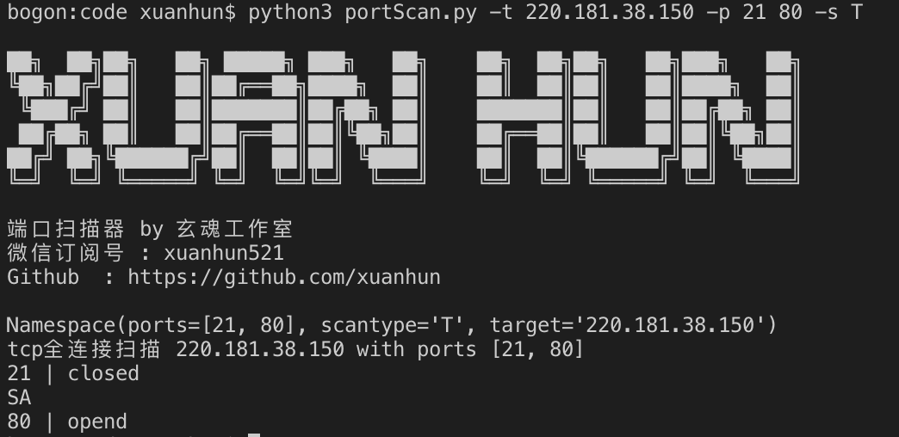

### 3.17.9  小结

本节我们基于scapy实现了8种端口扫描的方式。之所以需要多种方式来实现端口扫描主要有两个原因，一个是提升扫描速度，比如全连接扫描是速度最慢的；第二是由于操作系统的不同或者防火墙的配置等原因，一种扫描方法很难获得准确的结果。本节作业如下：

1. 学习巩固TCP和UDP协议
2. 动手实现端口扫描器

下一节，我们一同学习DNS毒化攻击。

           欢迎到关注微信订阅号，交流学习中的问题和心得


  

            本系列教程全部内容在玄说安全--入门圈发布，并提供答疑和辅导。

 


