## 协议概览

Web应用已经是当前互联网上数量最多、应用最广的应用形式了，Web 安全问题也是计算机网络安全中关注度最高的领域。Web应用起源于HTTP协议。由于HTTP是纯文本传输协议，无法加密传输数据，在此基础上出现了HTTPS、SSL。随着Web应用的发展，又推出了全双工通信的WebSocket协议。如今HTTP协议更新换代，HTTP/2标准正在越来越多的被支持。

理解Web安全，首先要从理解协议开始。本节对笔者认为应该重点了解的Web协议做一个概览性描述。更细节的内容，还需要大家去阅读规范文档或者书籍。

### 4.1.1 HTTP 协议

HTTP协议（或超文本传输​​协议）是用于在因特网上传输文件的网络协议。它是一种无状态协议，不仅可用于发送文件，还可用于发送资源（如动态生成的查询结果，CGI脚本的输出和其他数据）。HTTP资源由统一资源标识符（URI）或统一资源定位符（或URL）标识并位于Internet上。

HTTP/1.1 是当前版本主要应用的HTTP版本，是对 HTTP/1.0 的修订。HTTP/1.1 允许传输流数据。在 [W3C网站](https://www.w3.org/Protocols/rfc2616/rfc2616.html)可以阅读 HTTP/1.1 的详细内容。

HTTP协议具有设备无关性，可以从各种类型的主机和客户端之间进行通信。主机和客户端之间的通信通过 请求(Request)/响应(Response) 进行。

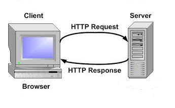

Web浏览器是HTTP客户端，因为它将请求发送到HTTP服务器（或Web服务器），然后HTTP服务器使用所需资源响应浏览器。

在发送HTTP请求之前，浏览器会先和服务端建立TCP连接（通常是80端口）。HTTP Server 在预定义端口上的等待客户端消息。请求由状态行和消息体组成。消息正文作为请求的资源返回，也可能返回错误消息或其他信息。

客户端使用“请求方法”向HTTP服务器发送请求消息。
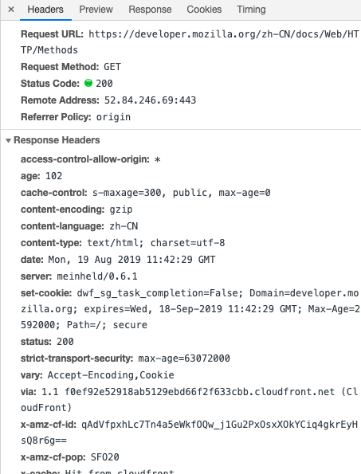

如上图，使用Chrome浏览的开发者工具可以很方便的查看HTTP请求和响应的信息。

HTTP协议指定的“请求方法”如下：

<dl>
 <dt><code><a href="/en-US/docs/Web/HTTP/Methods/GET">GET</a></code></dt>
 <dd>GET方法请求一个指定资源的表示形式. 使用GET的请求应该只被用于获取数据.</dd>
 <dt><code><a href="/en-US/docs/Web/HTTP/Methods/HEAD">HEAD</a></code></dt>
 <dd>HEAD方法请求一个与GET请求的响应相同的响应，但没有响应体.</dd>
 <dt><code><a href="/en-US/docs/Web/HTTP/Methods/POST">POST</a></code></dt>
 <dd>POST方法用于将实体提交到指定的资源，通常导致在服务器上的状态变化或副作用.&nbsp;</dd>
 <dt><code><a href="/en-US/docs/Web/HTTP/Methods/PUT">PUT</a></code></dt>
 <dd>PUT方法用请求有效载荷替换目标资源的所有当前表示。</dd>
 <dt><code><a href="/en-US/docs/Web/HTTP/Methods/DELETE">DELETE</a></code></dt>
 <dd>DELETE方法删除指定的资源。</dd>
 <dt><code><a href="/en-US/docs/Web/HTTP/Methods/CONNECT">CONNECT</a></code></dt>
 <dd>CONNECT方法建立一个到由目标资源标识的服务器的隧道。</dd>
 <dt><code><a href="/en-US/docs/Web/HTTP/Methods/OPTIONS">OPTIONS</a></code></dt>
 <dd>OPTIONS方法用于描述目标资源的通信选项。</dd>
 <dt><code><a href="/en-US/docs/Web/HTTP/Methods/TRACE">TRACE</a></code></dt>
 <dd>TRACE方法沿着到目标资源的路径执行一个消息环回测试。</dd>
 <dt><code><a href="/en-US/docs/Web/HTTP/Methods/PATCH">PATCH</a></code></dt>
 <dd>PATCH方法用于对资源应用部分修改。</dd>
 <dt>

 </dt>
</dl>

HTTP响应的第一行称为状态行。状态行包括数字状态代码和原因短语。状态代码可帮助客户端解释从服务器收到的响应。下面列出了一些以1,2,3,4和5号开头的最常用的状态码。以下内容来自MDN（https://developer.mozilla.org/zh-CN/docs/Web/HTTP/Status）

---

#### 信息响应

<dl>
 <dt><a href="/zh-CN/docs/Web/HTTP/Status/100" title="HTTP 100 Continue&nbsp;信息型状态响应码表示目前为止一切正常, 客户端应该继续请求, 如果已完成请求则忽略."><code>100 Continue</code></a></dt>
 <dd>这个临时响应表明，迄今为止的所有内容都是可行的，客户端应该继续请求，如果已经完成，则忽略它。</dd>
 <dt><a href="/zh-CN/docs/Web/HTTP/Status/101" title="HTTP &nbsp;101 Switching Protocol（协议切换）状态码表示服务器应客户端升级协议的请求（Upgrade请求头）正在进行协议切换。"><code>101 Switching Protocol</code></a></dt>
 <dd>该代码是响应客户端的 <a class="new" href="/zh-CN/docs/Web/HTTP/Headers/Upgrade" rel="nofollow" title="此页面仍未被本地化, 期待您的翻译!"><code>Upgrade</code></a> 标头发送的，并且指示服务器也正在切换的协议。</dd>
 <dt><a class="new" href="/zh-CN/docs/Web/HTTP/Status/102" rel="nofollow" title="此页面仍未被本地化, 期待您的翻译!"><code>102 Processing</code></a> (<a class="glossaryLink" href="/en-US/docs/Glossary/WebDAV" title="WebDAV: WebDAV  (Web Distributed Authoring and Versioning) is an HTTP Extension that lets web developers update their content remotely from a client.">WebDAV</a>)</dt>
 <dd>此代码表示服务器已收到并正在处理该请求，但没有响应可用。</dd>
 <dt><a href="/zh-CN/docs/Web/HTTP/Status/103" title="103 Early Hints 信息状态响应码，一般和&nbsp;Link header（首部）一起使用，来允许用户在服务器还在准备响应数据的时候预加载一些资源。"><code>103&nbsp;Early&nbsp;Hints</code></a>&nbsp;</dt>
 <dd>此状态代码主要用于与<a href="/zh-CN/docs/Web/HTTP/Headers/Link" title="HTTP实体报头 Link&nbsp;提供了序列化HTTP头部链接的方法。它在语义上与HTML元素 <link> 相等。"><code>Link</code></a>&nbsp;链接头一起使用，以允许用户代理在服务器仍在准备响应时开始预加载资源。</dd>
</dl>

#### 成功响应

<dl>
 <dt><a href="/zh-CN/docs/Web/HTTP/Status/200" title="状态码&nbsp;200 OK&nbsp;表明请求已经成功. 默认情况下状态码为200的响应可以被缓存。"><code>200 OK</code></a></dt>
 <dd>
 <p>请求成功。成功的含义取决于HTTP方法：</p>

 <ul>
  <li>GET：资源已被提取并在消息正文中传输。</li>
  <li>HEAD：实体标头位于消息正文中。</li>
  <li>POST：描述动作结果的资源在消息体中传输。</li>
  <li>TRACE：消息正文包含服务器收到的请求消息</li>
 </ul>
 </dd>
 <dt><a href="/zh-CN/docs/Web/HTTP/Status/201" title="在HTTP协议中，201 Created 是一个代表成功的应答状态码，表示请求已经被成功处理，并且创建了新的资源。新的资源在应答返回之前已经被创建。同时新增的资源会在应答消息体中返回，其地址或者是原始请求的路径，或者是 Location 首部的值。"><code>201 Created</code></a></dt>
 <dd>该请求已成功，并因此创建了一个新的资源。这通常是在POST请求，或是某些PUT请求之后返回的响应。</dd>
 <dt><a href="/zh-CN/docs/Web/HTTP/Status/202" title="响应状态码 202 Accepted 表示服务器端已经收到请求消息，但是尚未进行处理。但是对于请求的处理确实无保证的，即稍后无法通过 HTTP 协议给客户端发送一个异步请求来告知其请求的处理结果。这个状态码被设计用来将请求交由另外一个进程或者服务器来进行处理，或者是对请求进行批处理的情形。"><code>202 Accepted</code></a></dt>
 <dd>请求已经接收到，但还未响应，没有结果。意味着不会有一个异步的响应去表明当前请求的结果，预期另外的进程和服务去处理请求，或者批处理。</dd>
 <dt><a href="/zh-CN/docs/Web/HTTP/Status/203" title="在 HTTP 协议中，响应状态码&nbsp;203 Non-Authoritative Information &nbsp;表示请求已经成功被响应，但是获得的负载与源头服务器的状态码为 200 (OK)的响应相比，经过了拥有转换功能的 proxy （代理服务器）的修改。"><code>203 Non-Authoritative Information</code></a></dt>
 <dd>服务器已成功处理了请求，但返回的实体头部元信息不是在原始服务器上有效的确定集合，而是来自本地或者第三方的拷贝。当前的信息可能是原始版本的子集或者超集。例如，包含资源的元数据可能导致原始服务器知道元信息的超集。使用此状态码不是必须的，而且只有在响应不使用此状态码便会返回200 OK的情况下才是合适的。</dd>
 <dt><a href="/zh-CN/docs/Web/HTTP/Status/204" title="HTTP协议中&nbsp;204&nbsp;No Content&nbsp;成功状态响应码表示目前请求成功，但客户端不需要更新其现有页面。204 响应默认是可以被缓存的。在响应中需要包含头信息 {{HTTPHeader(&quot;ETag&quot;)}}。"><code>204 No Content</code></a></dt>
 <dd>服务器成功处理了请求，但不需要返回任何实体内容，并且希望返回更新了的元信息。响应可能通过实体头部的形式，返回新的或更新后的元信息。如果存在这些头部信息，则应当与所请求的变量相呼应。如果客户端是浏览器的话，那么用户浏览器应保留发送了该请求的页面，而不产生任何文档视图上的变化，即使按照规范新的或更新后的元信息应当被应用到用户浏览器活动视图中的文档。由于204响应被禁止包含任何消息体，因此它始终以消息头后的第一个空行结尾。</dd>
 <dt><a href="/zh-CN/docs/Web/HTTP/Status/205" title="在 HTTP 协议中，响应状态码&nbsp;205 Reset Content 用来通知客户端重置文档视图，比如清空表单内容、重置 canvas 状态或者刷新用户界面。"><code>205 Reset Content</code></a></dt>
 <dd>服务器成功处理了请求，且没有返回任何内容。但是与204响应不同，返回此状态码的响应要求请求者重置文档视图。该响应主要是被用于接受用户输入后，立即重置表单，以便用户能够轻松地开始另一次输入。与204响应一样，该响应也被禁止包含任何消息体，且以消息头后的第一个空行结束。</dd>
 <dt><a href="/zh-CN/docs/Web/HTTP/Status/206" title="HTTP 206 Partial Content 成功状态响应代码表示请求已成功，并且主体包含所请求的数据区间，该数据区间是在请求的 Range 首部指定的。"><code>206 Partial Content</code></a></dt>
 <dd>服务器已经成功处理了部分 GET 请求。类似于 FlashGet 或者迅雷这类的 HTTP 下载工具都是使用此类响应实现断点续传或者将一个大文档分解为多个下载段同时下载。该请求必须包含 Range 头信息来指示客户端希望得到的内容范围，并且可能包含 If-Range 来作为请求条件。</dd>
 <dt><a class="new" href="/zh-CN/docs/Web/HTTP/Status/207" rel="nofollow" title="此页面仍未被本地化, 期待您的翻译!"><code>207 Multi-Status</code></a> (<a class="glossaryLink" href="/en-US/docs/Glossary/WebDAV" title="WebDAV: WebDAV  (Web Distributed Authoring and Versioning) is an HTTP Extension that lets web developers update their content remotely from a client.">WebDAV</a>)</dt>
 <dd>由WebDAV(RFC 2518)扩展的状态码，代表之后的消息体将是一个XML消息，并且可能依照之前子请求数量的不同，包含一系列独立的响应代码。</dd>
 <dt><a class="new" href="/zh-CN/docs/Web/HTTP/Status/208" rel="nofollow" title="此页面仍未被本地化, 期待您的翻译!"><code>208 Multi-Status</code></a> (<a class="glossaryLink" href="/en-US/docs/Glossary/WebDAV" title="WebDAV: WebDAV  (Web Distributed Authoring and Versioning) is an HTTP Extension that lets web developers update their content remotely from a client.">WebDAV</a>)</dt>
 <dd>在 DAV 里面使用: propstat 响应元素以避免重复枚举多个绑定的内部成员到同一个集合。</dd>
 <dt><a class="new" href="/zh-CN/docs/Web/HTTP/Status/226" rel="nofollow" title="此页面仍未被本地化, 期待您的翻译!"><code>226 IM Used</code></a> (<a class="external external-icon" href="https://tools.ietf.org/html/rfc3229" rel="noopener">HTTP Delta encoding</a>)</dt>
 <dd>服务器已经完成了对资源的 GET 请求，并且响应是对当前实例应用的一个或多个实例操作结果的表示。</dd>
</dl>

#### 重定向

<dl>
 <dt><a href="/zh-CN/docs/Web/HTTP/Status/300" title="300 Multiple Choices 是一个用来表示重定向的响应状态码，表示该请求拥有多种可能的响应。用户代理或者用户自身应该从中选择一个。由于没有如何进行选择的标准方法，这个状态码极少使用。"><code>300 Multiple Choice</code></a></dt>
 <dd>被请求的资源有一系列可供选择的回馈信息，每个都有自己特定的地址和浏览器驱动的商议信息。用户或浏览器能够自行选择一个首选的地址进行重定向。</dd>
 <dt><a href="/zh-CN/docs/Web/HTTP/Status/301" title="HTTP 301 永久重定向&nbsp;说明请求的资源已经被移动到了由&nbsp;Location 头部指定的url上，是固定的不会再改变。搜索引擎会根据该响应修正。"><code>301 Moved Permanently</code></a></dt>
 <dd>被请求的资源已永久移动到新位置，并且将来任何对此资源的引用都应该使用本响应返回的若干个 URI 之一。如果可能，拥有链接编辑功能的客户端应当自动把请求的地址修改为从服务器反馈回来的地址。除非额外指定，否则这个响应也是可缓存的。</dd>
 <dt><a href="/zh-CN/docs/Web/HTTP/Status/302" title="HTTP 302 Found 重定向状态码表明请求的资源被暂时的移动到了由Location 头部指定的 URL 上。浏览器会重定向到这个URL，&nbsp;但是搜索引擎不会对该资源的链接进行更新&nbsp;(In SEO-speak, it is said that the link-juice is not sent to the new URL)。"><code>302 Found</code></a></dt>
 <dd>请求的资源现在临时从不同的 URI 响应请求。由于这样的重定向是临时的，客户端应当继续向原有地址发送以后的请求。只有在Cache-Control或Expires中进行了指定的情况下，这个响应才是可缓存的。</dd>
 <dt><a href="/zh-CN/docs/Web/HTTP/Status/303" title="HTTP 303 See Other 重定向状态码，通常作为 PUT 或 POST 操作的返回结果，它表示重定向链接指向的不是新上传的资源，而是另外一个页面，比如消息确认页面或上传进度页面。而请求重定向页面的方法要总是使用&nbsp;GET。"><code>303 See Other</code></a></dt>
 <dd>对应当前请求的响应可以在另一个 URI 上被找到，而且客户端应当采用 GET 的方式访问那个资源。这个方法的存在主要是为了允许由脚本激活的POST请求输出重定向到一个新的资源。</dd>
 <dt><a href="/zh-CN/docs/Web/HTTP/Status/304" title="HTTP 304&nbsp;未改变说明无需再次传输请求的内容，也就是说可以使用缓存的内容。这通常是在一些安全的方法（safe），例如GET 或HEAD 或在请求中附带了头部信息：&nbsp;If-None-Match 或If-Modified-Since。"><code>304 Not Modified</code></a></dt>
 <dd>如果客户端发送了一个带条件的 GET 请求且该请求已被允许，而文档的内容（自上次访问以来或者根据请求的条件）并没有改变，则服务器应当返回这个状态码。304 响应禁止包含消息体，因此始终以消息头后的第一个空行结尾。</dd>
 <dt><code>305 Use Proxy</code> <span class="icon-only-inline" title="This deprecated API should no longer be used, but will probably still work."><i class="icon-thumbs-down-alt"> </i></span></dt>
 <dd>被请求的资源必须通过指定的代理才能被访问。Location 域中将给出指定的代理所在的 URI 信息，接收者需要重复发送一个单独的请求，通过这个代理才能访问相应资源。只有原始服务器才能建立305响应。</dd>
 <dt><code>306 unused</code></dt>
 <dd>在最新版的规范中，306 状态码已经不再被使用。</dd>
 <dt><a href="/zh-CN/docs/Web/HTTP/Status/307" title="原始请求中的请求方法和消息主体会在重定向请求中被重用。在确实需要将重定向请求的方法转换为 &nbsp;GET 的场景下，可以考虑使用 303 See Also 状态码。例如在使用 PUT 方法进行文件上传操作时，需要返回确认信息（例如“你已经成功上传了xyz”）而不是上传的资源本身，就可以使用这个状态码。"><code>307 Temporary Redirect</code></a></dt>
 <dd>请求的资源现在临时从不同的URI 响应请求。由于这样的重定向是临时的，客户端应当继续向原有地址发送以后的请求。只有在Cache-Control或Expires中进行了指定的情况下，这个响应才是可缓存的。</dd>
 <dt><a href="/zh-CN/docs/Web/HTTP/Status/308" title="在重定向过程中，请求方法和消息主体不会发生改变，然而在返回 301&nbsp;状态码的情况下，请求方法有时候会被客户端错误地修改为 GET 方法。"><code>308 Permanent Redirect</code></a></dt>
 <dd>这意味着资源现在永久位于由 <code>Location:</code> HTTP Response 标头指定的另一个 URI。 这与 <code>301 Moved Permanently HTTP</code> 响应代码具有相同的语义，但用户代理不能更改所使用的 HTTP 方法：如果在第一个请求中使用 <code>POST</code>，则必须在第二个请求中使用 <code>POST</code>。</dd>
</dl>


#### 客户端请求错误

<dl>
 <dt><a href="/zh-CN/docs/Web/HTTP/Status/400" title="HTTP 400 Bad Request 响应状态码表示由于语法无效，服务器无法理解该请求。 客户端不应该在未经修改的情况下重复此请求。"><code>400 Bad Request</code></a></dt>
 <dd>1、语义有误，当前请求无法被服务器理解。除非进行修改，否则客户端不应该重复提交这个请求。</dd>
 <dd>2、请求参数有误。</dd>
 <dt><a href="/zh-CN/docs/Web/HTTP/Status/401" title="状态码&nbsp;401 Unauthorized 代表客户端错误，指的是由于缺乏目标资源要求的身份验证凭证，发送的请求未得到满足。"><code>401 Unauthorized</code></a></dt>
 <dd>当前请求需要用户验证。该响应必须包含一个适用于被请求资源的 WWW-Authenticate 信息头用以询问用户信息。客户端可以重复提交一个包含恰当的 Authorization 头信息的请求。如果当前请求已经包含了 Authorization 证书，那么401响应代表着服务器验证已经拒绝了那些证书。如果401响应包含了与前一个响应相同的身份验证询问，且浏览器已经至少尝试了一次验证，那么浏览器应当向用户展示响应中包含的实体信息，因为这个实体信息中可能包含了相关诊断信息。</dd>
 <dt><code>402 Payment Required</code></dt>
 <dd>此响应码保留以便将来使用，创造此响应码的最初目的是用于数字支付系统，然而现在并未使用。</dd>
 <dt><a href="/zh-CN/docs/Web/HTTP/Status/403" title="状态码&nbsp;403 Forbidden 代表客户端错误，指的是服务器端有能力处理该请求，但是拒绝授权访问。"><code>403 Forbidden</code></a></dt>
 <dd>服务器已经理解请求，但是拒绝执行它。与 401 响应不同的是，身份验证并不能提供任何帮助，而且这个请求也不应该被重复提交。如果这不是一个 HEAD 请求，而且服务器希望能够讲清楚为何请求不能被执行，那么就应该在实体内描述拒绝的原因。当然服务器也可以返回一个 404 响应，假如它不希望让客户端获得任何信息。</dd>
 <dt><a href="/zh-CN/docs/Web/HTTP/Status/404" title="状态码&nbsp;404 Not Found 代表客户端错误，指的是服务器端无法找到所请求的资源。返回该响应的链接通常称为坏链（broken link）或死链（dead link），它们会导向链接出错处理(link rot)页面。"><code>404 Not Found</code></a></dt>
 <dd>请求失败，请求所希望得到的资源未被在服务器上发现。没有信息能够告诉用户这个状况到底是暂时的还是永久的。假如服务器知道情况的话，应当使用410状态码来告知旧资源因为某些内部的配置机制问题，已经永久的不可用，而且没有任何可以跳转的地址。404这个状态码被广泛应用于当服务器不想揭示到底为何请求被拒绝或者没有其他适合的响应可用的情况下。</dd>
 <dt><a href="/zh-CN/docs/Web/HTTP/Status/405" title="状态码&nbsp;405 Method Not Allowed&nbsp;表明服务器禁止了使用当前 HTTP 方法的请求。需要注意的是，GET 与 HEAD 两个方法不得被禁止，当然也不得返回状态码 405。"><code>405 Method Not Allowed</code></a></dt>
 <dd>请求行中指定的请求方法不能被用于请求相应的资源。该响应必须返回一个Allow 头信息用以表示出当前资源能够接受的请求方法的列表。 鉴于 PUT，DELETE 方法会对服务器上的资源进行写操作，因而绝大部分的网页服务器都不支持或者在默认配置下不允许上述请求方法，对于此类请求均会返回405错误。</dd>
 <dt><a href="/zh-CN/docs/Web/HTTP/Status/406" title="HTTP 协议中的 406 Not Acceptable 状态码表示客户端错误，指代服务器端无法提供与&nbsp; Accept-Charset 以及 Accept-Language 消息头指定的值相匹配的响应。"><code>406 Not Acceptable</code></a></dt>
 <dd>请求的资源的内容特性无法满足请求头中的条件，因而无法生成响应实体。</dd>
 <dt><a href="/zh-CN/docs/Web/HTTP/Status/407" title="状态码&nbsp;407 Proxy Authentication Required  代表客户端错误，指的是由于缺乏位于浏览器与可以访问所请求资源的服务器之间的代理服务器（proxy server&nbsp;）要求的身份验证凭证，发送的请求尚未得到满足。"><code>407 Proxy Authentication Required</code></a></dt>
 <dd>与401响应类似，只不过客户端必须在代理服务器上进行身份验证。代理服务器必须返回一个 Proxy-Authenticate 用以进行身份询问。客户端可以返回一个 Proxy-Authorization 信息头用以验证。</dd>
 <dt><a href="/zh-CN/docs/Web/HTTP/Status/408" title="响应状态码&nbsp;408 Request Timeout&nbsp;表示服务器想要将没有在使用的连接关闭。一些服务器会在空闲连接上发送此信息，即便是在客户端没有发送任何请求的情况下。"><code>408 Request Timeout</code></a></dt>
 <dd>请求超时。客户端没有在服务器预备等待的时间内完成一个请求的发送。客户端可以随时再次提交这一请求而无需进行任何更改。</dd>
 <dt><a href="/zh-CN/docs/Web/HTTP/Status/409" title="响应状态码&nbsp;409 Conflict 表示请求与服务器端目标资源的当前状态相冲突。"><code>409 Conflict</code></a></dt>
 <dd>由于和被请求的资源的当前状态之间存在冲突，请求无法完成。这个代码只允许用在这样的情况下才能被使用：用户被认为能够解决冲突，并且会重新提交新的请求。该响应应当包含足够的信息以便用户发现冲突的源头。</dd>
 <dt><a href="/zh-CN/docs/Web/HTTP/Status/410" title="The compatibility table in this page is generated from structured data. If you'd like to contribute to the data, please check out https://github.com/mdn/browser-compat-data and send us a pull request."><code>410 Gone</code></a></dt>
 <dd>被请求的资源在服务器上已经不再可用，而且没有任何已知的转发地址。这样的状况应当被认为是永久性的。如果可能，拥有链接编辑功能的客户端应当在获得用户许可后删除所有指向这个地址的引用。如果服务器不知道或者无法确定这个状况是否是永久的，那么就应该使用 404 状态码。除非额外说明，否则这个响应是可缓存的。</dd>
 <dt><a href="/zh-CN/docs/Web/HTTP/Status/411" title="响应状态码&nbsp;411 Length Required &nbsp;属于客户端错误，表示由于缺少确定的Content-Length 首部字段，服务器拒绝客户端的请求。"><code>411 Length Required</code></a></dt>
 <dd>服务器拒绝在没有定义 <code>Content-Length</code> 头的情况下接受请求。在添加了表明请求消息体长度的有效 <code>Content-Length</code> 头之后，客户端可以再次提交该请求。</dd>
 <dt><a href="/zh-CN/docs/Web/HTTP/Status/412" title="在 HTTP 协议中，响应状态码 412 Precondition Failed（先决条件失败）表示客户端错误，意味着对于目标资源的访问请求被拒绝。这通常发生于采用除&nbsp;GET 和 HEAD 之外的方法进行条件请求时，由首部字段 If-Unmodified-Since 或 If-None-Match 规定的先决条件不成立的情况下。这时候，请求的操作——通常是上传或修改文件——无法执行，从而返回该错误状态码。"><code>412 Precondition Failed</code></a></dt>
 <dd>服务器在验证在请求的头字段中给出先决条件时，没能满足其中的一个或多个。这个状态码允许客户端在获取资源时在请求的元信息（请求头字段数据）中设置先决条件，以此避免该请求方法被应用到其希望的内容以外的资源上。</dd>
 <dt><a href="/zh-CN/docs/Web/HTTP/Status/413" title="响应状态码&nbsp;413 Payload Too Large 表示请求主体的大小超过了服务器愿意或有能力处理的限度，服务器可能会（may）关闭连接以防止客户端继续发送该请求。"><code>413 Payload Too Large</code></a></dt>
 <dd>服务器拒绝处理当前请求，因为该请求提交的实体数据大小超过了服务器愿意或者能够处理的范围。此种情况下，服务器可以关闭连接以免客户端继续发送此请求。如果这个状况是临时的，服务器应当返回一个 <code>Retry-After</code> 的响应头，以告知客户端可以在多少时间以后重新尝试。</dd>
 <dt><a href="/zh-CN/docs/Web/HTTP/Status/414" title="响应码&nbsp;414 URI Too Long 表示客户端所请求的 URI 超过了服务器允许的范围。"><code>414 URI Too Long</code></a></dt>
 <dd>请求的URI 长度超过了服务器能够解释的长度，因此服务器拒绝对该请求提供服务。这比较少见，通常的情况包括：本应使用POST方法的表单提交变成了GET方法，导致查询字符串（Query String）过长。</dd>
 <dt><a href="/zh-CN/docs/Web/HTTP/Status/415" title="415 Unsupported Media Type 是一种HTTP协议的错误状态代码，表示服务器由于不支持其有效载荷的格式，从而拒绝接受客户端的请求。"><code>415 Unsupported Media Type</code></a></dt>
 <dd>对于当前请求的方法和所请求的资源，请求中提交的实体并不是服务器中所支持的格式，因此请求被拒绝。</dd>
 <dt><a href="/zh-CN/docs/Web/HTTP/Status/416" title="HTTP 416 Range Not Satisfiable 错误状态码意味着服务器无法处理所请求的数据区间。最常见的情况是所请求的数据区间不在文件范围之内，也就是说，Range 首部的值，虽然从语法上来说是没问题的，但是从语义上来说却没有意义。"><code>416 Requested Range Not Satisfiable</code></a></dt>
 <dd>如果请求中包含了 Range 请求头，并且 Range 中指定的任何数据范围都与当前资源的可用范围不重合，同时请求中又没有定义 If-Range 请求头，那么服务器就应当返回416状态码。</dd>
 <dt><a href="/zh-CN/docs/Web/HTTP/Status/417" title="HTTP协议中的&nbsp;&nbsp;417 Expectation Failed 状态码表示客户端错误，意味着服务器无法满足 Expect 请求消息头中的期望条件。"><code>417 Expectation Failed</code></a></dt>
 <dd>此响应代码意味着服务器无法满足 <a href="/zh-CN/docs/Web/HTTP/Headers/Expect" title="Expect 是一个请求消息头，包含一个期望条件，表示服务器只有在满足此期望条件的情况下才能妥善地处理请求。"><code>Expect</code></a> 请求标头字段指示的期望值。</dd>
 <dt><a href="/zh-CN/docs/Web/HTTP/Status/418" title="HTTP 418 I'm a teapot 客户端错误响应代码表示服务器拒绝冲泡咖啡，因为它是一个茶壶。 这个错误是超文本咖啡壶控制协议的参考，这是1998年愚人节的笑话。"><code>418 I'm a teapot</code></a></dt>
 <dd>服务器拒绝尝试用 <code>“<a class="external external-icon" href="https://zh.wikipedia.org/wiki/%E8%B6%85%E6%96%87%E6%9C%AC%E5%92%96%E5%95%A1%E5%A3%B6%E6%8E%A7%E5%88%B6%E5%8D%8F%E8%AE%AE" rel="noopener">茶壶冲泡咖啡</a>”</code>。</dd>
 <dt><a class="new" href="/zh-CN/docs/Web/HTTP/Status/421" rel="nofollow" title="此页面仍未被本地化, 期待您的翻译!"><code>421 Misdirected Request</code></a></dt>
 <dd>该请求针对的是无法产生响应的服务器。 这可以由服务器发送，该服务器未配置为针对包含在请求 URI 中的方案和权限的组合产生响应。</dd>
 <dt><a href="/zh-CN/docs/Web/HTTP/Status/422" title="HTTP 422 返回码 表示服务器理解请求实体的content type,并且请求实体的语法是正确的，但是服务器不能处理所包含的指示."><code>422 Unprocessable Entity</code></a> (<a class="glossaryLink" href="/en-US/docs/Glossary/WebDAV" title="WebDAV: WebDAV  (Web Distributed Authoring and Versioning) is an HTTP Extension that lets web developers update their content remotely from a client.">WebDAV</a>)</dt>
 <dd>请求格式良好，但由于语义错误而无法遵循。</dd>
 <dt><a class="new" href="/zh-CN/docs/Web/HTTP/Status/423" rel="nofollow" title="此页面仍未被本地化, 期待您的翻译!"><code>423 Locked</code></a> (<a class="glossaryLink" href="/en-US/docs/Glossary/WebDAV" title="WebDAV: WebDAV  (Web Distributed Authoring and Versioning) is an HTTP Extension that lets web developers update their content remotely from a client.">WebDAV</a>)</dt>
 <dd>正在访问的资源被锁定。</dd>
 <dt><a class="new" href="/zh-CN/docs/Web/HTTP/Status/424" rel="nofollow" title="此页面仍未被本地化, 期待您的翻译!"><code>424 Failed Dependency</code></a> (<a class="glossaryLink" href="/en-US/docs/Glossary/WebDAV" title="WebDAV: WebDAV  (Web Distributed Authoring and Versioning) is an HTTP Extension that lets web developers update their content remotely from a client.">WebDAV</a>)</dt>
 <dd>由于先前的请求失败，所以此次请求失败。</dd>
 <dt><a href="/zh-CN/docs/Web/HTTP/Status/425" title="The compatibility table in this page is generated from structured data. If you'd like to contribute to the data, please check out https://github.com/mdn/browser-compat-data and send us a pull request."><code>425 Too Early</code></a></dt>
 <dd>服务器不愿意冒着风险去处理可能重播的请求。</dd>
 <dt></dt>
 <dt><a href="/zh-CN/docs/Web/HTTP/Status/426" title="426 Upgrade Required 是一种HTTP协议的错误状态代码，表示服务器拒绝处理客户端使用当前协议发送的请求，但是可以接受其使用升级后的协议发送的请求。"><code>426 Upgrade Required</code></a></dt>
 <dd>服务器拒绝使用当前协议执行请求，但可能在客户机升级到其他协议后愿意这样做。 服务器在 426 响应中发送 <a class="new" href="/zh-CN/docs/Web/HTTP/Headers/Upgrade" rel="nofollow" title="此页面仍未被本地化, 期待您的翻译!"><code>Upgrade</code></a> 头以指示所需的协议。</dd>
 <dt><a href="/zh-CN/docs/Web/HTTP/Status/428" title="在HTTP协议中，响应状态码&nbsp;&nbsp;428 Precondition Required 表示服务器端要求发送条件请求。"><code>428 Precondition Required</code></a></dt>
 <dd>原始服务器要求该请求是有条件的。 旨在防止“丢失更新”问题，即客户端获取资源状态，修改该状态并将其返回服务器，同时第三方修改服务器上的状态，从而导致冲突。</dd>
 <dt><a href="/zh-CN/docs/Web/HTTP/Status/429" title="在HTTP协议中，响应状态码 &nbsp;429 Too Many Requests 表示在一定的时间内用户发送了太多的请求，即超出了“频次限制”。"><code>429 Too Many Requests</code></a></dt>
 <dd>用户在给定的时间内发送了太多请求（“限制请求速率”）。</dd>
 <dt><a href="/zh-CN/docs/Web/HTTP/Status/431" title="响应码&nbsp;431 Request Header Fields Too Large 表示由于请求中的首部字段的值过大，服务器拒绝接受客户端的请求。客户端可以在缩减首部字段的体积后再次发送请求。"><code>431 Request Header Fields Too Large</code></a></dt>
 <dd>服务器不愿意处理请求，因为它的 请求头字段太大（ Request Header Fields Too Large）。 请求可以在减小请求头字段的大小后重新提交。</dd>
 <dt><a href="/zh-CN/docs/Web/HTTP/Status/451" title="451 Unavailable For Legal Reasons （因法律原因不可用）是一种HTTP协议的错误状态代码，表示服务器由于法律原因，无法提供客户端请求的资源，例如可能会导致法律诉讼的页面。"><code>451 Unavailable For Legal Reasons</code></a></dt>
 <dd>用户请求非法资源，例如：由政府审查的网页。</dd>
</dl>

#### 服务端响应错误

<dl>
 <dt><a href="/zh-CN/docs/Web/HTTP/Status/500" title="在 HTTP 协议中，500 Internal Server Error 是表示服务器端错误的响应状态码，意味着所请求的服务器遇到意外的情况并阻止其执行请求。"><code>500 Internal Server Error</code></a></dt>
 <dd><span id="result_box" lang="zh-CN"><span>服务器遇到了不知道如何处理的情况。</span></span></dd>
 <dt><a href="/zh-CN/docs/Web/HTTP/Status/501" title="HTTP 501 Not Implemented&nbsp;服务器错误响应码表示请求的方法不被服务器支持，因此无法被处理。服务器必须支持的方法（即不会返回这个状态码的方法）只有 GET 和 HEAD。"><code>501 Not Implemented</code></a></dt>
 <dd>此请求方法不被服务器支持且无法被处理。只有<code>GET</code>和<code>HEAD</code>是要求服务器支持的，它们必定不会返回此错误代码。</dd>
 <dt><a href="/zh-CN/docs/Web/HTTP/Status/502" title="502 Bad Gateway 是一种HTTP协议的服务器端错误状态代码，它表示作为网关或代理角色的服务器，从上游服务器（如tomcat、php-fpm）中接收到的响应是无效的。"><code>502 Bad Gateway</code></a></dt>
 <dd>此错误响应表明服务器作为网关需要得到一个处理这个请求的响应，但是得到一个错误的响应。</dd>
 <dt><a href="/zh-CN/docs/Web/HTTP/Status/503" title="503 Service Unavailable 是一种HTTP协议的服务器端错误状态代码，它表示服务器尚未处于可以接受请求的状态。"><code>503 Service Unavailable</code></a></dt>
 <dd>服务器没有准备好处理请求。 常见原因是服务器因维护或重载而停机。 请注意，与此响应一起，应发送解释问题的用户友好页面。 这个响应应该用于临时条件和 <code>Retry-After</code>：如果可能的话，HTTP头应该包含恢复服务之前的估计时间。 网站管理员还必须注意与此响应一起发送的与缓存相关的标头，因为这些临时条件响应通常不应被缓存。</dd>
 <dt><a href="/zh-CN/docs/Web/HTTP/Status/504" title="504 Gateway Timeout 是一种HTTP协议的服务器端错误状态代码，表示扮演网关或者代理的服务器无法在规定的时间内获得想要的响应。"><code>504 Gateway Timeout</code></a></dt>
 <dd>当服务器作为网关，不能及时得到响应时返回此错误代码。</dd>
 <dt><a href="/zh-CN/docs/Web/HTTP/Status/505" title="505 HTTP Version Not Supported 是一种HTTP协议的服务器端错误状态代码，表示服务器不支持请求所使用的 HTTP 版本。"><code>505 HTTP Version Not Supported</code></a></dt>
 <dd>服务器不支持请求中所使用的HTTP协议版本。</dd>
 <dt><a class="new" href="/zh-CN/docs/Web/HTTP/Status/506" rel="nofollow" title="此页面仍未被本地化, 期待您的翻译!"><code>506 Variant Also Negotiates</code></a></dt>
 <dd>服务器有一个内部配置错误：对请求的透明内容协商导致循环引用。</dd>
 <dt><a class="new" href="/zh-CN/docs/Web/HTTP/Status/507" rel="nofollow" title="此页面仍未被本地化, 期待您的翻译!"><code>507 Insufficient Storage</code></a></dt>
 <dd>服务器有内部配置错误：所选的变体资源被配置为参与透明内容协商本身，因此不是协商过程中的适当端点。</dd>
 <dt><a class="new" href="/zh-CN/docs/Web/HTTP/Status/508" rel="nofollow" title="此页面仍未被本地化, 期待您的翻译!"><code>508 Loop Detected</code></a> (<a class="glossaryLink" href="/en-US/docs/Glossary/WebDAV" title="WebDAV: WebDAV  (Web Distributed Authoring and Versioning) is an HTTP Extension that lets web developers update their content remotely from a client.">WebDAV</a>)</dt>
 <dd>服务器在处理请求时检测到无限循环。</dd>
 <dt><a class="new" href="/zh-CN/docs/Web/HTTP/Status/510" rel="nofollow" title="此页面仍未被本地化, 期待您的翻译!"><code>510 Not Extended</code></a></dt>
 <dd>客户端需要对请求进一步扩展，服务器才能实现它。服务器会回复客户端发出扩展请求所需的所有信息。</dd>
 <dt><a href="/zh-CN/docs/Web/HTTP/Status/511" title="511 Network Authentication Required 是一种HTTP协议的错误状态代码，表示客户端需要通过验证才能使用该网络。"><code>511 Network Authentication Required</code></a></dt>
 <dd>511 状态码指示客户端需要进行身份验证才能获得网络访问权限。</dd>
</dl>

---

根据HTTP规范，请求或响应消息具有特定结构。通用结构如下所示：

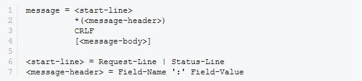

必须在消息HTTP标头和正文之间放置新行。可以有一个或多个HTTP标头，如：

```
General Headers
Request Specific Headers
Response Specific Headers
Entity Headers
```

很少的几个头可以被请求和响应公共：

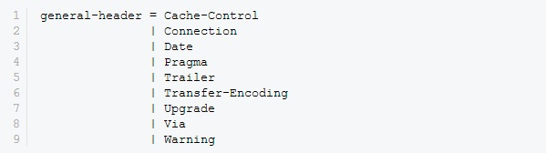

实体标头提供有正文的元信息。看起来像：

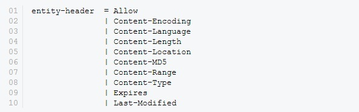

虽然HTTP支持自定义头，但它只查找请求和响应头。

请求消息具有通用结构。如下所示：

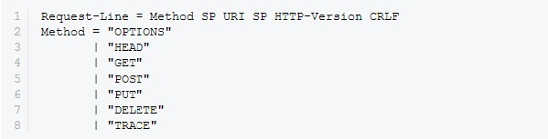

下图是一个简单示例：

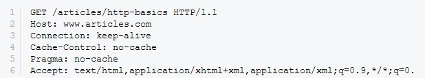

响应格式结构类似于请求消息。仅状态行和标头与请求消息不同。状态行结构如下：


成功消息的状态行如下所示：

```
HTTP/1.1 200 OK
```

完整的响应头看起来像:

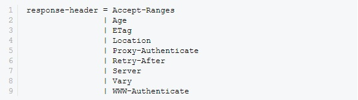

### 4.1.2 Web 服务（Web Services）

援引维基百科上的定义：\
“
Web服务是一种服务导向架构的技术，通过标准的Web协议提供服务，目的是保证不同平台的应用服务可以互操作。

根据W3C的定义，Web服务（Web service）应当是一个软件系统，用以支持网络间不同机器的互动操作。网络服务通常是许多应用程序接口（API）所组成的，它们透过网络，例如国际互联网（Internet）的远程服务器端，执行客户所提交服务的请求。
”

一个Web服务必须满足以下条件：
1. 可以通过网络搜索Web服务，也可以被调用。
2. 调用时，Web服务将能够为调用该Web服务的客户端提供功能。


WEB服务实际上是一组工具，并有多种不同的方法调用之。三种最普遍的手段是：远程过程调用（RPC），服务导向架构（SOA）以及表述性状态转移（REST）。

**远程过程调用:**

WEB服务提供一个分布式函数或方法接口供用户调用，这是一种比较传统的方式。通常，在WSDL中对RPC接口进行定义（类似于早期的XML-RPC）。

尽管最初的WEB服务广泛采用RPC方式部署，但针对其过于紧密之耦合性的批评声也随之不断。这是因为RPC式WEB服务实质上是利用一个简单的映射，以把用户请求直接转化成为一个特定语言编写的函数或方法。如今，多数服务提供商认定此种方式在未来将难有作为，在他们的推动下，WS-I基本协议集（WS-I Basic Profile）已不再支持远程过程调用。

**服务导向架构:**

现在，业界比较关注的是遵从服务导向架构（Service-oriented architecture，SOA）概念来构筑WEB服务。在服务导向架构中，通讯由消息驱动，而不再是某个动作（方法调用）。这种WEB服务也被称作面向消息的服务。

SOA式WEB服务得到了大部分主要软件供应商以及业界专家的支持和肯定。作为与RPC方式的最大差别，SOA方式更加关注如何去连接服务而不是去特定某个实现的细节。WSDL定义了联络服务的必要内容。

**表述性状态转移:**

表述性状态转移式（Representational state transfer，REST）WEB服务类似于HTTP或其他类似协议，它们把接口限定在一组广为人知的标准动作中（比如HTTP的GET、PUT、DELETE）以供调用。此类WEB服务关注与那些稳定的资源的互动，而不是消息或动作。

此种服务可以通过WSDL来描述SOAP消息内容，通过HTTP限定动作接口；或者完全在SOAP中对动作进行抽象。

### 4.1.3 WebSocket

WebSocket是基于TCP协议的双工协议。浏览器通过HTTP连接向服务器发送WebSocket握手请求来升级连接，从而启动WebSocket连接。除了升级请求标头之外，握手请求还包括64位Sec-WebSocket-Key标头。服务器使用Sec-Websocket-Auth头中的密钥哈希进行响应。基本流程如下图所示：

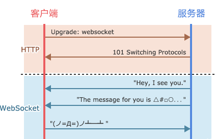

从建立连接开始，整个通信都是基于二进制的，不符合HTTP协议。服务器应用程序知道所有WebSocket连接，并且可以单独与每个连接进行通信。当WebSocket保持打开状态时，服务器或用户可以随时发送消息，直到其中一个关闭会话。可以在任一端启动通信，这使得事件驱动的Web编程成为可能。相反，标准HTTP仅允许用户请求新数据。

下面给出了WebSocket数据帧的统一格式。熟悉TCP/IP协议的同学对这样的图应该不陌生。

从左到右，单位是比特。比如FIN、RSV1各占据1比特，opcode占据4比特。
内容包括了标识、操作代码、掩码、数据、数据长度等。

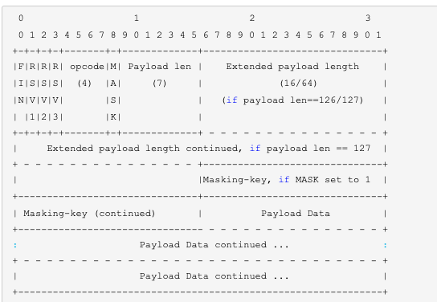

WebSocket协议详细内容请阅读[rfc6455文档](https://tools.ietf.org/html/rfc6455)

#### 4.1.4 Https

HTTPS代表超文本传输​​协议安全。它是用于保护两个系统之间通信的协议，例如浏览器和Web服务器。下图说明了通过http和https进行通信的区别：

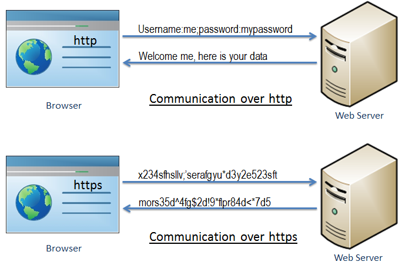

如上图所示，http以超文本格式在浏览器和Web服务器之间传输数据，而https以加密格式传输数据。因此，https可防止黑客在浏览器和Web服务器之间传输期间读取和修改数据。即使黑客设法拦截通信，他们也无法使用它，因为消息是加密的。

HTTPS使用安全套接字层（SSL）或传输层安全（TLS）协议在浏览器和Web服务器之间建立加密链接。TLS是SSL的新版本。

SSL是用于在两个系统之间建立加密链接的标准安全技术。这些可以是浏览器到服务器，服务器到服务器或客户端到服务器。基本上，SSL确保两个系统之间的数据传输保持加密和私密。

https本质上是http over SSL。SSL使用SSL证书建立加密链接，SSL证书也称为数字证书。

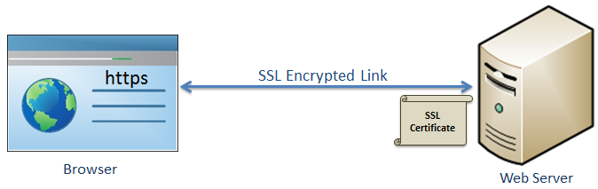

HTTP 和 HTTPS的简单对比如下：

<table>
            <thead>
                <tr>
                    <th>
                        http
                    </th>
                    <th>
                        https
                    </th>
                </tr>
            </thead>
            <tbody>
                <tr>
                    <td>
                        以超文本（结构化文本）格式传输数据
                    </td>
                    <td>
                        以加密格式传输数据
                    </td>
                </tr>
                <tr>
                    <td>
                        默认使用端口80
                    </td>
                    <td>
                        默认使用端口443
                    </td>
                </tr>
                <tr>
                    <td>
                        不安全
                    </td>
                    <td>
                        使用SSL技术保护安全
                    </td>
                </tr>
                <tr>
                    <td>
                        以 <code>http://</code>开始
                    </td>
                    <td>
                        以 <code>https://</code>开始
                    </td>
                </tr>
            </tbody>
        </table>


### 4.1.5 小结

本节简单介绍了 Web 应用中的常用几种协议，想要了解每种协议的详情，需要阅读对应的规范文档。本节作业如下：

1. 结合抓包工具来分析、学习web协议

下一节我们学习如何通过编程的方式连接远程web服务，获取基本信息，进行简单交互。

  

            本系列教程全部内容在知识星球--玄说安全 发布，并提供答疑和辅导。

 

